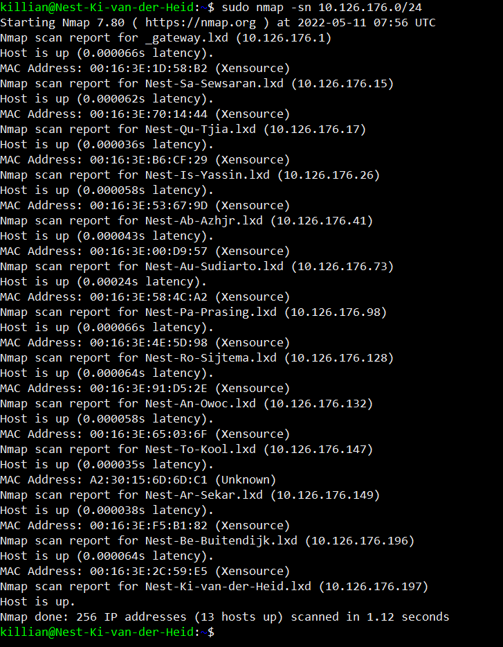
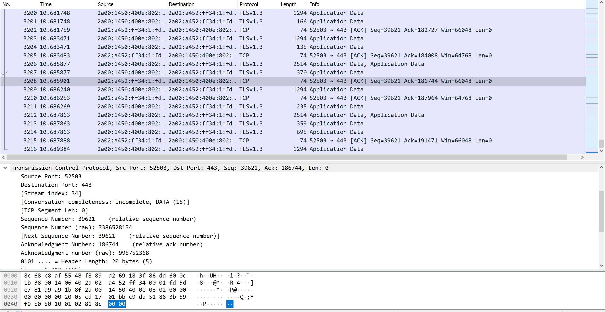
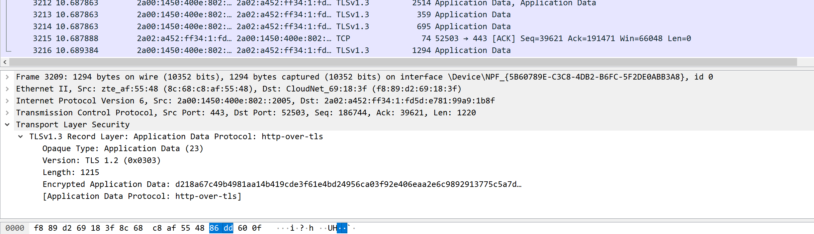

# Network Detenction
Learn how to use the basics of NMAP and use wireshark to find your browser communication

## Key terminology
- ***NMAP(Network Mapper):*** NMAP is a open source Mapper, you can use this as a command line tool to scan your IP adresses and ports in a network and, to scan and find installed applications. For example a admin or network supervisor can see what devices are connected to his network and detect vulnerabilities.
- ***-sn(scan no port):*** This NMAP command tells NMAP to not probe the ports but just do a light quick scan. 
- ***ip addr:*** This command shows you your IP and other information. Notice when you do this a /24 is added to your IP adress, when you do the scan and you add /24 you tell NMAP todo a scan of the entire range of the network. In my case the parameter “10.126.176.0/24” translates as “start at IP address 10.126.176.0 and work right through all IP addresses up to and including 10.126.176.255”.
- ***TLS (Transport Layer Protocol):*** This is a encryption protocol. It is used to secure web traffic.
- ***port 52503:*** This port used TCP, TCP guarantees data delivery trough this port.
- ***port 443:*** This is the standard port for HTTPs traffic, this makes port 443 essentian for web activity

## Exercise
### Sources
1. [NMAP](https://www.freecodecamp.org/news/what-is-nmap-and-how-to-use-it-a-tutorial-for-the-greatest-scanning-tool-of-all-time/)
2. [NP2](https://www.howtogeek.com/423709/how-to-see-all-devices-on-your-network-with-nmap-on-linux/)

### Overcome challenges
Alot of time presure, i am on schedule but im afraid that i will rush the assignments.
I noticed that i do not understand wireshark completely yet.

### Results
1. In this screenshot you can see the results of my scan, what i can see is that as expected it listed all the VM's connected to the network. And i can see everyones IP adress connected to their VM. I can also see that TG used Xenserver to run the Linux server. XEN is a Hypervisor.

2. In this screenshot you can see a TCP protocol when i opened a browser page. you can see here where the data came from (port 52503) and where it has togo (port 443).

3. In this screenshot you can see that TLS is being applied to my request to open the webbrowser. in the bottom line you can see a litteral confirmation that the HTTP is going over the TLS.

