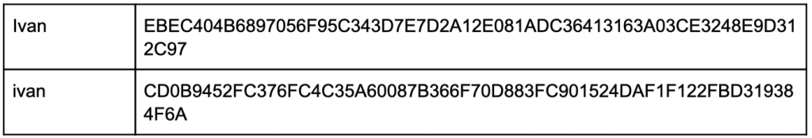
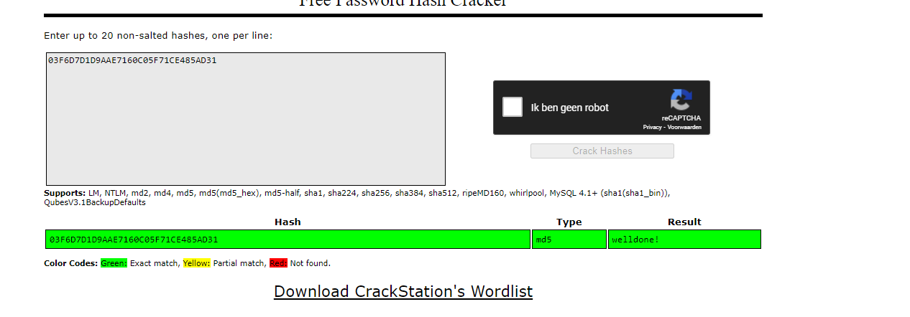
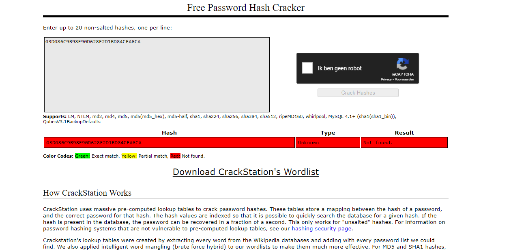

# Passwords
Learn about hashing

## Key terminology
- ***Check-sum:*** Hashing is meant to verify that a file or piece of data hasn’t been altered and that it is authentic. In other words, it serves as a check-sum. A checksum is a small-sized block of data derived from another block of digital data for the purpose of detecting errors that may have been introduced during its transmission or storage. By themselves, checksums are often used to verify data integrity but are not relied upon to verify data authenticity.
The procedure which generates this checksum is called a checksum function or checksum algorithm. Depending on its design goals, a good checksum algorithm usually outputs a significantly different value, even for small changes made to the input. This is especially true of cryptographic hash functions, which may be used to detect many data corruption errors and verify overall data integrity; if the computed checksum for the current data input matches the stored value of a previously computed checksum, there is a very high probability the data has not been accidentally altered or corrupted.
- ***Cryptographic Hashing:*** A cryptographic hash function is an algorithm that takes an arbitrary amount of data input—a credential—and produces a fixed-size output of enciphered text called a hash value, or just “hash.” That enciphered text can then be stored instead of the password itself, and later used to verify the user.
- ***Salting:*** Is a concept that typically relates to password hashing. Essentially, it’s a unique value that can be added to the end of the password to create a different hash value. This adds a layer of security to the hashing process, specifically against brute force attacks. The idea is that by adding a salt to the end of a password and then hashing it, you’ve essentially complicated the password cracking process.
- ***Brute force attack:*** Is where a computer or botnet attempts every possible combination of letters and numbers until the password is found.
- ***Rainbow table:*** A rainbow table is a precomputed compilation of plaintexts and matching ciphertexts (typically passwords and their matching hashes). Rainbow tables greatly speed up many types of password cracking attacks, often taking minutes to crack where other methods may take much longer.

## Exercise
### Sources
1. [Hash](https://academy.moralis.io/blog/what-is-hashing-a-complete-guide-to-hashing?utm_source=gads&utm_campaign=16265974031&utm_medium=133080359906&network=g&device=m&gclid=CjwKCAjwj42UBhAAEiwACIhADl7vrirsJ-T1JikPM31AzQNzjYua4F1Gwkgc88TBHzw2I-0XpDnIZhoCW2QQAvD_BwE)
2. [Hash2](https://www.2brightsparks.com/resources/articles/introduction-to-hashing-and-its-uses.html)
3. [checksum](https://en.wikipedia.org/wiki/Checksum)
4. [Hash3](https://www.thesslstore.com/blog/difference-encryption-hashing-salting/)

### Overcome challenges
Not much, i have alot of intrest in this and worked with hashing before when we had to secure our SQL database at my previous study. creating my maybe only challenge, me going way to deep.

### Results
## What is hashing?
Hashing is an algorithm that calculates a fixed-size bit string value from a file. A file basically contains blocks of data. Hashing transforms this data into a far shorter fixed-length value or key which represents the original string. The hash value can be considered the distilled summary of everything within that file.

A good hashing algorithm would exhibit a property called the avalanche effect, where the resulting hash output would change significantly or entirely even when a single bit or byte of data within a file is changed. A hash function that does not do this is considered to have poor randomization, which would be easy to break by hackers.
The picture below show this effect.

In this example picture you can see that the only thing changed about the input is the first letter, it goes from a lower care to a upper case i. Because of this the entire hash changes.

A hash is usually a hexadecimal string of several characters. Hashing is also a unidirectional process so you can never work backwards to get back the original data. You can actually do reverse it but hashing is considered one-way, encryption for example is two-way. The power you need to reverse a hash is so high that hashing is considered one-way

A good hash algorithm should be complex enough such that it does not produce the same hash value from two different inputs. If it does, this is known as a hash collision. A hash algorithm can only be considered good and acceptable if it can offer a very low chance of collision.
But Imagine that you have N different possibilities of an birthday happening. In this case, you need a square root of N to have a 50% chance of a collision. When it comes to birthdays, there are 365 distinct possibilities of that event happening. Upon square rooting that, we get sqrt(365) = ~23. This is why, if we were in a room with about 30 people there will be a chance of collision.

## Below are two MD5 password hashes. One is a weak password, the other is a string of 16 randomly generated characters. Try to look up both hashes in a Rainbow Table.
 1. 03F6D7D1D9AAE7160C05F71CE485AD31
 
 2. 03D086C9B98F90D628F2D1BD84CFA6CA 
 

## Create a new user in Linux with the password 12345. Look up the hash in a Rainbow Table.
I have not done this since i know what will happen. When i create my new user and give it the password, the password will be stored with a salt, when i would try to read it i would get an error because it doesnt match.

## To understand how salting works, find a peer who has the same password in /etc/shadow, and compare hashes.
I have not done this because i know how salting works.
