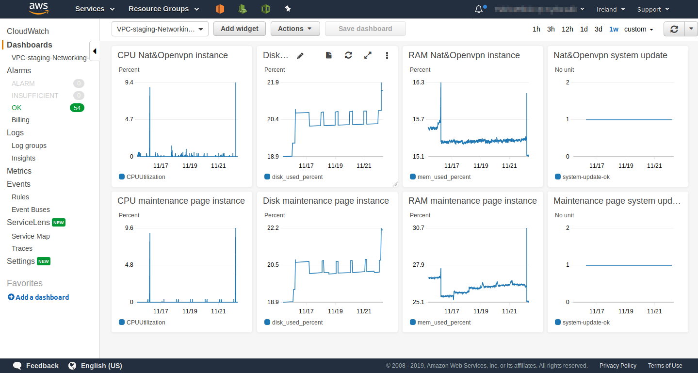

# Core Services
Prepare your knowledge for the cloud Practitioner exam

## Key terminology
I will put most of the key terms for this asignment in the Results parts.
- ***AWS EBS(Amazon Elastic Block Store):*** Is an easy to use, scalable, high-performance block storage service designed for Amazon EC2. Block storage breaks up data into blocks and then stores those blocks as separate pieces, each with a unique identifier.

- ***SDK(Software Devolopment Kit):*** Is a set of software-building tools for a specific platform, including the building blocks, debuggers and, often, a framework or group of code libraries such as a set of routines specific to an operating system (OS)

## Exercise
### Sources
1. Other assignments.
2. [AWS Lib](https://docs.aws.amazon.com/AWSEC2/latest/UserGuide/concepts.html)
3. Entire AWS documentation about all these terms.

### Overcome challenges
Always getting nervous when i see the word exam. A mental challenge gets created in my brain that i NEED to know every single detail about every single subject, creating a way to big information flow into my head and "leaking" half of it.

### Results

First i will write a list of Key services that AWS offers. Then i will explain them 1 by 1. Besides this list, the exams can also include questions about cloud concepts, like the Well-Architected Framework or the cloud pricing model, as well as questions on the different support categories. These subjects i will study myself and not talk about them in here because then this form will be way to long. If you want to talk about it, we can talk about it In Real Life.

- Amazon EC2 
- AWS Lambda 
- AWS Elastic Beanstalk 
- Amazon VPC
- Amazon Route 53
- Amazon S3
- Amazon S3 Glacier
- Amazon CloudFront
- Amazon RDS
- Amazon DynamoDB
- Amazon CloudWatch
- Amazon CloudFormation
- AWS IAM (Identity and Access Management)

***Amazon EC2 (12 months free):*** In other wortds Amazon Elastic Compute Cloud provides scalable computing capacity in the Amazon Web Services (AWS) Cloud. Using Amazon EC2 takes away your needs to invest in hardware up front, so you can develop and deploy applications faster. You can use Amazon EC2 to launch as many or as few virtual servers as you need, configure security and networking, and manage storage. Amazon EC2 enables you to scale up or down to handle changes in requirements or spikes in popularity, reducing your need to forecast traffic. EC2 is the core compute component of the many different AWS services. It comes with the pricing plan of you pay for what you use.
Below i will show you the features of EC2 that are promoted by AWS itself:.
- Virtual computing environments, known as instances
- Preconfigured templates for your instances, known as Amazon Machine Images (AMIs), that package the bits you need for your server including the operating system and additional software.
- Various configurations of CPU, memory, storage, and networking capacity for your instances, known as instance types.
- Secure login information for your instances using key pairs, AWS stores the public key, and you store the private key in a secure place.
-  Storage volumes for temporary data that's deleted when you stop, hibernate, or terminate your instance, known as instance store volumes.
- Persistent storage volumes for your data using Amazon Elastic Block Store (Amazon EBS), known as Amazon EBS volumes.
- Multiple physical locations for your resources, such as instances and Amazon EBS volumes, known as Regions and Availability Zones.
- A firewall that enables you to specify the protocols, ports, and source IP ranges that can reach your instances using security groups.
- Static IPv4 addresses for dynamic cloud computing, known as Elastic IP addresses.
- Metadata, known as tags, that you can create and assign to your Amazon EC2 resources.
- Virtual networks you can create that are logically isolated from the rest of the AWS Cloud, and that you can optionally connect to your own network, known as virtual private clouds (VPCs).

***Amazon Lambda(always free):*** Is a computing service that will take alot of work out of your hands and run your code for you. Lambda takes away the need for provisioning servers, maintaining them. Your code will be run on high-availablity infrastructures. Lambda also includes capacity provisioning, auto-scaling, logging and more. ALl you need to do is deliver your code and lambda will basicly do all the rest. It can handle thousands of requests per second. And maybe most important when your code is not running there are no costs. 3 examples of what you can do with Lambda are:
  1. Build data-processing triggers for AWS services such as Amazon Simple Storage Service (Amazon S3) and Amazon DynamoDB.
  2. Process streaming data stored in Amazon Kinesis.
  3. Create your own backend that operates at AWS scale, performance, and security.

***AWS Elastic Beanstalk(12 months free):*** This is also a service that makes everything alot easier for the user. EB lets you quickly deplay apps in the cloud and reduces the complexity of the management, but it doesnt take control away from you. You are still in full control and can decide what happens. This way you do need to learn about cloud infrastructure and things like that. You could say this is a plug and play service. Like lambda it also does auto-scaling, load balancing, maintenance and provisioning, so you wont need todo that yourself either.

***AWS Virtual Private Cloud:*** With AWS VPC you can launch other AWS resources like EC2 into a virtual network that you have defined, You can specify an IP address range for the VPC, add subnets, associate security groups, and configure route tables. This closely resembles a physical network in your own datacenter but then with the benefits of AWS's scalable infrastructure. A VPC is logically isolated from other virtual networks in the AWS Cloud. 
VPC can be controlled by 4 interfaces:
  1. ***AWS Management Console:*** Provides a web interface that you can use to access your VPCs.
  2. ***AWS Command Line Interface:*** Provides commands for a broad set of AWS services, including AWS VPC, and is supported on Windows, Mac, and Linux.
  3. ***AWS SDKs:*** Provides language-specific APIs and takes care of many of the connection details, such as calculating signatures, handling request retries, and error handling.
  4. ***Query API:*** Provides low-level API actions that you call using HTTPS requests. Using the Query API is the most direct way to access Amazon VPC, but it requires that your application handles low-level details such as generating the hash to sign the request, and error handling.

***AWS route 53:*** Route 53 is a DNS(Domain Name System), its highly available and scalable. It has 3 main functions. When using all 3 of the functions you need todo it in the order i will put them down below.
  1. ***Register domain names*** Your site or web app needs a name ofcourse. This step will let you register that name, aka the domain name
  2. ***Route internet traffic to the resources for your domain:*** When a user opens a web browser and enters your domain name (example.com) or subdomain name (acme.example.com) in the address bar, Route 53 helps connect the browser with your website or web application.
  3. ***Check the health of your resources:*** Route 53 will ping your resources to check if they are still available and reachable. If not, you can choose to receive notifications at those events.

***AWS CloudFront:*** Is a web service to speed up the distribution for static and dynamic web content, a CDN(Content delivery Network). For example HTML and css. Cloudfront uses edge locations to make this happen, If the content is already in the edge location with the lowest latency, CloudFront delivers it immediately. And if not CloudFront retrieves it from an origin that you've defined. Cloudfront always makes ensures the fastest delivry by using these edge locations.

***AWS CloudWatch(always free):*** Like the name says a little bit, cloudwatch monitors your AWS web services, your resources and your apps running on AWS, it does all this in real time. The CloudWatch home page automatically displays metrics about every AWS service you use. You can additionally create custom dashboards to display metrics about your custom applications, and display custom collections of metrics that you choose. You can create alarms that watch metrics and send notifications or automatically make changes to the resources you are monitoring when a threshold is breached. Below you can see an example of a part of the Cloudwatch Dashboard.

***AWS IAM(Identity and Access Management):*** This is a security service, IAM lets you control who has acces to your recourses and who doesnt. With IAM you can control who is authenticated (signed in) and authorized (has permissions) to use resources. IAM has alot of features but here are 3 of the ones that i really liked:
  1. ***Shared access to your AWS account:*** You can grant other people permission to administer and use resources in your AWS account without having to share your password or access key.
  2. ***Free to use:*** This doesnt need any explanation. AWS offers IAM for free, You are charged only when you access other AWS services using your IAM users.
  3. ***Multi factor authentication:*** With MFA you or your users must provide not only a password or access key to work with your account, but also a code from a specially configured device. This brings alot of extra security.

***Amazon CloudFormation(Always free):*** Is a service that helps you model and set up your AWS resources so that you can spend less time managing those resources and more time focusing on your applications that run in AWS. You can create a template that describes all the AWS resources that you want (like Amazon EC2 instances or Amazon RDS DB instances), and CloudFormation will take care of provisioning and configuring those resources for you. You don't need to individually create and configure AWS resources and figure out what's dependent on what, CloudFormation handles that.

***AWS RDS(Amazon Relational Database Service)(12 months free):*** Is a web service that makes it easier to set up, operate, and scale a relational database in the cloud. It provides cost efficient, resizable capacity for an industry standard relational database and manages common database administration tasks.

***Dynamo DB(Always free):*** Is a 100% managed noSQL database service. It delivers fast performance and scalability. It does the administrative tasks for you, there is no need to worry about hardware provisioning, setup and configuration, replication, software patching, or cluster scaling. It also ensures your data is secured by using ecryption at rest, I think this i what people care most about in their database, Security. You can use the AWS Management Console to monitor resource utilization and performance metrics. Dynamo DB allows your DB's to story any amount of data and serve any level of traffic. You can also create on demand back ups and use Point in time recovery so protect yourself from dataloss.

***Amazon S3(12 months free):*** Amazon Simple Storage Service (Amazon S3) is an object storage service that offers industry-leading scalability, data availability, security, and performance. Customers of all sizes and industries can use Amazon S3 to store and protect any amount of data for a range of use cases, such as data lakes, websites, mobile applications, backup and restore, archive, enterprise applications, IoT devices, and big data analytics. Amazon S3 provides management features so that you can optimize, organize, and configure access to your data to meet your specific business, organizational, and compliance requirements. Amazon S3 offers a range of storage classes designed for different use cases. For example, you can store mission-critical production data in S3 Standard for frequent access, save costs by storing infrequently accessed data in S3 Standard-IA or S3 One Zone-IA, and archive data at the lowest costs in S3 Glacier Instant Retrieval, S3 Glacier Flexible Retrieval, and S3 Glacier Deep Archive. For more information about S3 i would re direct you to the AWS documentation. S3 has alot of features.

***Amazon S3 Glacier:*** Is one of the many different storage classes for Amazon S3. Amazon S3 Glacier is a secure, durable, and extremely low-cost Amazon S3 storage class for data archiving and long-term backup. With S3 Glacier, customers can store their data cost effectively for months, years, or even decades.

