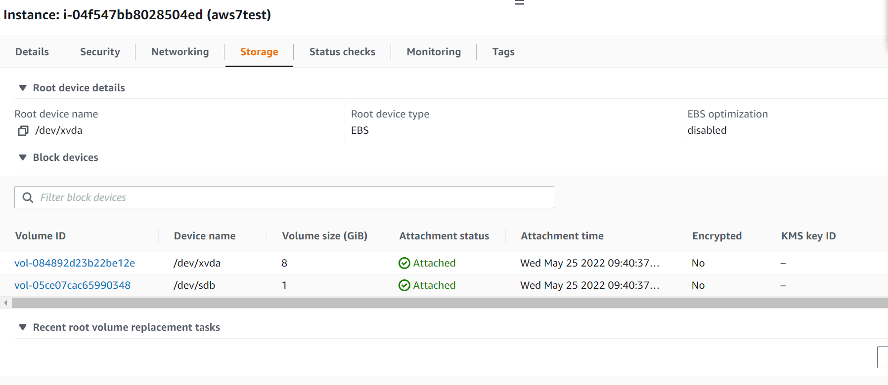
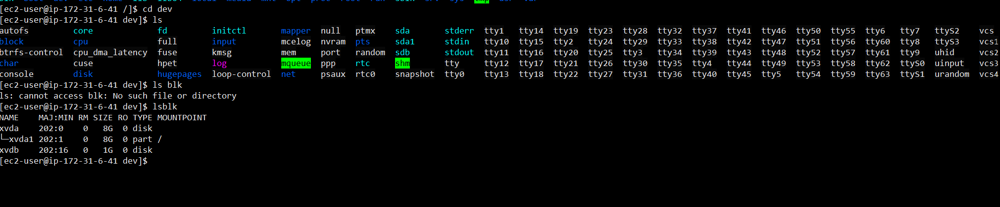
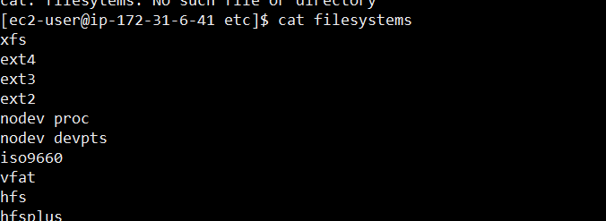
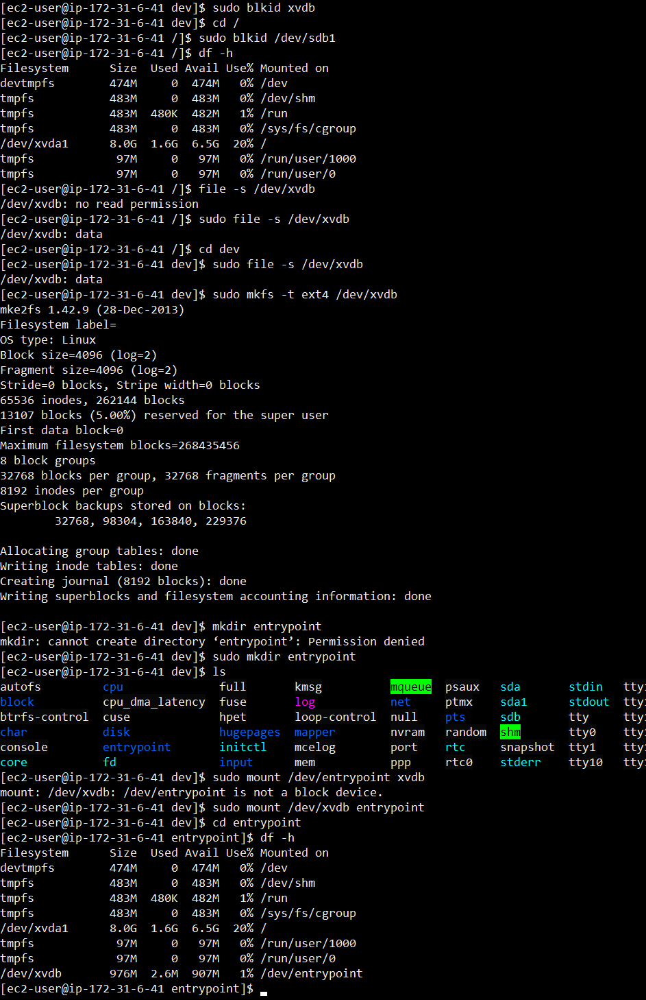
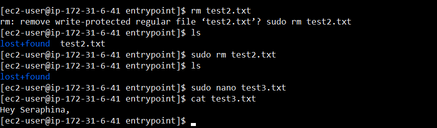
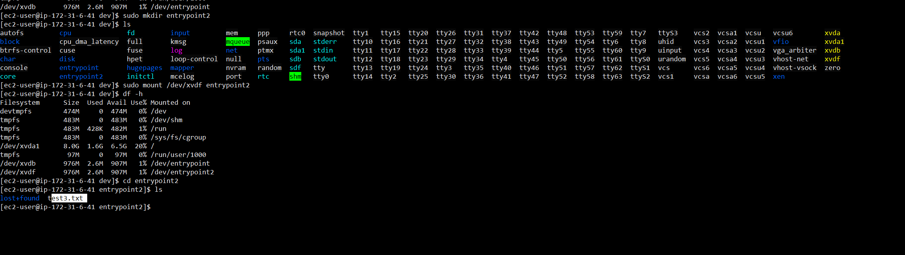

# EBS
Learn about volumes and how to create apply and get acces to them.

## Key terminology
- ***LSBLK command:*** is used to display details about block devices and these block devices(Except ram disk) are basically those files that represent devices connected to the pc.
- ***file -s command:*** With this command you can check the File System of a volume.
- ***mkfs -t ext4 command:*** With this command you can make/give a volume a certain file system.
- ***df -h command:*** This command list a summary of all mounted volumes and file systems, and their usage/free space.
- ***File system:*** A Linux file system is a structured collection of files on a disk drive or a partition. A partition is a segment of memory and contains some specific data. In our machine, there can be various partitions of the memory. Generally, every partition contains a file system.

## Exercise
### Sources
1. [AWS](https://docs.aws.amazon.com/AWSEC2/latest/UserGuide/ebs-using-volumes.html)
2. Classmate Aurel.
3. [YT](https://www.youtube.com/watch?v=VnO3Lz7Qr0U)

### Overcome challenges

### Results

## Exercise 1
1. Navigate to the EC2 menu.
2. Create a t2.micro Amazon Linux 2 machine with all the default settings.
3. Create a new EBS volume with the following requirements:
    - Volume type: General Purpose SSD (gp3)
    - Size: 1 GiB
    - Availability Zone: same as your EC2
4. Wait for its state to be available.

## Exercise 2
1. Attach your new EBS volume to your EC2 instance.
2. Connect to your EC2 instance using SSH.
3. Mount the EBS volume on your instance.
4. Create a text file and write it to the mounted EBS volume.

## Exercise 3
1. Create a snapshot of your EBS volume.
2. Remove the text file from your original EBS volume.
3. Create a new volume using your snapshot.
4. Detach your original EBS volume.
5. Attach the new volume to your EC2 and mount it.
6. Find your text file on the new EBS volume.

Below you can see that i am inside my new instance and that i already created the new volume while setting up the instance.

Next you can see that i found my volume called DB in the terminal.

Below you can see i found a list of file systems i could pick from so i could mount my volume. (i picked ext4)

Below you can see i mounted my volume with the entrypoint dir als accespoint.

Below you can see i created a txt file in my volume called DB trough entrypoint.

Lastly down here you can see i have created a new volume called DF and that i mounted it with accespoint "entrypoint2" and in the bottom of the screenshot you can see my snapshot worked because my test3.txt is already inside entrypoint2 aka the new volume.
