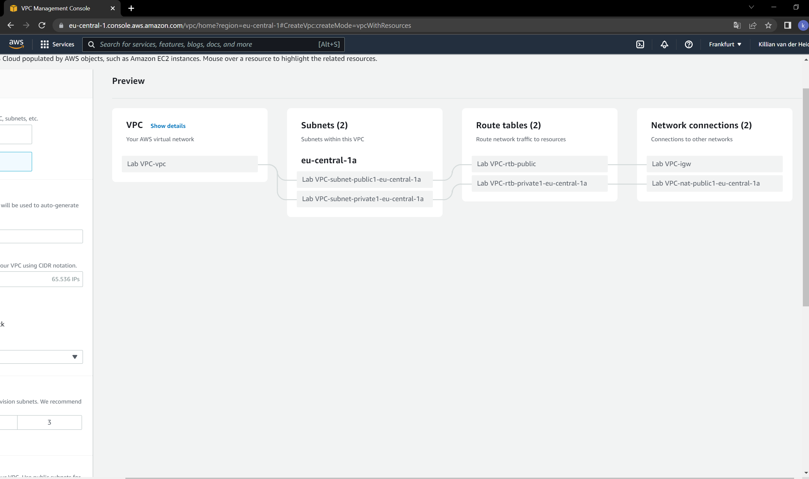
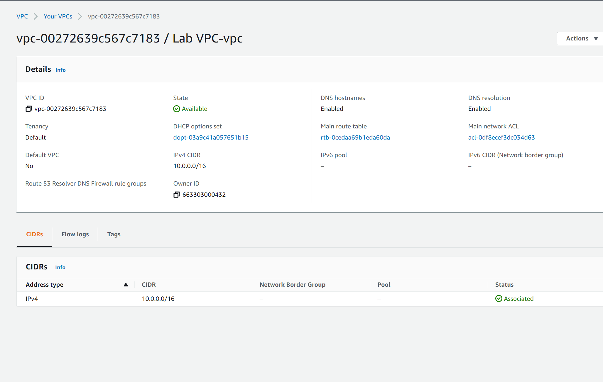
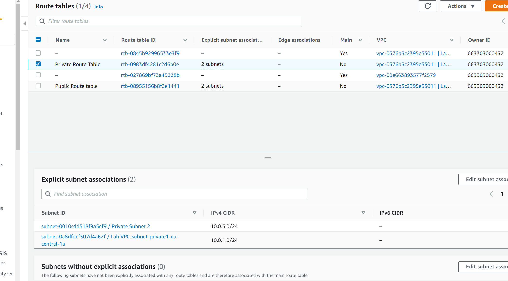
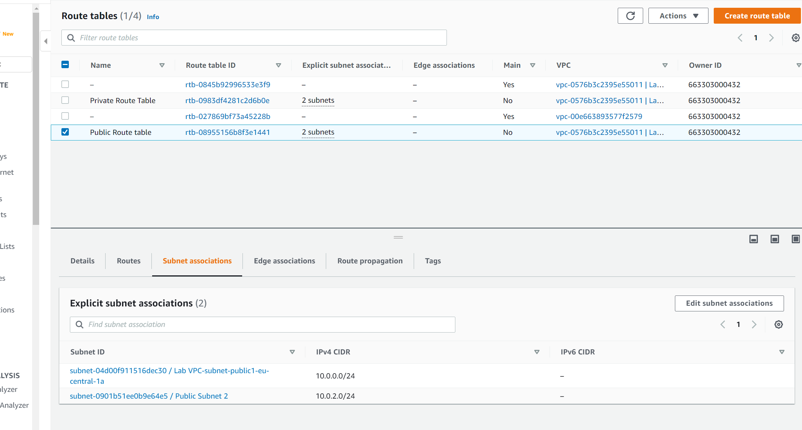
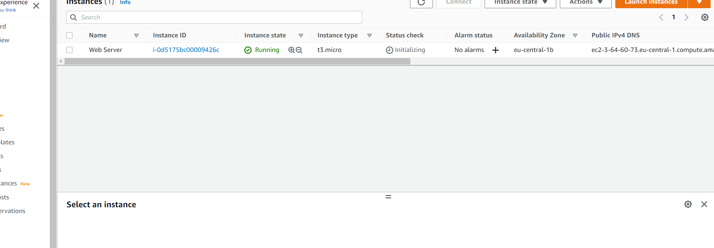
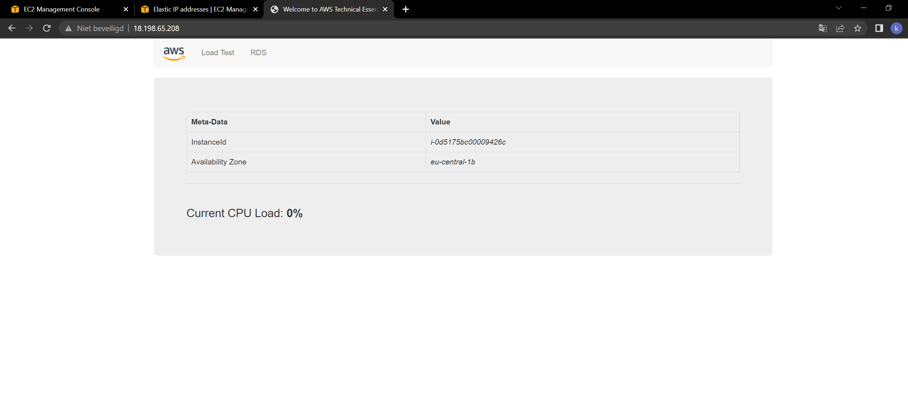

# VPC
Learn how to create and edit VPC's

## Key terminology
- ***EIP(Elastic IP addresses):*** An Elastic IP address is a static IPv4 address designed for dynamic cloud computing. An Elastic IP address is allocated to your AWS account, and is yours until you release it. By using an Elastic IP address, you can mask the failure of an instance or software by rapidly remapping the address to another instance in your account. Alternatively, you can specify the Elastic IP address in a DNS record for your domain, so that your domain points to your instance. For more information, see the documentation for your domain registrar, or Set up dynamic DNS on Your Amazon Linux instance.
- ***Accelerator:*** Global Accelerator is a global service that supports endpoints in multiple AWS Regions.

## Exercise
### Sources
1. Previous assignments about subnetting, masks and VPC's.
2. [EIP](https://docs.aws.amazon.com/AWSEC2/latest/UserGuide/elastic-ip-addresses-eip.html)
3. my classmate aurel

### Overcome challenges
For the start i was a bit scared of not understanding it, because last time i had to work with subnets it took me a long while to understand it all.

### Results

Below you can see me creating my VPC.

Below you can see that the creation was completed.

Below you will see 2 screenshots where you can see i explicitly associated my public subnets to the public route table and my private subnets to the private route table.

Below you can see that i created a new EC2 instance.

Lastly you can see below that i succesfully connected to my server

