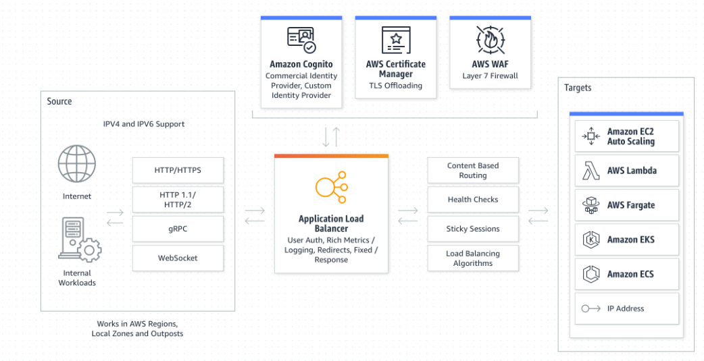
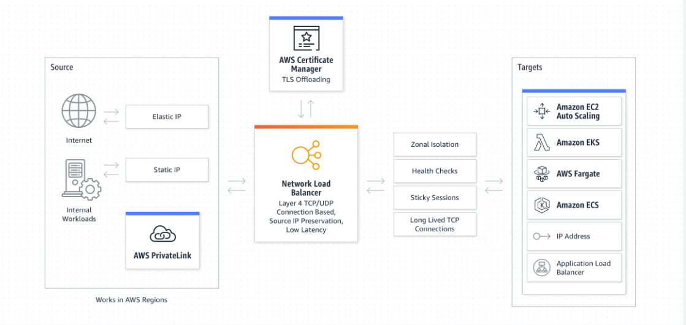
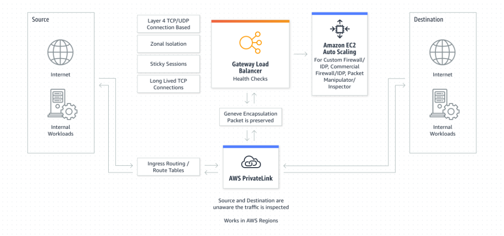
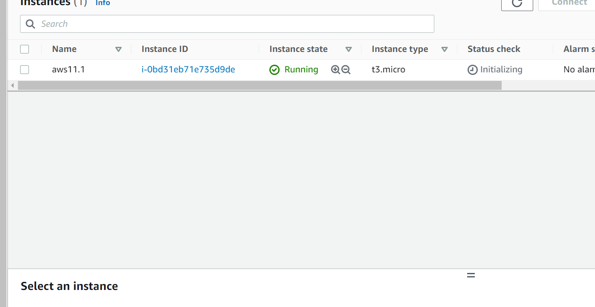
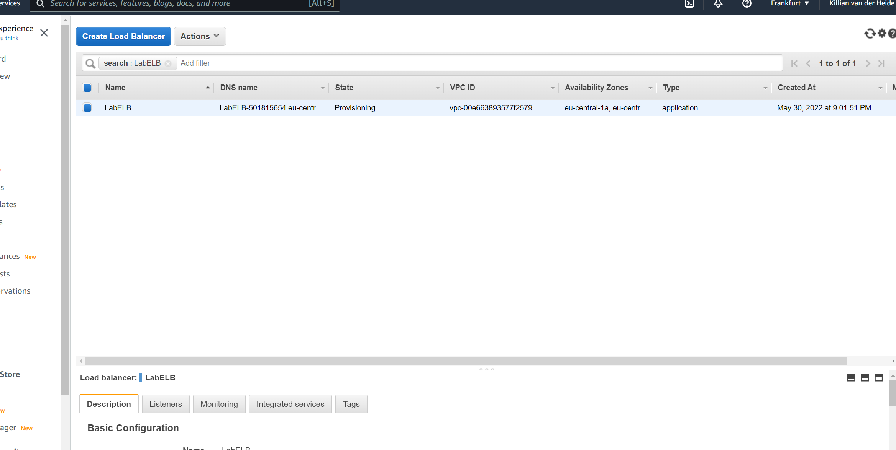
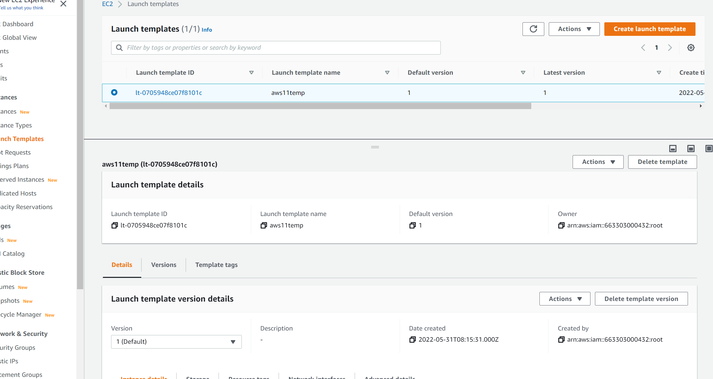
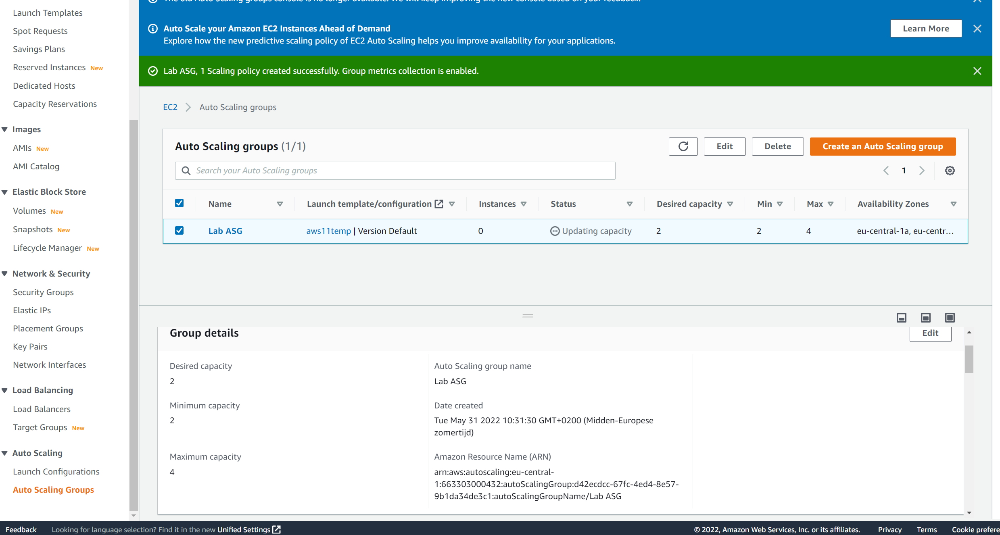
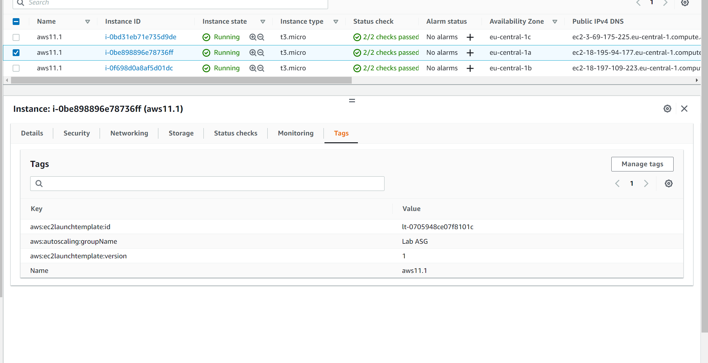
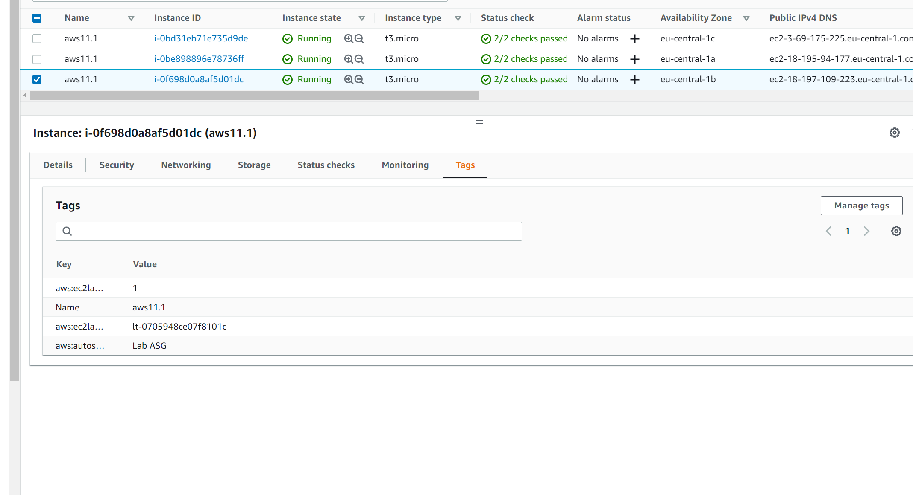
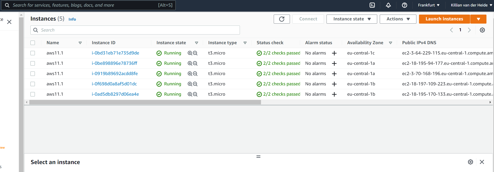

# ELB & Auto Scaling

## Key terminology
- ***AMI(Amazon Machine Image):*** Is a supported and maintained image provided by AWS that provides the information required to launch an instance. You must specify an AMI when you launch an instance. You can launch multiple instances from a single AMI when you require multiple instances with the same configuration. You can use different AMIs to launch instances when you require instances with different configurations.
- ***ELB(Elastic load Balancing):*** Elastic Load Balancing automatically distributes your incoming traffic across multiple targets, such as EC2 instances, containers, and IP addresses, in one or more Availability Zones. It monitors the health of its registered targets, and routes traffic only to the healthy targets. Elastic Load Balancing scales your load balancer capacity automatically in response to changes in incoming traffic. One of the big advantages of ELB is that it ups availability and fault tolerance of your apps, by distributing workloads across multiple compute resources, such as virtual servers.
There are four types of ELB's:
1. ***Application Load Balancer:*** Makes routing decisions at the application layer (HTTP/HTTPS), supports path-based routing, and can route requests to one or more ports on each container instance in your cluster. Application Load Balancers support dynamic host port mapping.
 
2. ***Network Load Balancer:*** A Network Load Balancer makes routing decisions at the transport layer (TCP/SSL). It can handle millions of requests per second. After the load balancer receives a connection, it selects a target from the target group for the default rule using a flow hash routing algorithm. It attempts to open a TCP connection to the selected target on the port specified in the listener configuration. It forwards the request without modifying the headers. Network Load Balancers support dynamic host port mapping.

3. ***Classic Load Balancer:*** A Classic Load Balancer makes routing decisions at either the transport layer (TCP/SSL) or the application layer (HTTP/HTTPS). Classic Load Balancers currently require a fixed relationship between the load balancer port and the container instance port. For example, it is possible to map the load balancer port 80 to the container instance port 3030 and the load balancer port 4040 to the container instance port 4040. However, it is not possible to map the load balancer port 80 to port 3030 on one container instance and port 4040 on another container instance. To ensure that your registered instances are able to handle the request load in each Availability Zone, it is important to keep approximately the same number of instances in each Availability Zone registered with the load balancer. For example, if you have ten instances in Availability Zone us-west-2a and two instances in us-west-2b, the requests are distributed evenly between the two Availability Zones. As a result, the two instances in us-west-2b serve the same amount of traffic as the ten instances in us-west-2a. Instead, you should have six instances in each Availability Zone.
4. ***Gateway Load Balancers:*** Allow you to deploy, scale, and manage virtual appliances, such as firewalls, intrusion detection and prevention systems, and deep packet inspection systems. It combines a transparent network gateway (that is, a single entry and exit point for all traffic) and distributes traffic while scaling your virtual appliances with the demand. A Gateway Load Balancer operates at the third layer of the Open Systems Interconnection (OSI) model, the network layer. It listens for all IP packets across all ports and forwards traffic to the target group that's specified in the listener rule. It maintains stickiness of flows to a specific target appliance using 5-tuple (for TCP/UDP flows) or 3-tuple (for non-TCP/UDP flows). The Gateway Load Balancer and its registered virtual appliance instances exchange application traffic using the GENEVE protocol on port 6081. It supports a maximum transmission unit (MTU) size of 8500 bytes. Gateway Load Balancers use Gateway Load Balancer endpoints to securely exchange traffic across VPC boundaries. A Gateway Load Balancer endpoint is a VPC endpoint that provides private connectivity between virtual appliances in the service provider VPC and application servers in the service consumer VPC. You deploy the Gateway Load Balancer in the same VPC as the virtual appliances. You register the virtual appliances with a target group for the Gateway Load Balancer.

- ***Dynamic Host Port Mapping:*** Dynamic port mapping allows you to run multiple tasks over the same host using multiple random host por (in spite of defined host port). Dynamic port mapping with an Application Load Balancer makes it easier to run multiple tasks on the same Amazon ECS service on an Amazon ECS cluster. For example, if your task's container definition specifies port 80 for an NGINX container port, and port 0 for the host port, then the host port is dynamically chosen from the ephemeral port range of the container instance (such as 32768 to 61000 on the latest Amazon ECS-optimized AMI). When the task is launched, the NGINX container is registered with the Application Load Balancer as an instance ID and port combination, and traffic is distributed to the instance ID and port corresponding to that container. This dynamic mapping allows you to have multiple tasks from a single service on the same container instance.
- ***Listener:*** A listener is a process that checks for connection requests, using the protocol and port that you configure. The rules that you define for a listener determine how the load balancer routes requests to its registered targets.
- ***Listener Rules:*** Are The rules that you define for your listener to determine how the load balancer routes requests to the targets in one or more target groups.
Each rule consists of a priority, one or more actions, and one or more conditions.
- ***5 and 3-tuple:*** A Gateway Load Balancer does not maintain application state, but it maintains flow stickiness to a specific appliance using 5-tuple (for TCP/UDP flows) or 3-tuple (for non-TCP/UDP flows)
- ***GENEVE protocol:*** [Geneve](https://datatracker.ietf.org/doc/html/rfc8926)

## Exercise
### Sources
1. [AMI](https://docs.aws.amazon.com/AWSEC2/latest/UserGuide/AMIs.html)
2. [APP](https://faun.pub/understanding-dynamic-port-mapping-in-amazon-ecs-with-application-load-balancer-bf705ee0ca8e)
3. [ELB](https://docs.aws.amazon.com/AmazonECS/latest/developerguide/load-balancer-types.html)
4. [ELB](https://docs.aws.amazon.com/elasticloadbalancing/latest/classic/introduction.html)
5. [Listener-rule](https://docs.aws.amazon.com/elasticloadbalancing/latest/application/listener-update-rules.html)

### Overcome challenges
lots and lots of clicking to see what happens and therefor making some mistakes, but it was fun. also needed ALOT of patience for the stres test.

### Results

Below you can see i created a new instance.

Below you can see i created a AMI from my instance.

Below you can see my created Application load balancer.

Below you can see i crated a template from my EC2 instance instead of a launch configuration because ive read that launch configs were outdated and could select templates or configs, i chose template.

Below you can see i succesfully created a auto scaling group with the template.

Below you can see the 2 new instances are online and that they are part of the correct target group.

Below you can see the 2 new instances that got created by the ELB

