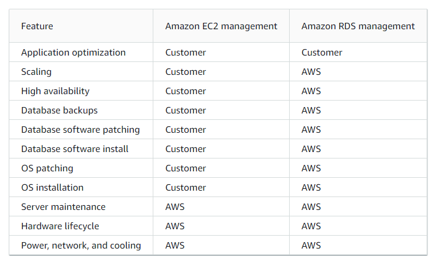
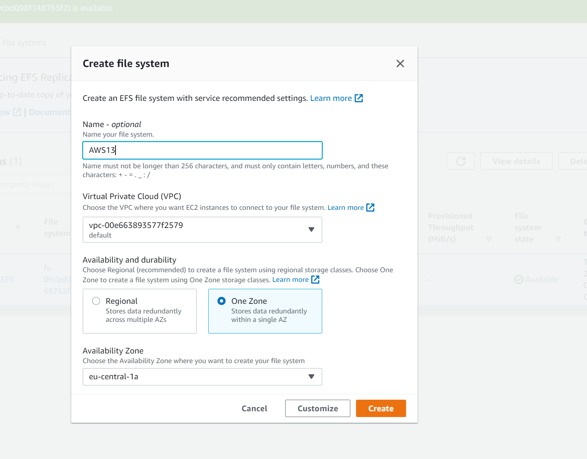

# Files app services, CDN, DNS & Database
Study and try to apply: EB, Cloudfront, Route53, EFS and RDS/aurora.

I will change my way of creating my answers from now on. Instead of having a key term part and a result part i will create a Theory block where i talk and explain theory parts and then i will also have a practical part. In the theory part i will answer the same questions for every subject and have a general piece of information. So basicly im changing the names but i want to restructure my answering a bit because the exercizes are also changing.

### Sources
1. Aurel my classmate.
2. [EB](https://docs.aws.amazon.com/elasticbeanstalk/latest/dg/Welcome.html)
3. [ALTS](https://stackshare.io/aws-elastic-beanstalk/alternatives)
4. [VS](https://www.justaftermidnight247.com/insights/cloudformation-vs-elastic-beanstalk-aws-paas-and-iac-services/#:~:text=Beanstalk%20is%20PaaS%20(platform%20as,has%20a%20lot%20to%20offer.))
5. [CloudfrontandS3](https://aws.amazon.com/blogs/networking-and-content-delivery/amazon-s3-amazon-cloudfront-a-match-made-in-the-cloud/)
6. [ALTS2](https://www.g2.com/products/amazon-cloudfront/competitors/alternatives)
7. [EFS](https://docs.aws.amazon.com/efs/latest/ug/whatisefs.html)
8. [EFSint](https://aws.amazon.com/blogs/storage/easy-to-use-amazon-efs-integrations-with-aws-compute-services/)
9. [EFSvsS3](https://www.justaftermidnight247.com/insights/ebs-efs-and-s3-when-to-use-awss-three-storage-solutions/)
10. [RDS]https://docs.aws.amazon.com/AmazonRDS/latest/UserGuide/Welcome.html)
11. [Aurora](https://docs.aws.amazon.com/AmazonRDS/latest/AuroraUserGuide/CHAP_AuroraOverview.html)
12. [EFStut](https://docs.aws.amazon.com/efs/latest/ug/gs-step-two-create-efs-resources.html)

### Overcome challenges
This was the first assignment in a new way of "learning" and doing the assignments so i was a bit nervous on how do it. But after talking with aurel we mostly agreed on how to tackle the new form of assigments.
Also lots and lots of things to read, learn and remember. And hard to decide what i should really learn and what i should let go of for now.

## Theoretical part.

I will answer these 4 quesions for every subject:
  
  1. What is "subject" for?
  2. What does "subject" replace compared to how it was done before?
  3. Can i and how to combine "subject" with other services?
  4. What is the difference between "subject" and other similar services. 

### ***Elastic Beanstalk(EB).***

1. Elastic beanstalk makes you able to launch, deploy and manage your applications in the AWS cloud without the needs to learn how the infrasctructure works and HOW the managing works. But it does not limit you to certain management decisions, you still have full control. For example you can deploy your newly made app and EB will handle the details of capacity provisioning, load balancing, scaling, and application health monitoring. This way you can focus a 100% on managing your app and your customers. EB makes managing your applications less complex. 
2. There was no service like EB before. Before hand if you wanted to deploy your app you needed to learn how to manage it. How to build the infrastructure and how to manage and gather enough resources. Many times this would end up in under or over provisioning or not having enough focus on the app itself because manegement needs time, and most important it would cost alot of money. If you want to read about the history of EB itself i recommend you to go here: [EB history](https://docs.aws.amazon.com/elasticbeanstalk/latest/platforms/platform-history.html)

3. EB is connected to alot of other AWS services because it needs/uses them. When you launch a new application, EB will launch an environment and gather/provide the resources it needs, for example you tell EB you want to launch a web application, EB will then provide an EC2 instance for you. This way EB automatically combines and uses alot of different AWS resources, as a customer you dont need to worry about this because it happens automatically.
4. There are quiet some alternatives for EB, most not in AWS itself but some are. I will list the top 8 alternatives and explain 1 of the alternatives in AWS itself. 

   - Google app engine.
   - Docker.
   - Azure App Serive.
   - Kubernetes.
   - Heroku.
   - Apollo.
   - AWS CodeDeploy.
   - AWS CloudFormation. (i will compare this one with EB)

**Elastic Beanstalk VS CloudFormation:**
Both services essentially have the same goal, deploying your applications. But they approach this very differently. EB is PaaS(platform as a service) and CF is IaC(infrastructure as code). The most important difference is that EB handles deployment and provisioning, so it makes it easier and more comfortable for you While CloudFormation needs alot of imput, So giving you alot of control. 

So what is EB good for?
Beanstalk can be great for teams who dont have time and resources to invest in the cloud itself. EB is simply said the easier way
CF will be good for? Teams who have the knowlegde about the cloud or when they really need full control. CF is simply said the harder way.
  
### ***Cloudfront.***

1. Cloudfront is a service that peeds up distribution of your static and dynamic web content, For example html and css files. Cloudfront does this by using edge locations. When a user requests your HTML page and you serve it with cloudfront, that request will be routed to the nearest edge location, this way the user will have te shortest delivery time and the best performance. By using edge locations Cloudfront can be used globally and requests can be delivered globally in seconds. Cloudfront is a CDN(Content Delivery Network.)
2. Before Cloudfront, Content needed to be stored locally. For example If you wanted your content that is stored in a S3 bucket to be delivered with the lowest latency as possible, it would mean that you needed to create a physical data center close to the user and store your content there aswell. Cloudfront is used to speed this all up. So before cloudfront you just needed to wait a little longer when surfing the WEB.
3. Yes you can combine Cloudfront with other services. Cloudfront uses the backbone of the AWS network itself. One of the best combinations by AWS ever is Cloudfront + S3 buckets. This is because when you store your static web content in a S3 bucket you no longer need to worry about scaling, S3 does this for you. S3 is serverles, So no more worries about patching and updating. S3 gives you the option to use OAI(Origin Access Identity), so you can secure your content by creating acces restrictions. So when you combine S3 with the Cloudfront delivery you can have cheap, efficient, automatic and secure content delivery to your web users. AWS calls this: A match made in heaven.
4. AWS cloudfront has quiet some competitors, I will list some below and explain the differences from 1 of them.

    - Cloudflare CDN (I will compare this one to Cloudfront)
    - Fastly
    - Azure CDN
    - Varnish Software
    - Imperva App Protect
    - KeyCDN
    - Sucuri
    - Akamai

**Cloudfront VS CloudFlare CDN:**
The key differences in these services is that cloudfront is purely focused on speeding up content delivery while cloudflare also offers DDos protection and a WAF. Another big and important difference is that Cloudflare works like a DNS for your website while cloudfront works directly with your network so it can deliver content instantly.

### ***Route 53.***

1. Route 53 is a highly scalable DNS web service, it has 3 main functions that you can use in any combination you want. These 3 are Domain registration, DNS routing and health checking. When you decide to use all three functions you do need to apply them in a certain order. You can use Route 53 to route to non-AWS infrastructures aswell.
    
    1. Register Domain name.
    2. Route internet traffic to the resources for your domain.
    3. Check the health of your resources.
2. Before AWS route 53 existed people would just have to use older DNS services, less available, less scalable and with less functions.
3. Route 53 can almost be combined with all other AWS services. You can use route 53 to log requests that are sent to the Route 53 API, monitor the status of your resources and assign tags to your resources. But you can also use route 53 to route internet traffic to your AWS resources.
One example for monitoring is Route 53 + Cloudwatch. You can use cloudwatch to monitor and check your route 53 health checks, Route 53 submits automated requests over the internet to your application, server, or other resource to verify that it's reachable, available, and functional. A routing example is Route 53 + ELB. If you host a website on multiple Amazon EC2 instances, you can distribute traffic to your website across the instances by using an ELB load balancer. The ELB service automatically scales the load balancer as traffic to your website changes over time. hereby you can use Route 53 to route traffic for your domain to your load balancer.
4. AWS has alot of competitors for their DNS service, below i will list a few and explain the differences from one of them. 

    - Cloudflare DNS (I will explain the differences to route 53)
    - Google cloud DNS
    - Azure DNS
    - GoDaddy Premium DNS
    - DNS Made Easy
    - ClouDNS
    - Ultra DNS
    - NS1
    - DNSimple
    - EasyDNS

**Route 53 VS CloudFlare DNS:** I think the biggest but also most important difference is that in times of failures and errors both services handle it very differently, or better said, 1 does not handle it at all. For example, your server goes down, Cloudflare DNS will keep redirecting users to it anyway. But route 53 wont, route 53 will redirect them to a different working server until the issue has been solved. Also Cloudflare is highly focused on speed and from what i have read, i can believe that they are also VERY good at that. and they also have privacy high in their priority list, for example they dont log your IP adress. Most of the neutral recommendations i have read actually recommend Cloudflare over Route 53, BUT route 53 is much more customizable and route 53 can perfectly fit and combine with other AWS services.

### ***Amazon Elastic File System(EFS).***

1. AWS EFS provides an easy to work with, serverless elastic file system for other AWS Services like EC2 and Lambda. EFS is created to scale on demand to petabytes(1000TB) without disrupting applications, like alot of other AWS services EFS takes away the needs from you for provisioning and capacity managing. EFS is easy to use because EFS has a simple web services interface that allows you to create and configure file systems quickly and easily. EFS also takes infrastructure management out of your hands by managing the entire file storage infrastructure for you. Another great feauture about EFS is that multiple instances can acces EFS file systems at the same time. Multiple EC2 and Lambda instances could acces the same EFS and therefor having a common data source for workloads. The 3 big USP's from EFS are: High scalability, High durability and High Availability. EFS also has multiple storage classes with: EFS Standard, EFS Standard–Infrequent Access (Standard-IA), EFS One Zone, and EFS One Zone–Infrequent Access (EFS One Zone-IA).

2. Before EFS there no such thing similar to it. Everyone needed todo it manually. Manually make sure you had enough capacity and create more or less. Manually provide the resources and manually do all the management. Sounds like quiet alot of work to me now i can see how easy AWS makes everything.
3. Yes you can combine EFS with other services, EFS basicly is created to work with other services. AWS is making it easier and easier to integrate their services with eachother. In a recent update AWS made it possible that you can launch a new EC2 instance and in your EC2 console you can create and attach it to your EC2 instance.
4. There are alot of alternatives for EFS, also inside AWS itself, i will list 8 below and talk about 1 of them.
    - Dropbox
    - Cloudapp
    - Google Cloud Filestorage
    - LucidLink Filespaces
    - Filerobot
    - Vchasno
    - AWS S3 (i will explain the differences for this one)
    - AWS EBS

**AWS EFS VS AWS S3:** Both Services have similar foundations but very different use cases, so usually you can decide wich one you want or need by establishing your needs and understanding in wich situations either S3 or EFS works best. So when should you use EFS? EFS is a good option when you need a shared file storage with auto high-performing scaling. Content management systems benefit from this higly because of the autoscaling, and also app development benefits highly because EFS is ideal for code and media file storage. So why use S3? S3 has an archiving system so when you need to store long term data like reports and records S3 will store this for you at a way lower cost then EFS. S3 can also handle data on which complex queries may be run. So S3 is useful for data related to customer purchases, behaviour or profiles, because that data can be easily queried and fed into analytics tools. S3 is also great for back ups and restoration as it can be combined with AWS glacier.

### ***AWS RDS(Relational Database Service):***

1. Amazon Relational Database Service (Amazon RDS) is a web service that makes it easier to set up, operate, and scale a relational database in the AWS Cloud. It provides cost-efficient, resizable capacity for an industry-standard relational database and manages common database administration tasks.

2. Like most other services in my assignment there was nothing before AWS RDS, before RDS you simply needed to host, manage, create and scale your own database. You would problably use MySQL and i think alot of people still use MySQL

3. Yes you can combine RDS with other instances as most AWS services can be used with eachother. But i dont think you really combine RDS with other services. When you need a DB and you work with AWS you "will" use RDS but you would still problably use EC2 at the same time, or S3 or other services. This is because i think most application dont just need a database but also other things, for example a webshop, probably you will use EFS for the shop itself but a EFS DB to store customer account details. But there are other AWS services that could be considered to be combined and one of those services is AWS Aurora, i will explain a bit about aurora later. I said could be considered because Aurora is an option for RDS as a DB engine, just like MY]ySQL and PostgreSQL. Since it is already inside RDS i dont think it is combining.

4. In AWS it self there is already a big question when you migrate your apps from on-premise to AWS. Should i use EC2 or RDS to host my database. I can explain why but i can also just share 1 table with you about the DB management and you will instantly understand why you should almost always pick RDS over EC2, (this does not mean you should not use EC2).

### What is AWS Aurora?

Amazon Aurora (Aurora) is a fully managed relational database engine that's compatible with MySQL and PostgreSQL. Aurora includes a high-performance storage subsystem. Its MySQL- and PostgreSQL-compatible database engines are customized to take advantage of that fast distributed storage. The underlying storage grows automatically as needed. An Aurora cluster volume can grow to a maximum size of 128 tebibytes. Aurora also automates and standardizes database clustering and replication, which are typically among the most challenging aspects of database configuration and administration. Aurora takes advantage of the AWS RDS features for management and administration. Aurora uses the Amazon RDS AWS Management Console interface, AWS CLI commands, and API operations to handle routine database tasks such as provisioning, patching, backup, recovery, failure detection, and repair.

## Practical part.

Below you can see i am creating a EFS.

### Results

