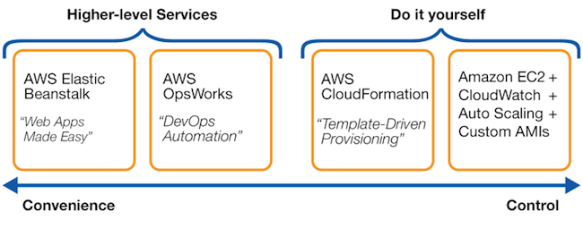

# Files app services, CDN, DNS & Database
Study and try to apply: EB, Cloudfront, Route53, EFS and RDS/aurora.

I will change my way of creating my answers from now on. Instead of having a key term part and a result part i will create a Theory block where i talk and explain theory parts and then i will also havea practical part. In the theory part i will answer the same questions for every subject and have a general piece of information. So basicly im changing the names but i want to restructure my answering a bit because the exercizes are also changing.

### Sources
1. Aurel my classmate.
2. [EB](https://docs.aws.amazon.com/elasticbeanstalk/latest/dg/Welcome.html)
3. [ALTS](https://stackshare.io/aws-elastic-beanstalk/alternatives)

### Overcome challenges
This was the first assignment in a new way of "learning" and doing the assignments so i was a bit nervous on how do it. But after talking with aurel we mostly agreed on how to tackle the new form of assigments.

## Theoretical part.

I will answer these 4 quesions for every subject:
  
  1. What is "subject" for?
  2. What does "subject" replace compared to how it was done before?
  3. Can i and how to combine "subject" with other services?
  4. What is the difference between "subject" and other similar services. 

### ***Elastic Beanstalk(EB).***

1. Elastic beanstalk makes you able to launch, deploy and manage your applications in the AWS cloud without the needs to learn how the infrasctructure works and HOW the managing works. But it does not limit you to certain management decisions, you still have full control. For example you can deploy your newly made app and EB will handle the details of capacity provisioning, load balancing, scaling, and application health monitoring. This way you can focus a 100% on managing your app and your customers. EB makes managing your applications less complex. 
2. There was no service like EB before. Before hand if you wanted to deploy your app you needed to learn how to manage it. How to build the infrastructure and how to manage and gather enough resources. Many times this would end up in under or over provisioning or not having enough focus on the app itself because manegement needs time, and most important it would cost alot of money. If you want to read about the history of EB itself i recommend you to go here: [EB history](https://docs.aws.amazon.com/elasticbeanstalk/latest/platforms/platform-history.html)
3. EB is connected to alot of other AWS services because it needs them. When you launch a new application, EB will launch an environment and gather/provide the resources it needs, for example you tell EB you want to launch a web application, EB will then provide an EC2 instance for you. This was EB automatically combines and used alot of different AWS resources, as a customer you dont need to worry about this because it happens automatically.
4. There are quiet some alternatives for EB, most not in AWS itself but some are. I will list the top 8 alternatives and explain 1 of the alternatives in AWS itself. 

    1. Google app engine.
    2. Docker.
    3. Azure App Serive.
    4. Kubernetes.
    5. Heroku.
    6. Apollo.
    7. AWS CodeDeploy.
    8. AWS CloudFormation. (i will compare this one with EB)

**Elastic Beanstalk VS CloudFormation:**
Both services essentially have the same goal, deploying your applications. But they approach this very differently. EB is PaaS(platform as a service) and CF is IaC(infrastructure as code). The most important difference is that EB handles deployment and provisioning, so it makes it easier and more comfortable for you While CloudFormation needs alot of imput, So giving you alot of control. 

So what is EB good for?
Beanstalk can be great for teams who dont have time and resources to invest in the cloud itself. EB is simply said the easier way
CF will be good for? Teams who have the knowlegde about the cloud or when they really need full control. CF is simply said the harder way.
  
### ***Cloudfront.***

1. 

## Practical part.

### Results

