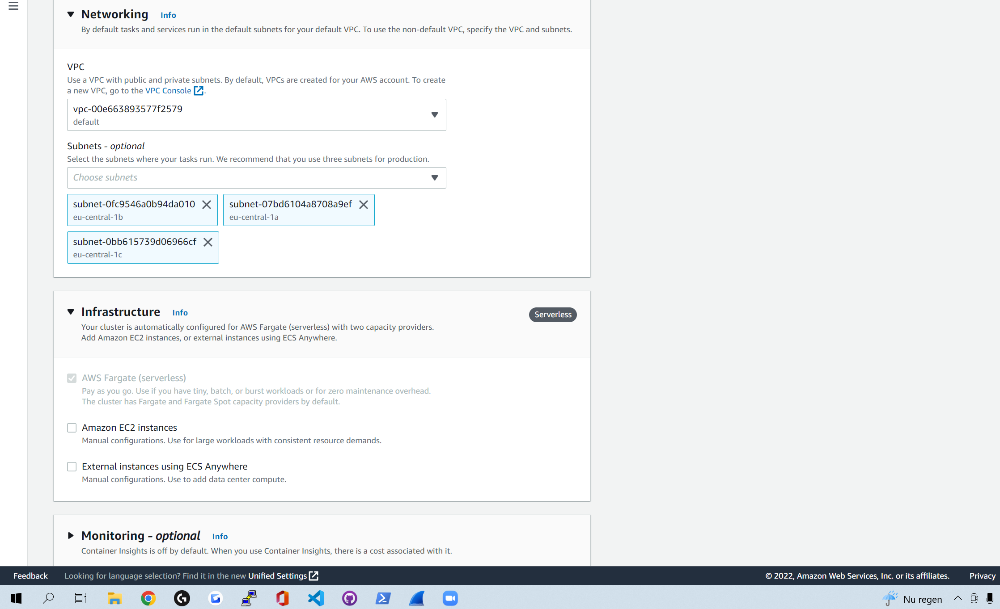

# ECS (Elastic Container Service)
Study ECS

### Sources
1. Aurel and Ben my classmates
2. [Container](https://docs.aws.amazon.com/AmazonECS/latest/developerguide/ECS_instances.html)
3. [ECS](https://docs.aws.amazon.com/AmazonECS/latest/developerguide/Welcome.html)
4. [Task defs](https://docs.aws.amazon.com/AmazonECS/latest/developerguide/task_definition_parameters.html)

### Overcome challenges
Lots of stress in the start because of little time for 10 subjects this week.

## Key terms

***Task definition:*** Task definitions are some form of a blueprint for containers. With Amazon ECS, your containers are defined in a task definition that you use to run an individual task or task within a service. In this context, a service is a configuration that you can use to run and maintain a specified number of tasks simultaneously in a cluster. So in ECS a task definition defines your containers. THe parameters for these definitions are: the task family, the IAM task role, the network mode, container definitions, volumes, task placement constraints, and launch types.

## Theoretical part.

I will answer these 4 quesions for ECS:
  
  1. What is "subject" for?
  2. What does "subject" replace compared to how it was done before?
  3. Can i and how to combine "subject" with other services?
  4. What is the difference between "subject" and other similar services. 

1. The name does suggest it a a little bit already but ECS is a container management service. The word elastic meaning scalable, and in ECS's case higly scalable. It can be used to manage multiple containers in a cluster. Just to be sure, a container is a EC2 instance. And these containers are defined by task definitions. If you dont mind having less control yourself over your containers and services you could run them on a serverless infrastructure that's managed by AWS Fargate. If you rather have more control you can run your tasks and services on a cluster of Amazon EC2 instances that you manage.

2. I have given this answer a little bit in question 1 but before ECS existed you just had full control yourself, You could hire people todo the managing for you but that costs alot of money. With ECS you no longer need to manage your own containers and instead you can fully focus on your app or customers or anything else that needs focus.

3. You can easily combine ECS with Fargate and EC2, You can use ECS to manage your container and use fargate to manage your serverless instances where your containers are running on, This way you wont have alot of control yourself but you will have alot of time savings because no management. With EC2 its some what the other way around, a EC2 instance is managed by yourself, but you can still use ECS to run and manage the containers ON the instances. But you do need to manage the EC2 yourself. This gives more control than Fargate.

4. ***AWS ECS vs Azure Kubernetes Service***

    These 2 have alot of similarities BUT they are fundamentally different. In my opinion a funny thing is that AWS also has EKS(elastic kubernetes service), so if you want the best out of both worlds you can also just use AWS EKS. Back to the differences between ECS en AKS, One of the biggest differences is that ECS relies on either EC2 instances or fargate platforms offering on-demand pricing, scalability, security, reliability, and cost-efficiency. AKS is a open source container management solution creating the option to use many different platforms instead of just 2 like ECS. This creates alot of flexibility in terms of configuration. In my personal opinion the ease for customers difference between the 2 is huge. ECS has a easy way to set it up, you use the AWS console, you select what you want and there you go, this makes it extremely usefull for customers without expertise. ASK on the other hand does need expertise to set it up. You will have way more control and know exactly what is happening but you do need the knowlegde and now all customers have it.

### Practical Results
This exercize was a full theory assignment.

But below you can see a part of cluster creation in ECS. You can see the 3 launch types.

