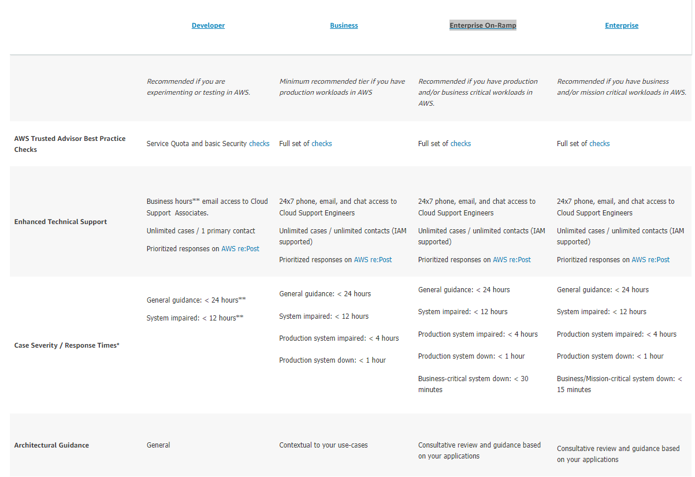
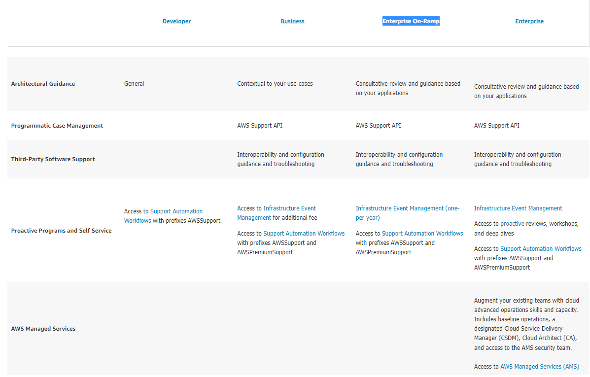
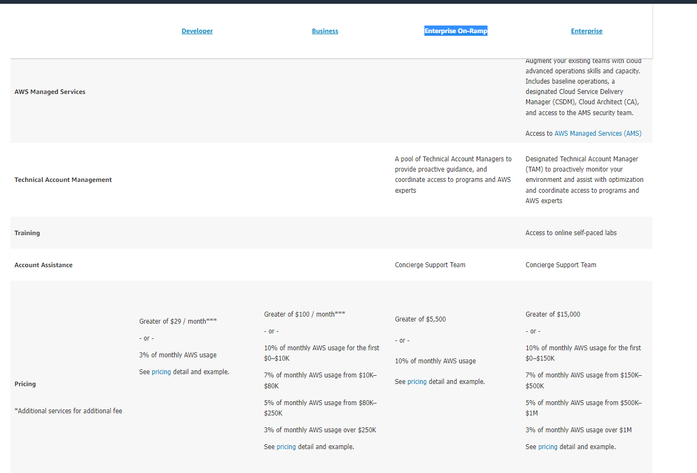

# AWS Support Plans
Study AWS Support Plans

### Sources
1. Aurel my classmate
2. [Supp plans](https://aws.amazon.com/premiumsupport/plans/)

### Overcome challenges

## Theoretical part.

AWS support plans AWS packages that are designed to give you the right mix of tools and access to expertise so that you can be successful with AWS while optimizing performance, managing risk, and keeping costs under control. There are 4 different support plans, and a basic support plan but the basic support plan is included in all the other 4. The Basic support includes: 
- ***Customer Service and Communities:*** 24x7 access to customer service, documentation, whitepapers, and AWS re:Post.
- ***AWS Trusted Advisor:*** Access to core Trusted Advisor checks and guidance to provision your resources following best practices to increase performance and improve security.
- ***AWS Personal Health Dashboard:*** A personalized view of the health of AWS services, and alerts when your resources are impacted.
To explain the differences i will simply show you the table AWS created for this themselves, i think their own explanation explains it way better then i would in my own words, or i would write a way to long page. The 4 Support plans are:

1. Developer
2. Business
3. Enterprise On-Ramp
4. Enterprise

### Practical Results
This exercize was a full theory assignment.

