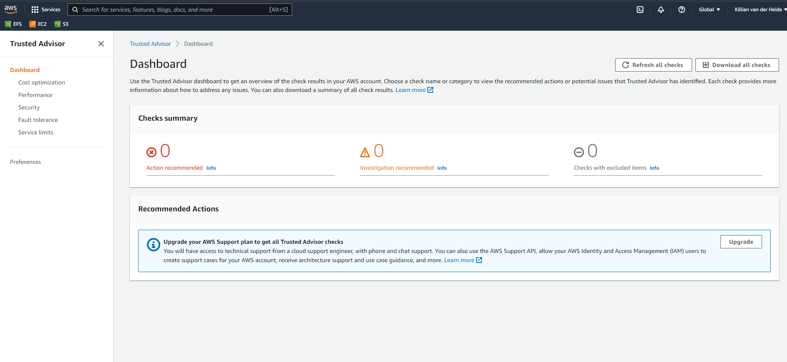

# Trusted Advisor
Study Trusted Advisor

### Sources
1. Aurel my classmate
2. [Trust adv](https://docs.aws.amazon.com/awssupport/latest/user/trusted-advisor.html)

### Overcome challenges
hard to stick to frontpage knowledge because i see alot of keyterms that i will need later.

## Theoretical part.

Trusted advisor is like it says, A advisor. It will check upon your enviroment and tell you where you can save money or make it more efficient or have security breaches, etc etc. The trusted advisor does differ with what support plan you have, maybe you remember from my previous assignment but If you have a Developer Support plan, you can use the Trusted Advisor console to access all checks in the Service Limits category and six basic checks in the Security category. And if you have a Business, Enterprise On-Ramp, or Enterprise Support plan, you can use the Trusted Advisor console and the AWS Support API to access all Trusted Advisor checks.

Below you can see how the AWS console mainpage of the trusted advisor looks like.

### Practical Results
This exercize was a full theory assignment.

