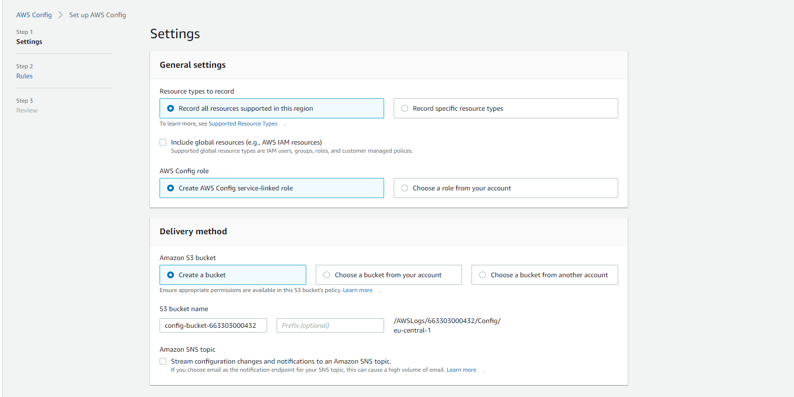
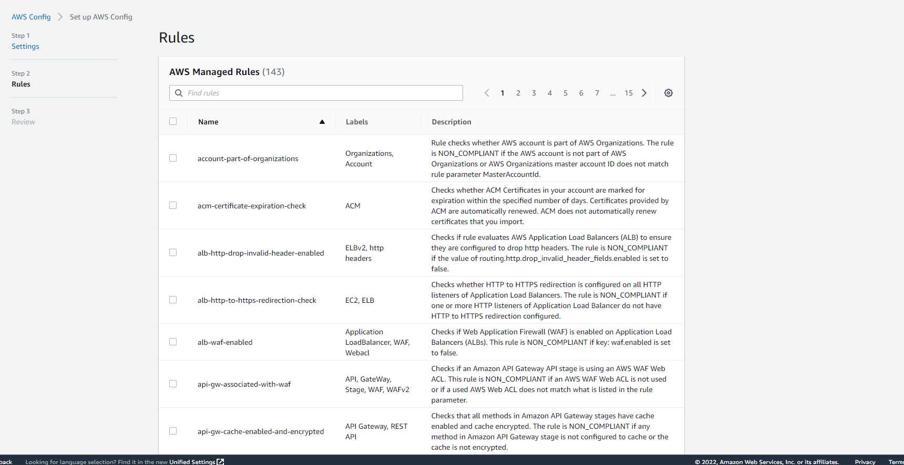
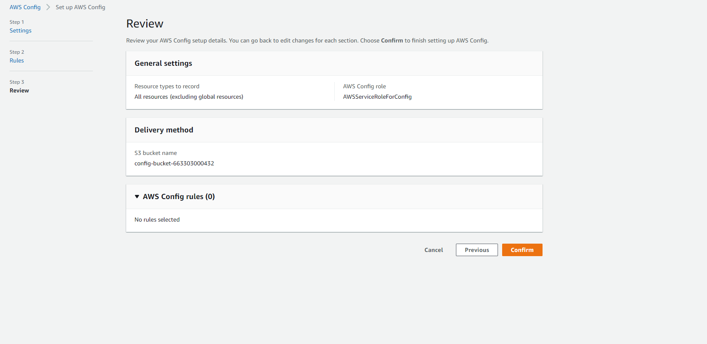

# AWS Config
Study AWS Config

### Sources
1. [Conf](https://docs.aws.amazon.com/config/latest/developerguide/WhatIsConfig.html)

### Overcome challenges
None really, just alot of reading again.

## Theoretical part.

AWS Config provides a detailed view of the configuration of AWS resources in your AWS account. This includes how the resources are related to one another and how they were configured in the past so that you can see how the configurations and relationships change over time.

***With AWS Config, you can do the following:***

- Evaluate your AWS resource configurations for desired settings.
- Get a snapshot of the current configurations of the supported resources that are associated with your AWS account.
- Retrieve configurations of one or more resources that exist in your account.
- Retrieve historical configurations of one or more resources.
- Receive a notification whenever a resource is created, modified, or deleted.
- View relationships between resources. For example, you might want to find all resources that use a particular security group.

So basicly AWS config is your entire AWS view, very very handy in my opinion. For example, f you ever wonder about how someone could have gotten acces to sensivite information, you can check the history of the IAM settings and permissions. When you own a application your usual goal is grow and expand, this will make you use more resources. AWS config helps you keep control and have a overview of this.

Below you can see the 3 steps of how to set up a AWS config. What you will see and what really intrested me is the sheer amount of rules and checkups you can select. I wonder how long it takes to set a config up.

### Practical Results
This exercize was a full theory assignment.

