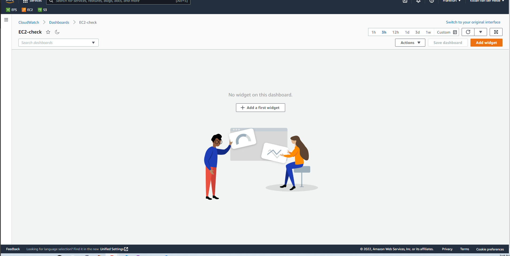
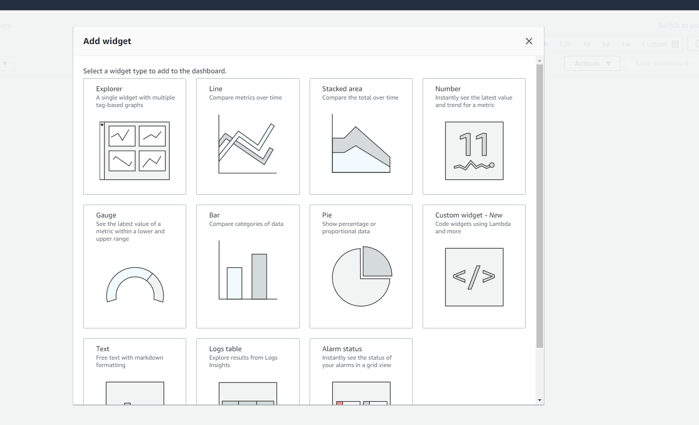
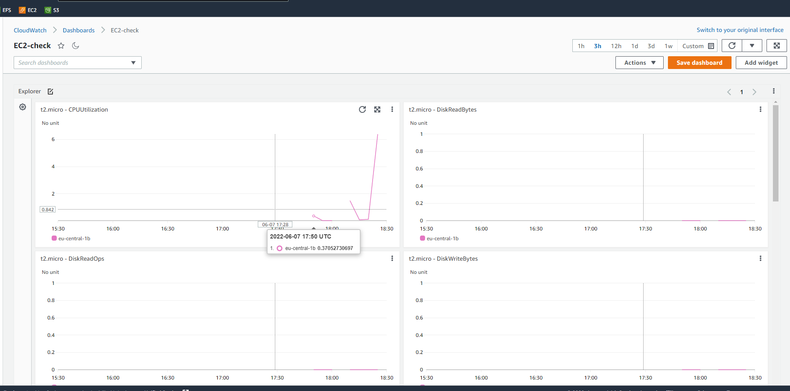

# AWS Cloudwatch
Study Cloudwatch and show where you can find it and try to apply it.

## What is Cloudwatch

I would simply say that Cloudwatch is your personal AWS security camera because Amazon CloudWatch monitors your Amazon Web Services (AWS) resources and the applications you run on AWS in real time. You can use CloudWatch to collect and track metrics, which are variables you can measure for your resources and applications.

The CloudWatch home page automatically displays metrics about every AWS service you use. You can additionally create custom dashboards to display metrics about your custom applications, and display custom collections of metrics that you choose.

You can create alarms that watch metrics and send notifications or automatically make changes to the resources you are monitoring when a threshold is breached. For example, you can monitor the CPU usage and disk reads and writes of your Amazon EC2 instances and then use that data to determine whether you should launch additional instances to handle increased load. You can also use this data to stop under-used instances to save money.

## Exercise
### Sources
1. [CW](https://docs.aws.amazon.com/AmazonCloudWatch/latest/monitoring/WhatIsCloudWatch.html) 

### Overcome challenges
None, i already knew what cloudwatch was because we encountered it so many times already.

### Results

Below you can see i created a new Cloudwatch Dashboard.

Below here you can see that i can add a Widget and when i do that i can select what type of widget i want. I am kinda amazed by how many options there are.

Below you can see me that i created a new EC2 instance and that i started a load test on it. Then i checked my newly created EC2 Cloudwatch widget and you can see the CPU spiking hard.

