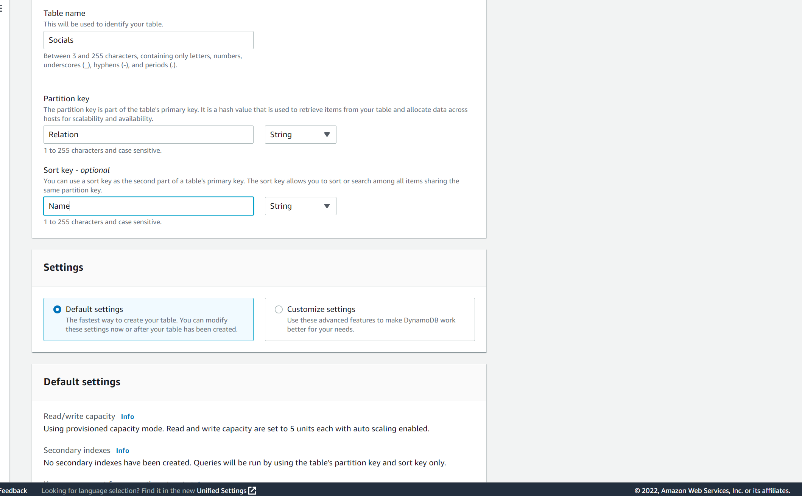
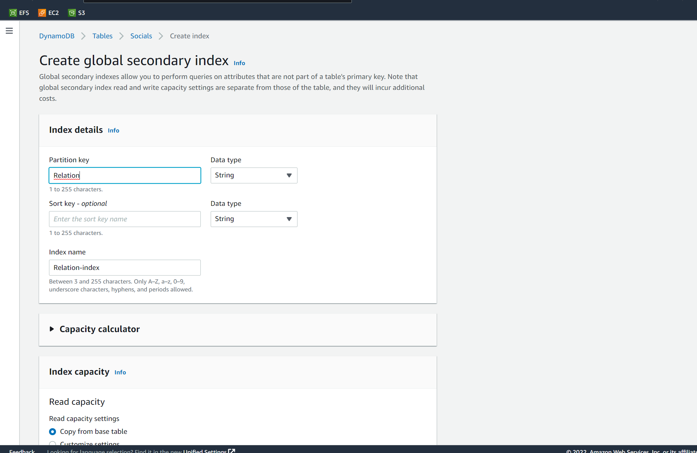
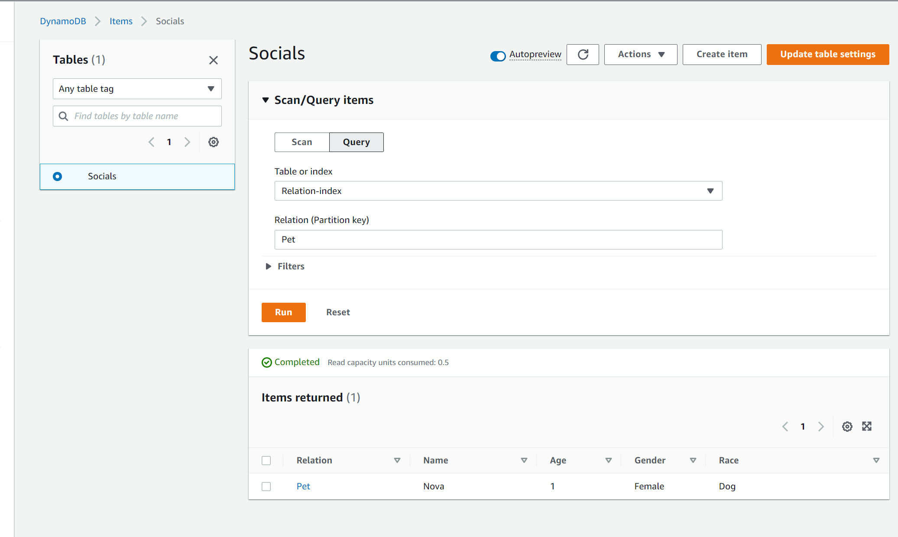

# DynamoDB
Study DynamoDB and apply your knowlegde in a self created test.

## Key terminology
- ***Encryption at rest:*** Is protecting stored data from unauthorized access by encrypting it.
- ***Encryption in transit:*** Refers to protecting your data from being intercepted while it moves between communication endpoints.
- ***Global Secondary Index:*** A index where you can add attributes as query criteria.

## What is DynamoDB?

DynamoDB is a fully managed NoSQL database service that like alot of AWS services takes alot of work out of your hands. DynamoDB takes the administrative task of operating and scaling a distributed database so that you don't have to worry about hardware provisioning, setup and configuration, replication, software patching, or cluster scaling. DynamoDB also offers a form of security by providing encryption at rest, which eliminates the operational task and complexity involved in protecting sensitive data. DynamoDB provides fast and predictable performance with seamless scalability. With DynamoDB, you can create database tables that can store and retrieve any amount of data and serve any level of request traffic. You can scale up and down your tables throughput capacity without downtime or performance degradation. This being pretty amazing because this means you can always build without being afraid of efficiency loss. 

DynamoDB provides on-demand backup capability. It allows you to create full backups of your tables for long-term retention and archival for regulatory compliance needs. And You can create on-demand backups and enable point-in-time recovery for your Amazon DynamoDB tables, To protect your tables from accidental write or delete oopsies. Also to save costs DynamoDB allows the option to automatically delete expired data.

DynamoDB offers High Availability and Durability by automatically spreading the data and traffic for your tables over a sufficient number of servers to handle your throughput and storage requirements, while maintaining consistent and fast performance. All of your data is stored on solid-state disks (SSDs) and is automatically replicated across multiple Availability Zones in an AWS Region, providing built-in high availability and data durability. You can use global tables to keep DynamoDB tables in sync across AWS Regions.

## Exercise
### Sources
1. [DB](https://docs.aws.amazon.com/amazondynamodb/latest/developerguide/Introduction.html)
2. Aurel my classmate
3. [DBtut](https://docs.aws.amazon.com/amazondynamodb/latest/developerguide/getting-started-step-8.html)

### Overcome challenges
Not much me and aurel just did everything by clicking and trying things.

### Results

As a practical exersize i am going to try to make a DynamoDB table, add data to it, read the data, edit the data,

Below you can see me creating a new DynamoDB table, this table will be about my social life.

Below you can see i added multiple items to the table and gave them more attributes.

Below you can see ive eddited a item after creating it.

Below you can see i have query filtered on classmate so i can see all my classmates in the table.

Below you can see me creaing a secondary global index so i can use that to query in my table.

Below you can see that my secondary index works and that i can use it to filter on Relations directly.

