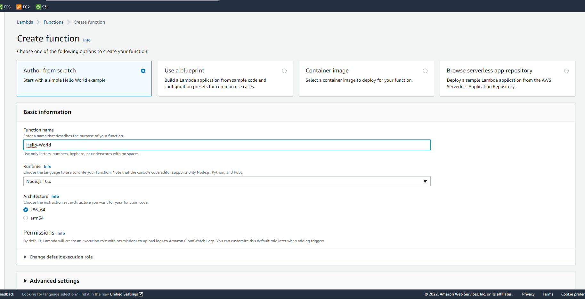

# AWS Lambda
Study lambda and show your understanding in a practical test.

## Key terminology
***JSON(JavaScript Object Notation):*** Is a standard text-based format/language for representing structured data based on JavaScript object syntax.
- ***Lambda Function:*** A function is like a executable, inside a function will be code that can be run by lambda.
- ***Lambda Trigger:*** A trigger is a resource or configuration that invokes a Lambda function.
- ***Lambda Event:*** An event is a JSON-formatted document that contains data for a Lambda function to process.

## What is Lambda

Lambda is a compute service that lets you run code without provisioning or managing servers. Lambda runs your code on a high-availability compute infrastructure and performs all of the administration of the compute resources, including server and operating system maintenance, capacity provisioning and automatic scaling, code monitoring and logging. With Lambda, you can run code for virtually any type of application or backend service. All you need to do is supply your code in one of the languages that Lambda supports, For example Node.js, Python, Ruby, Java and a few more.

## Exercise
### Sources
1. [Lambda1](https://docs.aws.amazon.com/lambda/latest/dg/gettingstarted-concepts.html#gettingstarted-concepts-function)
2. [Lambda2](https://docs.aws.amazon.com/lambda/latest/dg/welcome.html)

### Overcome challenges
None really, lambda means coding and i love coding :D, it was kinda hard for me to remember and rely purely on my memory but it worked.

### Results

As a practical test i am simple going to try to make Lambda run a 'hello world' script.

Below you can see me in the process of making a very default function.

