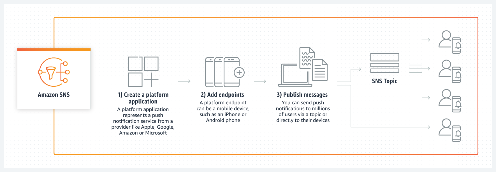
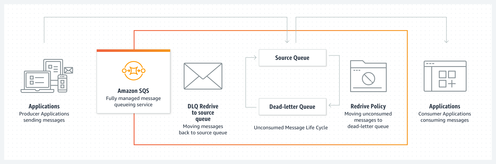
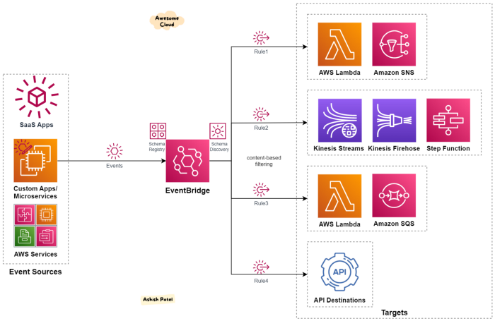
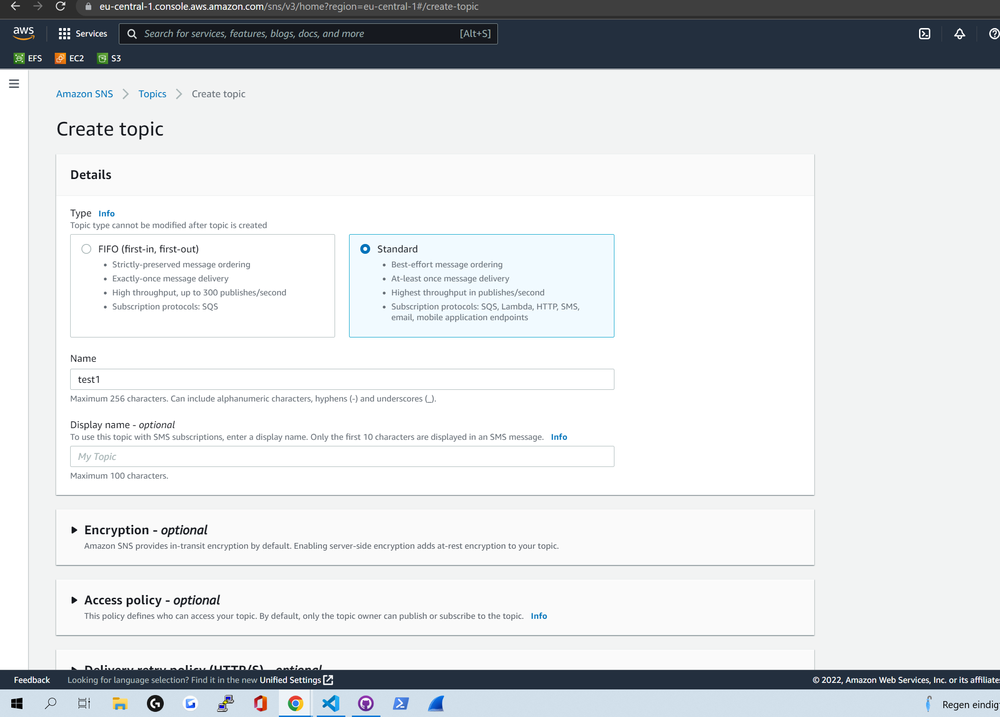
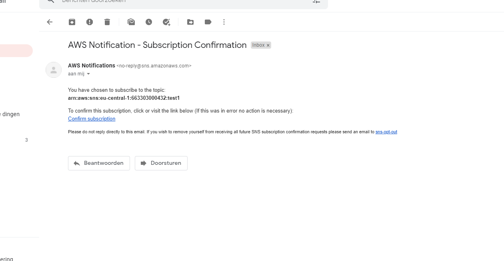
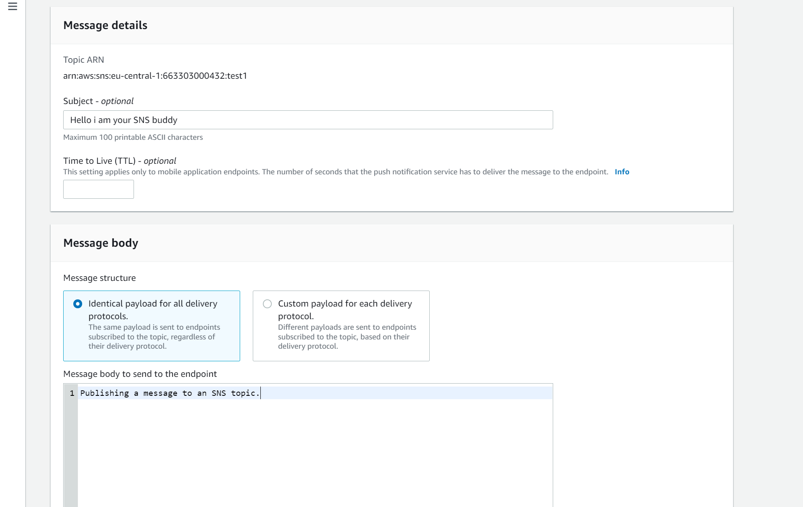

# SNS, SQS, Event Bridge

## Key terminology SNS
- ***AWS SNS(Simple Notification Service):*** Is a messaging service for AWS services. It is fully managed for application-to-application (A2A) and application-to-person (A2P) communication.
- ***A2A(application-to-application):*** The A2A pub/sub functionality provides topics for high-throughput, push-based, many-to-many messaging between distributed systems, microservices, and event-driven serverless applications. Using Amazon SNS topics, your publisher systems can sendout messages to a large number of subscriber systems, including Amazon SQS queues, AWS Lambda functions, HTTPS endpoints, and Amazon Kinesis Data Firehose, for parallel processing.
- ***A2P:*** The A2P functionality enables you to send messages to users at scale via SMS, mobile push, and email.

Below you can see Pub/Sub, SMS and Mobile push and how it works, for me these pictures made it way simpler.
1. PUB/SUB 
2. SMS 
3. Mobile Push 

## Key terminology SQS
- ***AWS SQS(Simple Queue Service):*** Like the name suggests maybe, SQS can be used as a Queue service. SQS offers a secure, durable, and available hosted queue that lets you integrate and decouple distributed software systems and components. Amazon SQS offers common constructs such as dead-letter queues. Using SQS, you can send, store, and receive messages between software components at any volume, without losing messages or requiring other services to be available. A simple example could be that 

    SQS offers two types of message queues. Standard queues offer maximum throughput, best-effort ordering, and at-least-once delivery. SQS FIFO queues are designed to guarantee that messages are processed exactly once, in the exact order that they are sent.
- ***AWS DLQ(dead-letter queues (DLQ):*** is a service which other queues (source queues) can target for messages that can't be processed (consumed) successfully. Dead-letter queues are useful for debugging your application or messaging system because they let you isolate unconsumed messages to determine why their processing doesn't succeed, or for when spikes in data happen and a service cant handle all the requests, instead of losing these requests you can "park" them into the DLQ and process them 1 by 1.

## Key terminology Event Bridge.
- ***AWS Event Bridge:*** Is a serverless event bus service that you can use to connect your applications with data from a variety of sources. EventBridge delivers a stream of real-time data from your applications, software as a service (SaaS) applications, and AWS services to targets such as AWS Lambda functions, HTTP invocation endpoints using API destinations, or event buses in other AWS accounts. You can set up rules so your event bridge knows where to route the data.
- ***Event bridge Event:*** An event indicates a change in an environment such as an AWS environment, a SaaS partner service or application, or one of your applications or services. The following are examples of events:
    - Amazon EC2 generates an event when the state of an instance changes from pending to running.
    - Amazon EC2 Auto Scaling generates events when it launches or terminates instances.
    - AWS CloudTrail publishes events when you make API calls.

## Exercise
### Sources
1. Ben en Aurel my classmates
2. [SNS](https://docs.aws.amazon.com/sns/latest/dg/welcome.html)
3. [SNS2](https://aws.amazon.com/sns/?whats-new-cards.sort-by=item.additionalFields.postDateTime&whats-new-cards.sort-order=desc)
4. [SQS](https://docs.aws.amazon.com/AWSSimpleQueueService/latest/SQSDeveloperGuide/welcome.html)
5. [SQS2](https://aws.amazon.com/sqs/)
6. [bridge](https://aws.amazon.com/eventbridge/#:~:text=Amazon%20EventBridge%20is%20a%20serverless,)
7. [bridge2](https://docs.aws.amazon.com/eventbridge/latest/userguide/eb-what-is.html)

### Overcome challenges
I was very very confused about how deep to go on these 3 subjects, and got insecure if i was learning enough about it or not.

### Practical Results 

## SNS result.

Below you can see me creating my Topic for my SNS.

Below you can see me subcribing to the topic i created above and that the endpoint will be me(a user) trough email.

Below you can see the endpoint was correct and that i confirmed my subscription.

Below you can see i published a message in the topic and that i received the message because i am subbed to the topic.

## SQS Result.

I will try to send a test message with SQS and also recieve it with SQS.

Below you can see me creating a default SQS queue.

Below you can see me sending a message to my SQS.

Below you can see that i have send 2 messages and that they are ready to be received.

Below you can see i have succesfully received my message.

## ***Next i will try to connect a SNS topic with a SQS queue as a end point. So i will send a msg with SNS and SQS will recieve it.***

Below you can see me creating a fifo sns topic.

Then you can see me creating the Fifo SQS queue.

Next you can mee see subscribing to my SNS topic with my SQS queue.

Here you can see me sending a message with SNS.

Lastly you can see that it worked succesfully and that i recieved the message with my SQS queue.

## Event bridge results.

I am going to try to use a event bridge to trigger a event rule that will send a message with SNS to a SQS queue when i upload a foto to a S3 bucket. I have already made a S3 bucket, a SNS topic and a SQS queue so i will not show the creation of those.

Below you can see me creating a EB rule.

Below you can see me uploading a picture to my S3 bucket.

And lastly you can see that i succesfully recieved a msg on my SQS trough SNS because a event rule triggered.
