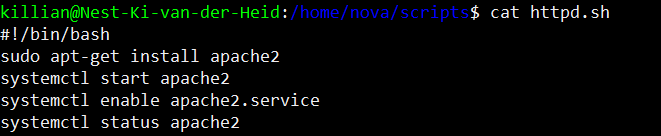
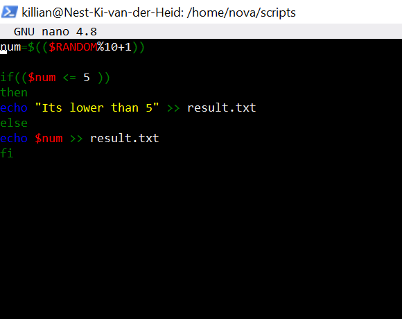
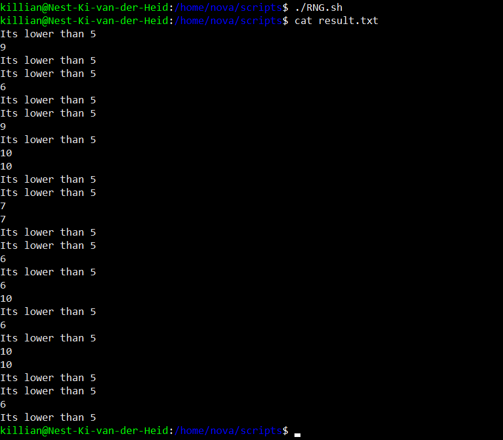

# Bash scripting 
learn scripting basics

## Key terminology
 - ***$PATH:*** Het path variable waar je je server mee verteld waar het naar executable files moet zoeken.
 - ***Variable:*** Een variable is iets wat je vult met een value en later weer kan oproepen
 - ***.sh:*** Een .sh bestand is een script. 
 - ***apt-get install programma:*** Met deze command pak je een programma en installeer je dat op jou locale machine.
 - ***systemctl start programma:*** Met deze command start je een programma wat op je machine staat.
 - ***systemctl enable programma:*** Met deze command enable je een programma.
 - ***systemctl status programma.service:*** Met deze command print je de status van een service
 - ***if, then, else:*** Met een if statement in een script kan je een script iets laten doen IF iets word gehaald en anders doet het script de else.
 

## Exercise
### Sources
1. [$PATH](https://opensource.com/article/17/6/set-path-linux)
2. [bash scripting 101](https://linuxconfig.org/bash-scripting-tutorial)
3. opdracht 3 sources over append
4. [install packages with scripts](https://blog.devgenius.io/create-a-bash-script-to-install-your-packages-automatically-55b7f0638f3e)
5. [install, activate, enable](https://docs.rackspace.com/support/how-to/centos-7-apache-and-php-install/)
6. my own memory for creating scripts

### Overcome challenges
teveel fun hebben in scripting en teveel side tracken

### Results

1. Hier zie je dat mijn script op een regel te appenden naar een text bestand is gelukt.

2. Hier zie je mijn script om apache2 te instaleren, te starten, te enablen en de status te checken en printen.

3. Hier zie je dat mijn httpd scripts is gelukt.

4. Hier zie je mijn script om een random nummer te generen en het resultaat te appenden naar een text bestand maar met een voorwaarde.

5. Hier zie je dat mijn script van result 4 werkt.

