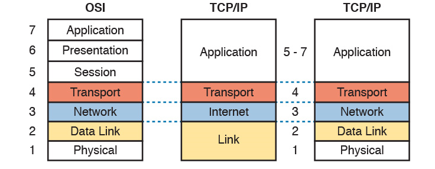
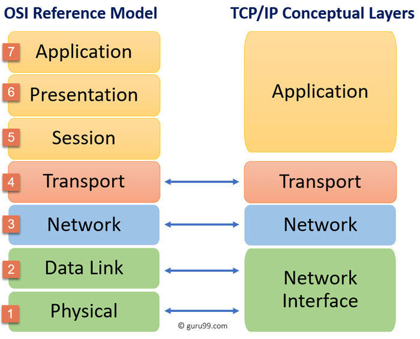
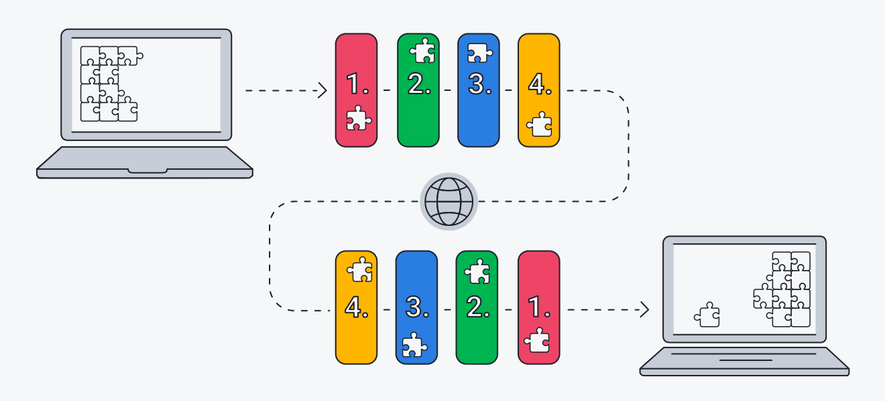

# OSI stack
Study about the OSI model and the TCP/IP model.

## Key terminology
- i will explain most keyterms in results.

## Exercise
### Sources
1. [OSI layers](https://linuxhint.com/network-osi-layers-explained/#:~:text=Open%20System%20Interconnection%20OSI%20model,performed%20on%20each%20abstract%20layer.)
2. [Intranet](https://www.techtarget.com/whatis/definition/intranet)
3. [OSI model](https://www.linux.org/threads/open-systems-interconnect-osi-model.9095/)
4. [TCP/IP](https://www.avg.com/nl/signal/what-is-tcp-ip)

5. 

6. 

7. 

8. 

### Overcome challenges
Deze opdracht is voor mij alleen maar lezen. Voor mezelf de opdracht gemaakt schrijf op en leg uit wat je begrijpt. Dat zijn alle 2 niet mijn sterkste punten. Ik leer veel beter met praktische opdrachten.

### Results

- ### The OSI model

    When Data gets send from layer 7 every layer will add a header to the data before sending it to the next layer, in these headers the layer puts information needed for the next layer. When receiving data the headers are checked processed and removed before sending it to the next layer. This process repeats until all data is send and received.

1. **Layer 7 (Application layer):** This is the layer closest to the user and as the name of the layer suggests, it is the layer that displays the data, it is also the only layer that has direct interaction with the user. Layer 7 creates connections between the end to end users, a example for this is "HTTP". HTTP enables internet connection.

2. **Layer 6 (presentation layer):** This layer Compresses date it gets from layer 7 making the data smaller and creating more efficient communincation. This also goes the other way, when this layer receives compressed data it translates/converts it and makes it presentable for layer 7.

3. **Layer 5 (Session layer):** This layer is the control  layer of the connetions, these connections between devices are called "sessions". The session layer works efficiently by only keeping a session open when data is being exchanged and closing it when the exchange is done. To make this safe the layer applies checkpoints to the data exchange, when the exchange is interupted it can continue from a checkpoint instead of starting over. The layer also determs if the transmission is "full or half duplex". 
- Full duplex means that both ends can send and receive at the same time, think about phone conversation, both persons can talk and listen at the same time.
- Half duplex means that only 1 end can talk and the other end can only receive at the same time, think about a walkie talkie, when one talks the other one can only listen.

4. **Layer 4 (Transport layer):** This layer as the name suggests is in control of data transport, this works in 2 ways. When it receives data from layer 6 is breaks this data into smaller bits called "segments" and sends these to layer 3 (the network layer). The other way around is when it receives segments from layer 3 it reassembles these segments before sending them to layer 5. This layer applies Flow and Error control.
- Error control, on the receivers end this makes sure the data is send and received correctly, if not it will request a re transmission.
- Flow control, on the senders end flow control makes sure the receiver is not flooded. For example when the sender has a quicker connection than the receiver the flow control will match the transmission speed to the speed of the receiver. This creates a optimal data transmission.

    Layer 4 is also where the adressing occurs, this in done in protocols TCP/IP is a example protocol more about this later.

5. **Layer 3 (Network layer):** When this layer receives segments from layer 4 it splits them into even smaller units called "packets", the destination is also in these packets. When this layer receiver packets it will reasemmble then into segments again. The network layer ALWAYS ensures data is transported in the most efficient way. Out of a billion options this layer will identify the most efficient one, this is called routing. The destinations for these packets can be "LAN" or "WAN".
- LAN, Local Area Network. If the destination is same LAN the destination adress will be copied from layer 4.
- WAN, Wide Area Network. If the destination is WAN the packets will be send to a gateway (for example a router), in this case the destination should always be the receivers gateway adress since it has to go to a different LAN. When the destinated "router" receives the packets it will transmit them to the LAN.

6. **layer 2 (Data Link):** The data link breaks the data packets from layer 3  into even smaller pieces called frames before sending them to their destination. The data link is responsible for the commuincation of physically connected nodes(nodes on the same intra-network). The data network also applies flow and error control on the communication inside in the intre-network.   

7. **Layer 1 (Physical layer):** In this layer the data frames are converted into bitstreams, These bitstreams consist of 1s and 0s. Layer 1 sends these bitstreams to a physical device trough physical resources for example: "cables (with electrical pulses)" or "hubs(with frequencies)". when the receiver received all the data in bitstream form, it will flow back to layer 7 and apear on his device for example a email.

    ***A example for this process is:***
A writes an email to B. A uses an email application to compose the message on a laptop and sends it.
The application sends the message to the application layer.
Layer 7 selects a protocol (SMTP) and passes the data to layer 6.
The presentation layer compresses the data and passes it to layer 5.
The session layer initializes the communication session and sends A’s data to layer 4.
The transport layer segments the data in the message and passes them to layer 3.
The network layer breaks the segments into packets and sends them to layer 2.
The data link layer breaks the packets down even further into frames and delivers them layer 1.
The physical layer converts the email data into a bitstream of 1s and 0s and transmits it through a cable or other physical medium.
B’s computer receives the bitstream physically through a wifi or other physical medium, and the email data begins to flow back through the same series of layers in the opposite order on B’s device.

- ## The TCP/IP model

    The TCP and IP are seperate computer network protocols together they are a suite of protocols consisting of 4 layers or 5 layers in the updated model. HTTP, FTP, and SMTP are 3 command the most used protocols. In this model the IP sorts the mail and finds the IP adress where the data needs to go and TCP sends and receives it. 

1. **Layer 1 (Network Acces Layer):** This layer is split into the Data link and physical layer again in the updated version. 

- The data link layer has 2 sublayers. 
1. 1 sublayer is the LLC (Logical Link Control) this layer talks to the network layer in this layer are your cables and your NIC
2. The other sub layer is the  MAC (Media Acces Control) this layer defines HOW devices acces the medium (cables or wifi). CSMA/CD (Carrier senes multiple acces with Collision detection)(wired) or CSMA/CA (Carrier senses multiple acces with collision avoidance)(WIFI). 

    The data link layer does error checking.

- The pshysical layer does the same thing as layer 1 in the OSI model, it encodes the data into 1s into 0s.
  
2. **Layer 2 (Internet Layer):** Like the 5th layer in the OSI model this layer provides the IP adress of the sender, it picks the best route to the destination (routing). This layer maintains the Quality of service, this makes it more efficient bij prioritizing the packets who have more prio then others for example a email has less prio then a live conversation. Thanks to the transport layer IP adresses can be connectionless networked all over the internet because the connection is already established in the transport layer.

3. **Layer 3 (Transport Layer):** This layer is the equivalant of the 4th layer of the OSI layer. This layer establishes the connections and allows communication between the applications from layer 4 on different ports. It facilitates reliable (TCP) and unreliable (UDP) end to end data transport. This layer also open and closes the connections this is also TCP

4. **Layer 4 (Application layer):** This layer is a combination of the layers 7,6 and 5 of the OSI model. Layer 4 in the TCP/IP model has protocols and services that interact with the end user.

    The key differences of the TCP/IP layer are:
    
    1. TCP/IP uses a horizontal approach, OSI does vertical approach
    2. TCP only has 5 layers while OSI has 7.
    3. The minimum head size for TCP (20bytes)is 4 times as big as the OSI minumum (5bytes)
    4. The OSI model is mainly used for troubleshooting because its a logical model and defines network communication. TCP/IP help determing HOW a specific device should connect to the net and secures its transition.