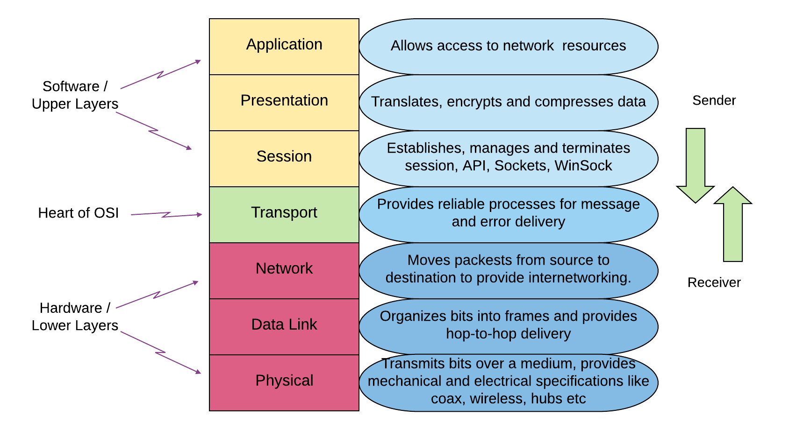

# OSI stack
Study about the OSI model and the TCP/IP model.

## Key terminology
- ***

## Exercise
### Sources
1. [OSI layers](https://linuxhint.com/network-osi-layers-explained/#:~:text=Open%20System%20Interconnection%20OSI%20model,performed%20on%20each%20abstract%20layer.)
2. 

### Overcome challenges
Deze opdracht is voor mij alleen maar lezen en voor mezelf de opdracht gemaakt schrijf op wat je begrijpt. dat zijn alle 2 niet mijn sterkste punten. Ik leer veel beter met praktische opdrachten.

### Results
1. 