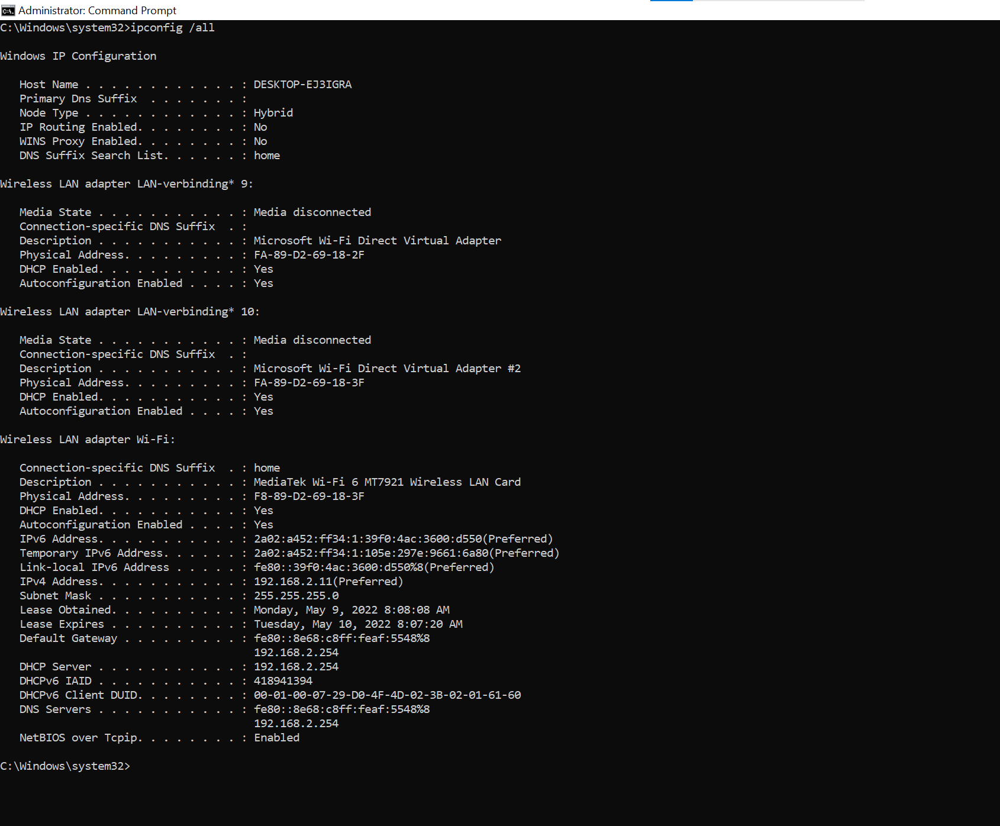

# Network Devices
Study about Networkdevices and explain commonly found functions.
Learn how to accees your router and find information inside.

## Key terminology
- ***Multiport:*** When a device uses more then 1 port for input and output.
- ***MAC adresses (Media Access Control):*** This is a physical adress and is connected to a single device. MAC adresses are in the datalink layer. A device can have multiple MAC adresses.s
- ***Star topology:*** This is a topology where all network components are pshysically connected to a central node, for example a router or a switch.
- ***Collision Domain:*** A collision domain defines a set of devices on wich their frames could collide. its a network segment connected by a shared medium or repeaters where data transmissions can collide. a collision happens when two seperate devices send a packet on the shared network segment at the same time, both devices need to resend their package.
- ***Broadcast Domain:*** This is a logical division of a computer network. Here nodes can reach eachother at the data link layer. In this domain are all devices which can reach eachother with the help of broadcast.

## Exercise
### Sources
1. [network devices](https://www.geeksforgeeks.org/network-devices-hub-repeater-bridge-switch-router-gateways/)
2. [DHCPconfig](https://en.wikiversity.org/wiki/Computer_Networks/Ipconfig/DHCP_Options#:~:text=Open%20a%20command%20prompt.,when%20it%20shows%20Lease%20Expires.)

### Overcome challenges
Een nog existing challenge, ik kan mijn router niet in.

### Results
- ***Commonly used Network devices and their functions***

    1. **Repeater:** The repeater works at the Physical layer. A repeater ensures the signal doesnt become to weak. It copies the bit by bit and regenerate to the orignal strentgh. Its important so realize is does NOT STRENGTHEN the original signal it REGENERATES it. A repeater works on 2 ports.

    2. **Hub:** A hub is basically a multiport repeater. A hub connects multiple wires coming from different branches, for example, the connector in star topology which connects different stations. Hubs cannot filter data, so data packets are sent to all connected devices.  In other words, the collision domain of all hosts connected through Hub remains one.  Also, they do not have the intelligence to find out the best path for data packets which leads to inefficiencies and wastage. There are 3 types of hubs with 3 different functions:
        
        1. **Active hub:**  These are the hubs that have their own power supply and can clean, boost, and relay the signal along with the network. It serves both as a repeater as well as a wiring center. These are used to extend the maximum distance between nodes.
        2. **Passive hub:** These are the hubs that collect wiring from nodes and power supply from the active hub. These hubs relay signals onto the network without cleaning and boosting them and can’t be used to extend the distance between nodes.
        3. **Intelligent hub:** It works like active hubs and includes remote management capabilities. They also provide flexible data rates to network devices. It also enables an administrator to monitor the traffic passing through the hub and to configure each port in the hub.

    3. **Bridge:** A bridge operates at the data link layer. A bridge is a repeater, with the add on functionality of filtering content by reading the MAC addresses of source and destinations. It is also used for interconnecting two LANs working on the same protocol. A Bridge is also a 2 port device. There are 2 types of bridges:

        1. **Transparent Bridges:** These are the bridge in which the stations are completely unaware of the bridge’s existence in example: whether or not a bridge is added or deleted from the network, reconfiguration of the stations is unnecessary. These bridges make use of two processes in example: bridge forwarding and bridge learning.
        2. **Source Routing Bridges:** In these bridges, routing operation is performed by the source station and the frame specifies which route to follow. The host can discover the frame by sending a special frame called the discovery frame, which spreads through the entire network using all possible paths to the destination.

    4. **Switch:** A switch is a multiport bridge with a buffer and a design that can boost its efficiency(a large number of ports imply less traffic) and performance. A switch is a data link layer device. The switch can perform error checking before forwarding data, which makes it very efficient as it does not forward packets that have errors and forward good packets selectively to the correct port only.  In other words, the switch divides the collision domain of hosts, but broadcast domain remains the same. 

    5. **Routers:**  A router is a device like a switch that routes data packets based on their IP addresses. The router is mainly a Network Layer device. Routers normally connect LANs and WANs together and have a dynamically updating routing table based on which they make decisions on routing the data packets. Router divide broadcast domains of hosts connected through it.

    6. **Gateway:** A gateway, as the name suggests, is a passage to connect two networks together that may work upon different networking models. They basically work as the messenger agents that take data from one system, interpret it, and transfer it to another system. Gateways are also called protocol converters and can operate at any network layer. Gateways are generally more complex than switches or routers. Gateway is also called a protocol converter. 

    7. **Brouter:** It is also known as the bridging router, its a device that combines features of both bridge and router. It can work either at the data link layer or a network layer. Working as a router, it is capable of routing packets across networks, and working as the bridge, it is capable of filtering local area network traffic.

    8. **NIC:** NIC or network interface card is a network adapter that is used to connect the computer to the network. It is installed in the computer to establish a LAN.  It has a unique id that is written on the chip, and it has a connector to connect the cable to it. The cable acts as an interface between the computer and router or modem. NIC card is a layer 2 device which means that it works on both physical and data link layer of the network model.

    --Vind een lijst met alle verbonden apparaten aan je router, kan pas als ik in mijn router kan.--

    De screenshot hier onder is mijn DHCP IP config in mijn CMD.
    Ik heb een leased IP adress meaning it will expire daily and i will need to request new ip adresses over time.
    s
