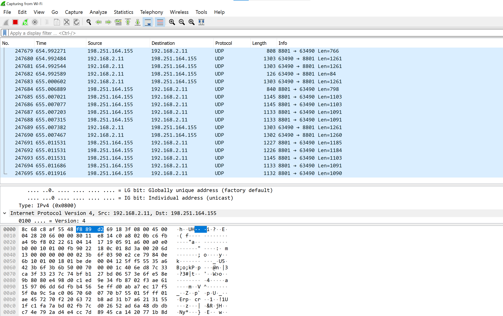

# Protocols
Find protocols and connect them to the OSI model. Learn about wireshark.

## Key terminology
- check results.

## Exercise
### Sources
1. [OSI](https://www.guru99.com/layers-of-osi-model.html#:~:text=OSI%20uses%20the%20network%20layer,uses%20only%20the%20Internet%20layer.&text=TCP%2FIP%20uses%20only%20one%20layer%20(link).)
2. [Protocolslayer 4](https://www.google.com/search?q=OSI+layer+4+what+protocols+are+used&rlz=1C1VDKB_nlNL998NL998&oq=OSI+layer+4+what+protocols+are+used&aqs=chrome..69i57j33i160j33i22i29i30.7927j0j7&sourceid=chrome&ie=UTF-8)
3. [SMTP](https://postmarkapp.com/guides/everything-you-need-to-know-about-smtp)
4. [SNMP](https://www.thousandeyes.com/learning/techtorials/snmp-simple-network-management-protocol#:~:text=The%20SNMP%20protocol%20is%20embedded,vendor%20LAN%20or%20WAN%20environments.)
5. [MIME](https://www.geeksforgeeks.org/multipurpose-internet-mail-extension-mime-protocol/)
6. [netbios](https://www.ncsc.gov.ie/emailsfrom/DDoS/NetBIOS/#:~:text=NetBIOS%20is%20an%20abbreviation%20of,local%20area%20network%20(LAN).)
7. [SPX](https://techterms.com/definition/spx)
8. [MTCP](https://en.wikipedia.org/wiki/Multipath_TCP)
9. [IPX](https://techterms.com/definition/ipx)
10. [ARP](https://www.fortinet.com/resources/cyberglossary/what-is-arp#:~:text=Address%20Resolution%20Protocol%20(ARP)%20is,%2Darea%20network%20(LAN).)
11. [ATM](https://www.lifewire.com/asynchronous-transfer-mode-817942)
12. [W3C](https://www.w3.org/Consortium/join)

### Overcome challenges
What is wireshark.

### Results

## Name some Protocols in the OSI model and in what layer they are used.
### I will name 2 protocols for every layer.

1. ***Layer 7(Application layer):*** 
    - **SMTP(Simple Mail Transfer Protocol):** This is a commmonly used protocol, big email programs like GMAIL, outlook and applemail depend on SMTP to send/push messages from a sender to a receiver. 
    Layer 7 establishes a connection with the SMTP server and the email service can connects to it. When a User hits send the email service opens a SMTP connection and the message can be send.
    - **SNMP(Simple Network Management Protocol):** This protocol like the name suggests is a protocol to manage and monitor of devices connected to the local network. SNMP is present in more then 1 local device, like the router, firewalls, and WAP's. SNMP reads MIB's (Management information bases) from local devices, with that information SNMP will know what to collect, change and configure. Usually SNMP is included in UDP.

2. ***Layer 6(Presentaion layer):***
    - **MPEG(Moving Picture Expert Group):** May sound familiar since its used alot and almost every human on earth uses it daily. MPEG is the protocol format for moving compressing and presenting audio and video containers to Layer 7.
    - **MIME(Multi Purpose Mail Extension):** Mime Adds a additional header to the original header. MIME is used in mail for example. SMPT can only send 7bit format messages. MIME makes this 8bit. This gives us the option to send emails in multiple languages like russian and chinese. SMTP cannot send binary videos and audio data. MIME does make us able to send these kinds of mail.

3. ***Layer 5(Session layer):***
    - **NetBios(Network Basic Input/Output System):** The primary purpose of NetBios is to allow applications on separate computers to communicate and establish sessions to access shared resources, for example printers, and to find each other over a LAN.
    - **SAP(Session Announcement Protocol):** The name does suggests it but the SAP protocol Announces/distributes information about multimedia sessions when a user has them. Each SAP packet contains a header and a single session description.

4. ***Layer 4(Transport Layer):***
    - **MTCP(Multipath Transaction Control Protocol:** MTCP allows the TCP connection to use multiple paths for the routing. This maximizes resource usage and reduces errors. MTCP isnt the most secure way for TCP. Since the firewalls and scanners only see 1 path.
    - **SPX(Sequenced Packet Exchange):** SPX is part of the IPX/SPX protocol SPC is similar to TCP. SPX commands are used to establish, confirm, and close connections.

5. ***layer 3(Network Layer:)*** 
    - **IPX(Internetwork Packet Exchange):** IPX is similar to IP protocol and has a similar function. IPX defines how data is send and received by systems. Together with the SPX protocol i described in Layer 4 these 2 are used create connections and send/receive data just like the TCP and IP protocol.
    - **ARP(Address Resolution Protocol):** Is a important protocol, it connects constant changing IP adresses to a MAC adresses. This is important cause IP and MAC are different lengths. This change/translation is needed because other wise the 2 systems cant recognize eachother. see this as a dutch guy and a chines guy talking to eachother in their native languages.

6. ***Layer 2(Data Link Layer):***
    - **Ethernet:** Ethernet is a communication Protocol for Local networks. It uses cables to send and receive data.
    - **ATM(Asynchronous Transfer Mode):** This protocol is for example very good for a telephone network. It supports voice, video and data communications. It uses a fixed cell size of 53 bytes, each cell processes on its own and the next cell will only start when the previous one is handled (Asynchronous).

7. ***Layer 1(Pshycical Layer):***
    - **Bluetooth:** Bluetooth is ment for short range communication. You will problably recognize this in your headset for example, or when you connect to phones to eachother. This is a done Wireless.
    - **USB(Universal serial bus)**: The name bus suggests it a little bit but USB is the litterall physical protoc to transport information from device to device (port to port). In these days you have universal USB cables to eliminate the confusion between multiple devices.
        

## Who detirmes what protocol i use and how do i introduce my own?
   -  ***W3C(World Wide Web Consortium):*** Many standards these days are standardized by the W3C. Their aim is to take the web to its full potential, creating protocols and standards that support technologies with specifications, guidelines, applications, and support programs.

   - If you want to introduce your own protocol to the W3C, you first have to apply for a member ship. this application takes a while and is very serious process.
   there are 4 main benefits of being a member:
   1. You can interact directly with the leading enterprises.
   2. You are allowed to help deciding the strategies.
   3. You are allowed to participate in groups, and you are allowed to help shape new technologies (including introducing new protocols) to enable customers.
   4. You can show leadership by ensuring and trying to make the web stay healthy. 

## Wireshark.
Wireshark is the most used packet "sniffer" in the world. Like any other packet sniffer, Wireshark does 3 things:

1. **Packet Capture:** Wireshark listens to a network connection in real time and then grabs entire streams of traffic, even thousands of packets at the same time.

2. **Filtering:** Wireshark is capable of slicing and dicing all of this live data using filters. With this filter you can search way more precise to what you need.

3. **Visualization:** Wireshark allows you to dive right into the very middle of a network packet. It also allows you to visualize entire conversations and network streams.

In this screenshot you can see some of my data transmissions in wireshark. After some testing i found that all the lines with 8801 in it is zoom communication, zoomes uses port 8801.
All the HEX coding in the bottom are the data packets filled with the data from zoom, they include the heaedrs etc. If was to unpack all that data on my own i should be able to get a screenshot of zoom from that moment of transmission.

I also found out that i have a big spyware virus in my PC, i found this out because i noticed that something called CLOUDNET 69 was interfering with every single line of communication. and when i looked into some of the protocols i noticed that cloudnet 69 send all the information to a outside IP adress(leaking my information). I am not happy about this but i do think it is funny that i already have a instant use and result from this assignment.
