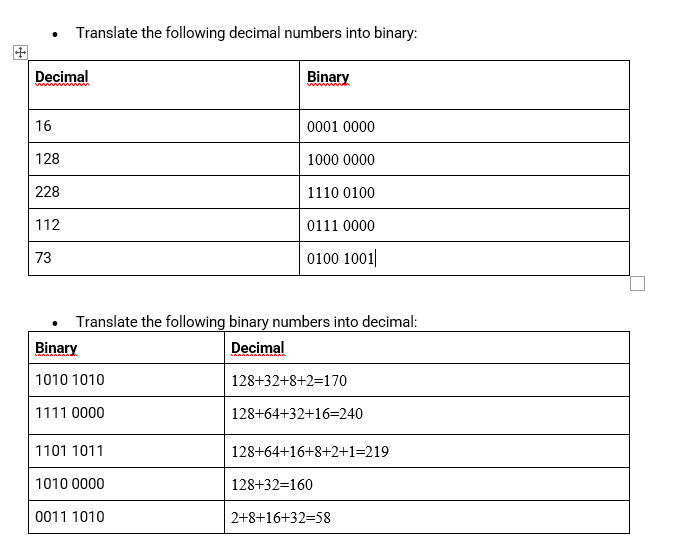
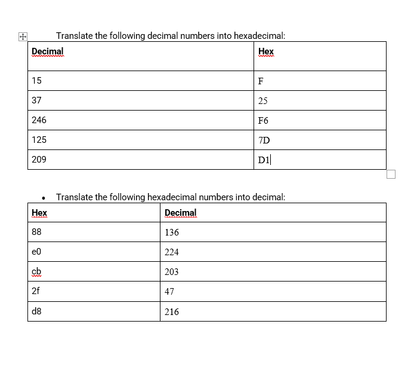

# Binary and hex
Learn how to count in Binary and hex and how to convert it to eachother and to decimal.

## Key terminology
- no key terms just math

## Exercise
### Sources
1. [YT](https://www.youtube.com/watch?v=VLflTjd3lWA)
2. [YT](https://www.youtube.com/watch?v=QJW6qnfhC70)

### Overcome challenges

### Results

1.

2. 
