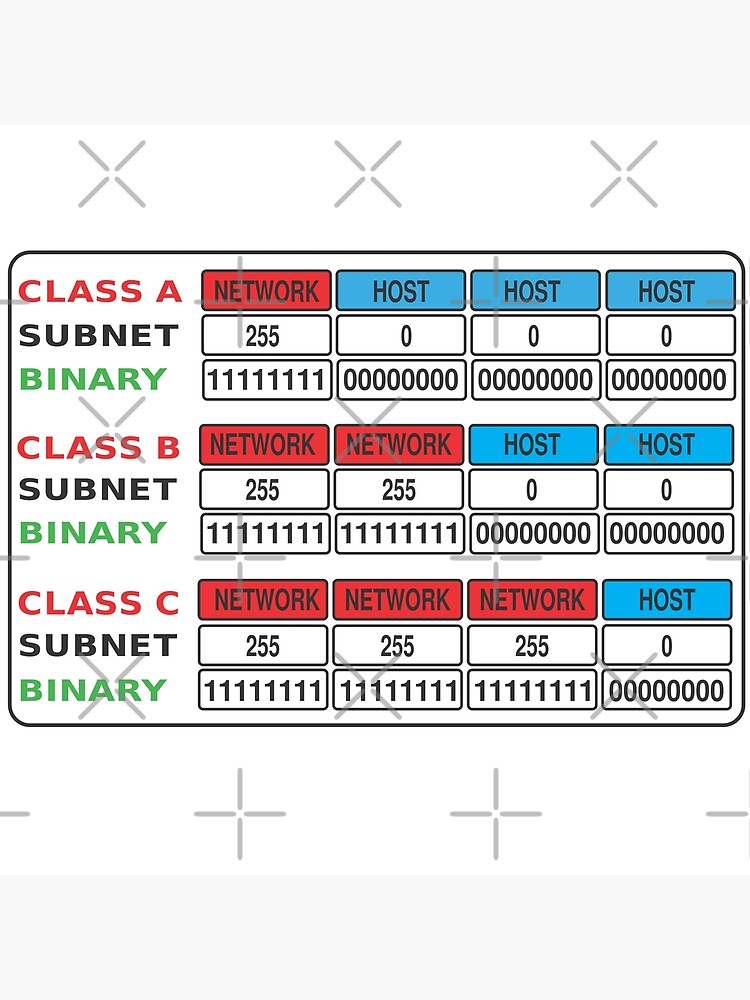
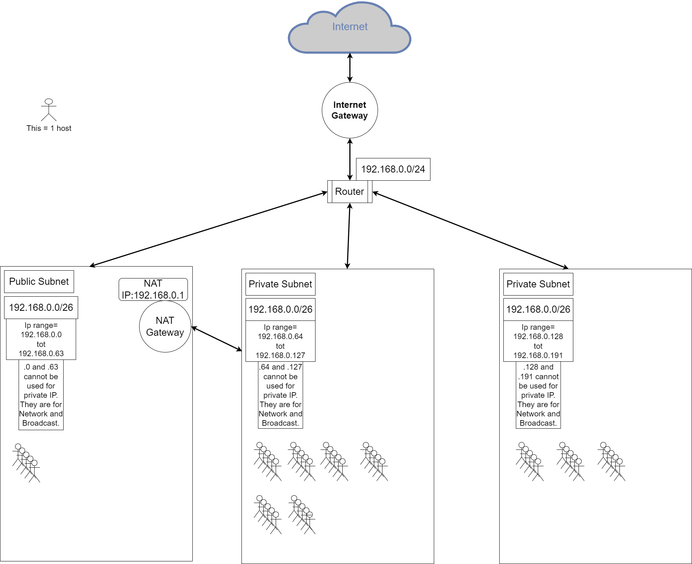

# Subnetting
Learn about Subnets and create a network architecture with subnets.

## Key terminology
- ***Subnet:*** A subnet is a smaller segmented part of a bigger network. A big advantage of using a subnet is that for example big companier can divide their huge network into smaller networks. This way the minimaze traffic in a efficient way by making it so data does not need to travel unnecessary routes, this increases network speed.
- ***Subnet Mask:*** Subnet masks are used to split a IP adress into 2 parts. The network IP part and the Host IP part. A subnet mask splits the bits of a IP adress and in this way it determines the bits the network IP can use and so the range and the same thing for the Host IP. A subnet mask can be noted using CIDR notation.
- ***CIDR Notation (Classless Inter Domain Routing):*** A CIDR notation shows how many bits are reserved for the network ID and in turn also how many for the host ID. For example, we can express the idea that the IP address 192.168.0.1 is associated with the netmask 255.255.255.0 by using the CIDR notation of 192.168.0.1/24, where 24 represents the number of network bits in the IP address (IPv4 address has 32 bits, so the network can be between 0 and 32).
- ***Private Subnet:*** This is a Subnet that has no internet Gateway in its route so no acces to the internet
- ***Public Subnet:*** This is a subnet with a route that leads to a internet gateway, so it does have acces to the internet
- ***Point to point Subnet:*** This subnet version allows 2 devices to connect.
- ***Data Center Subnet:*** This subnet version allows alot of devices to be connected if configured todo so.
- ***IP adres division:*** An IP address is divided into two fields: a Network Prefix (also called the Network ID) and a Host ID. What separates the Network Prefix and the Host ID depends on whether the address is a Class A, B or C address.
- ***NAT gateway:*** A NAT gateway is simply said a 1 way tunnel. A device in a private subnet can acces a service on the internet trough the NAT gateway but that service cannot establish a connection with the device in the private subnet. When data comes back from the internet and arrives at the NAT gateway the NAT gateway will have remembered the route and routes the data back to the device that did the original request.
- ***Subnet classes:*** I will explain this by just showing a picture and you will understand IF you understand "subnet mask". 

## Exercise
### Sources
1. [subnet](https://www.techtarget.com/searchnetworking/definition/subnet#:~:text=A%20subnet%2C%20or%20subnetwork%2C%20is,to%20another%20over%20the%20internet.)
2. [subnetmask](https://www.techopedia.com/definition/5563/subnet-mask#:~:text=A%20subnet%20mask%20is%20a,mask%20reveal%20the%20underlying%20subnetwork.)
3. [CIDR](https://en.wikipedia.org/wiki/Broadcast_address)
4. Ben de uitleg held uit mijn groepje.
5. [NAT](https://docs.aws.amazon.com/vpc/latest/userguide/vpc-nat-gateway.html)
6. [broad](https://en.wikipedia.org/wiki/Broadcast_address)
7. The learning coach explained alot of usefull information.
8. [DIA](https://app.diagrams.net/)

### Overcome challenges
Hearing from my classmates that this was one of the hardest assignments of the course so i went in a bit nervous.

### Results
Wat heb ik nodig voor mijn architecture?
- Een internet gateway.
- Een nat gateway
- een private subnet dat alleen van binnen het LAN bereikbaar is. Dit subnet moet minimaal 15 hosts kunnen plaatsen.
- een private subnet dat internet toegang heeft via een NAT gateway. Dit subnet moet minimaal 30 hosts kunnen plaatsen (de 30 hosts is exclusief de NAT gateway).
- 1 public subnet met een internet gateway. Dit subnet moet minimaal 5 hosts kunnen plaatsen (de 5 hosts is exclusief de internet gateway).
Hier onder kan je mijn gemaakte architecture zien.
1
