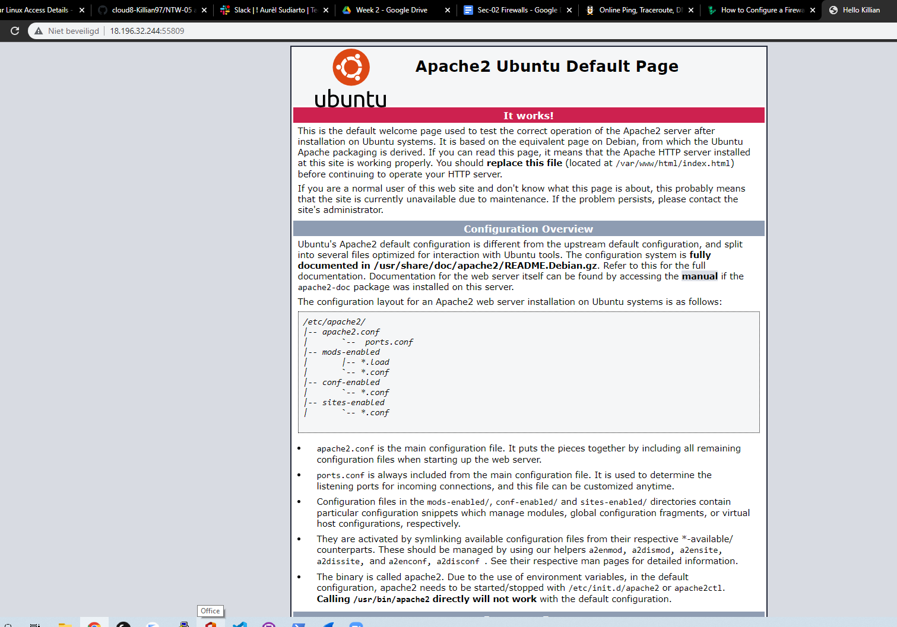
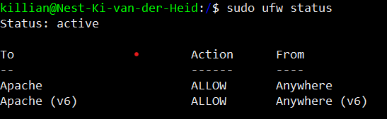
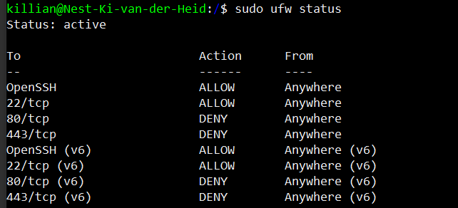

# Firewalls
Install a web server and set your firewall to only allow SSH traffic

## Key terminology
- ***Web page:*** Is a document that can be displayed in a web browser, for example google chrome.
- ***Website:*** A collection of web pages.
- ***Web server:*** This is a machine(computer) that hosts a website on the internet.
- ***sudo ufw allow portID:*** With this command you can allow ports trough the firewall. Making it able to receive data trough that port.
- ***sudo ufw deny portID:*** With this command you can deny traffic trough a specific port.
- ***ufw(uncomplicated firewall):*** Is the basic firewall for Ubuntu, it is a easy to use firewall since you can edit it with your command line.
- ***Firewall:*** A Firewall is a network security that checks incoming and outgoing data with a set of rules. Data is moving in the form of packets. A firewall checks these packets based on those set rules. This way you can create a lets say shield around your network and protect it from unwanted data or even other users.

## Exercise
### Sources
1. [webserv](https://developer.mozilla.org/en-US/docs/Learn/Common_questions/Pages_sites_servers_and_search_engines)
2. [webserv2](https://developer.mozilla.org/en-US/docs/Learn/Common_questions/What_is_a_web_server)
3. [ping](https://docs.microsoft.com/en-us/answers/questions/628271/problem-accessing-ports-443-and-80-on-a-ubuntu-vm.html)
4. [UFW](https://www.linode.com/docs/guides/configure-firewall-with-ufw/
)
5. [ufw](https://www.digitalocean.com/community/tutorials/ufw-essentials-common-firewall-rules-and-commands)
6. [firewall](https://www.forcepoint.com/cyber-edu/firewall)

### Overcome challenges
lots and lots of stress because i coudnt reach the default apache page. and not understanding why not. I solved or my LC solved this by explaining some things about inbound and outbound requests.

### Results
1. I already had apache installed so i tried to connect to the apache standard page, this didnt work and i got a error that the page wasnt reachable. When i tried to ping port 80 i noticed that port 80 was closed. After some heavy thinking and some tips from my learning coach i realised that with our entire class there was no way we could all use port 80. I found out that i had to use my unique port 55809. 
In this screenshot below you will see i reached the default page from my installed webserver. and for a fun thing i changed the title of the page in the HTML file.

In the screenshot below you can see i added a rule to the ufw that allowes incoming traffic from apache (my installed webserver).

2. In the screenshot below you can see i added rules to ufw that allows SSH traffic but blocks web traffic. the result of this is that i cannot acces my default apache page anymore.

