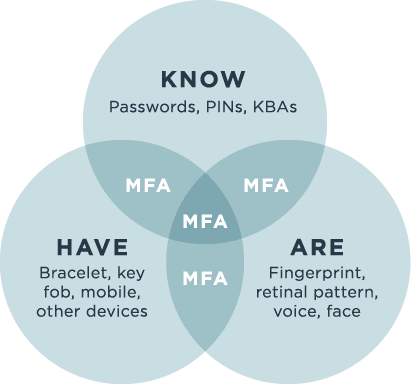

# IAM (Identity and Acces Management)
Study about
- The difference between authentication and authorization.
 -The three factors of authentication and how MFA improves security.
 -What the principle of least privilege is and how it improves security.

## Key terminology
- ***MFA(Multi Factor Authentication):*** MFA is extra protection layer or replacement for the common USRname/Passwrd combination. With MFA multiple factors get combined: the knowlegde factor, the possesion factor and the inherence factor. When users try to log in somewhere that uses a MFA, they will need more then just a password. They need to prove who they are with "2FA" atleast 2 pieces of proof from the knowledge, possesion or inherence factor. The advantage for this is that even if hackers get their hands on 1 of them they will still need another factor proof.
- ***2FA:*** Two Factor Authentication is a subset of MFA, where MFA can use any amount (minimum of 2) of factors to protect, 2FA only uses 2.
- ***Knowledge Factor (What you know):*** This the most common factor, the name explains on its own but this factor is something only you can know for example a password, a PIN code or a security question. Securiry questions in this case should never be used alone since the answers for the questions are usually not that hard to get.
- ***Possesion Factor (What you have):*** This is a physical form factor, like the name says its something that you have, like your phone or a key token or a card. For example i use one myself all the time. When i try to login to my favorite game i need my phone and a app on it that shows me a random code every 20 seconds. Without that code i will not be able to login.
- ***Inherence Factor (What you are):*** This is the spy movie Factor, What you are maybe means your fingerprint, your voice recognition or even a rectal scan. It can be any form of security layer where you literally need to be you to prove you are you.
- ***SSO(Single Sign On):*** Allows a user to sign on with one set of credentials and gain access to multiple applications and services. SSO increases security and provides a better user experience for customers, employees and partners by reducing the number of required accounts/passwords and providing simpler access to all the apps and services they need. SSO is very effective combined with MFA since it covers multiple platforms in 1 go.
- ***Principle of Least Privilege:*** Is a supportive Discipline to the 3 main disciplines: confidentiality, integrity, and availability. The least privilege is a way of controlling acces control and makes sure the right people can reach the right information and nothing else. For example an employee whose job entails processing payroll checks would only have access to that specific function in a payroll application but would not have administrative access to the customer database. Or a marketing specialist does not need access to employee salary data. The principle of least privilege applies not just to individuals but also to networks, devices, programs, processes, and services. When it comes to access control, all of these are considered subjects (active entities) that request access to resources, or objects (passive entities that contain or receive information), such as systems, files, applications, directories, databases, ports, and more.
The least privilege reduces a organisations attack surface, because it locks things from eachother a attacker can never reach multiple systems or files when they do get in. Or for example a malware that infects a system gets detained in the area it enters. 
Beyond security, the principle of least privilege also bolsters system stability by limiting the effects of changes to the area in which they’re made.

## Exercise
### Sources
1. [MFA](https://www.trustbuilder.com/trustbuilder-io-suite/capabilities/multi-factor-authentication/?utm_term=multi-factor%20authentication&utm_campaign=UK+and+IE+-+Leads+-+IAM+-+Low+funnel&utm_source=adwords&utm_medium=ppc&hsa_acc=4190588647&hsa_cam=10028913016&hsa_grp=135543866842&hsa_ad=585224568926&hsa_src=g&hsa_tgt=kwd-2569437482&hsa_kw=multi-factor%20authentication&hsa_mt=e&hsa_net=adwords&hsa_ver=3&gclid=Cj0KCQjwyYKUBhDJARIsAMj9lkFUEgUE7r6MwWnuWv8S6lWFqFZR48jK5UicbxgkMKaOMre6yoyjS4waAk9DEALw_wcB)
2. [MFA2](https://www.pingidentity.com/en/resources/blog/posts/2020/what-is-multi-factor-authentication-mfa.html#:~:text=Multi%2Dfactor%20authentication%20(MFA)%20is%20used%20to%20ensure%20that,have%20or%20something%20they%20are.)
3. [SSO](https://www.pingidentity.com/en/resources/blog/posts/2021/what-is-single-sign-on-sso.html)
4. [POLP](https://www.f5.com/labs/articles/education/what-is-the-principle-of-least-privilege-and-why-is-it-important#:~:text=The%20principle%20of%20least%20privilege%20addresses%20access%20control%20and%20states,or%20task%20and%20nothing%20more.)

### Overcome challenges

### Results
1. In the screenshot below you can see the 3 factors and how they can be combined.
