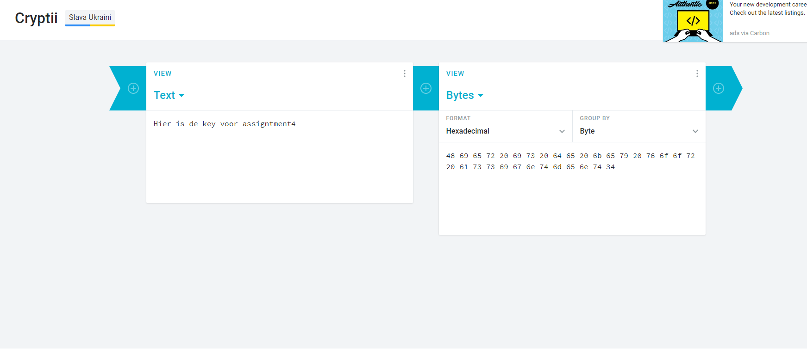
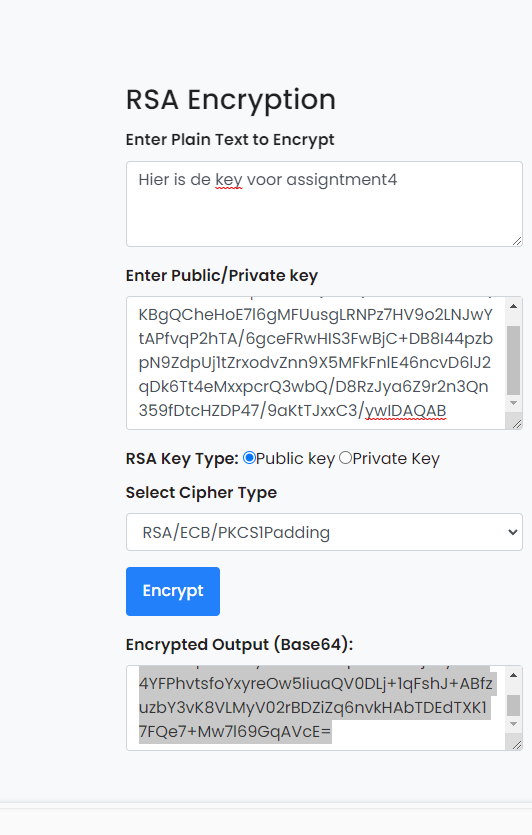
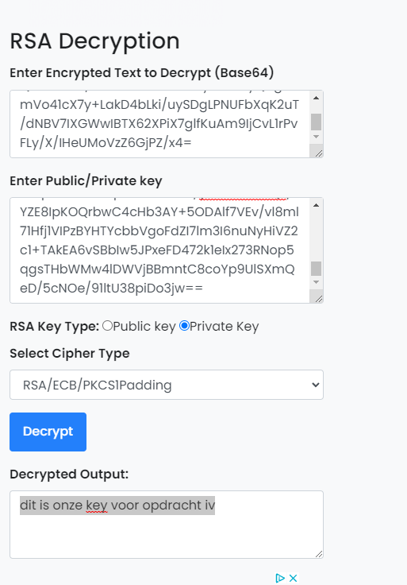
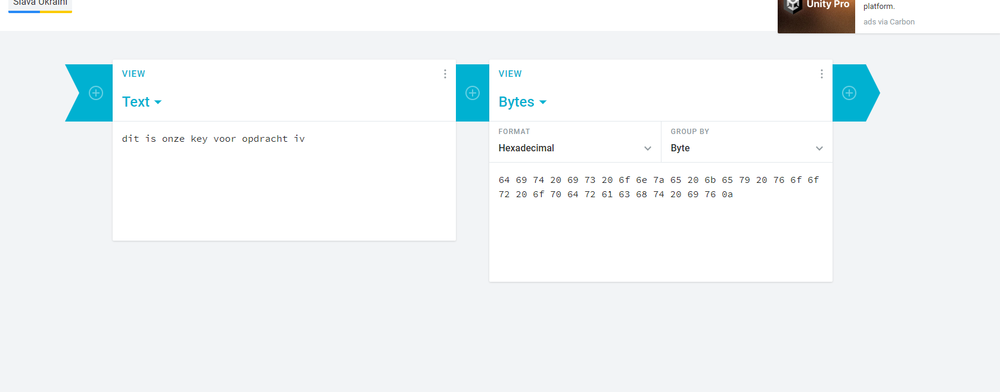
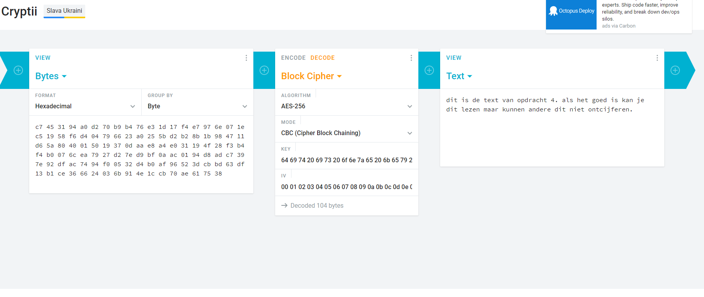

# Asymmetric encryption
Learn about Asymmetric encryption.

## Key terminology
- ***Asymmetric encryption:*** This way of encrypting uses more then just 1 key. Like in the results below, a sender who wants his message to be assymetriccal encrypted needs to generate a key pair. The sender uses the public key send by the receiver to encrypt the message and the receiver needs to decrypt the message by using his private key.
- ***Key pair:*** A key pair is a combination of a public key that is used to encrypt data and a private key that is used to decrypt data.
- ***RSA:*** Is a assymetric 

## Exercise
### Sources
1. [AsymvsSymm](https://blog.mailfence.com/symmetric-vs-asymmetric-encryption/#:~:text=Symmetric%20encryption%20uses%20a%20private,her%20private%20key%20to%20decrypt.)
2. [encrypting](https://cryptii.com/)
3. [ecnryptRSA](https://www.devglan.com/online-tools/rsa-encryption-decryption)

### Overcome challenges
Me confusing myself alot by thinking to easy about.

### Results
Below you will see the results of my encryption messages to Ben.
1. In the screenshots below you can see the key i converted to hex for Ben to decrypt my encrypted message to him for assignment 4.

2. Below you can see me encrypting my message to Ben Containing the key to decrypt the message of assignment 4.

3. Below you can see me encrypting my message for Ben for Assignment 4.

Below you will see the encrypted messages i received from Ben.
1. Below you can see the encrypted message i got from Ben, I decrypt this message.

2. Below you can see me converting the message i got above to read the key i need to decrypt his message for assignment 4.

3. Below you can see me decrypting Ben's message.

After symmetric en assymetric encripting in assignment 4 and 5 i noticed that it's barely possible to make symmetric ecryption 100% safe or it's simply impossible. When a Public key needed for symmetric is known everyone can just guess the message and slowly translate it until it makes sence. With Assymetric encryption this is simply impossible since you will always need the private key to decrypt a message. For this reason it's always smart to store your private key on a local device and not on a public device.