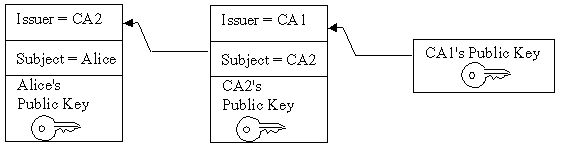
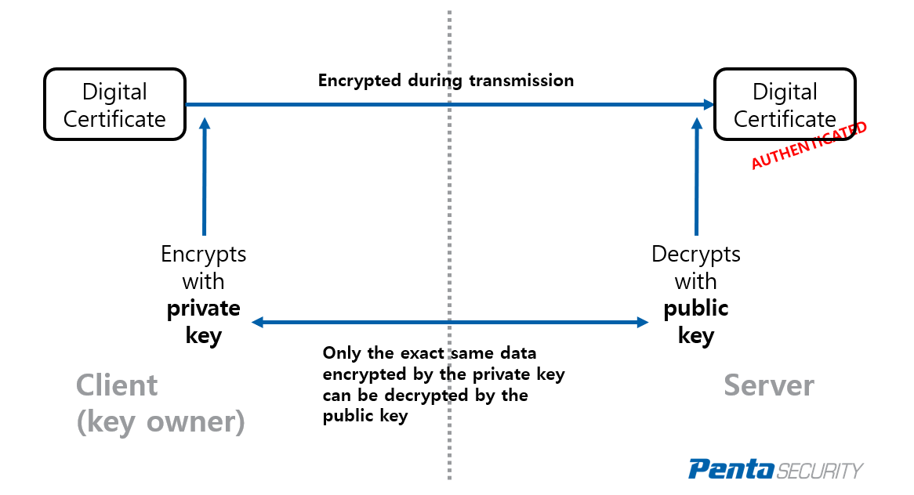
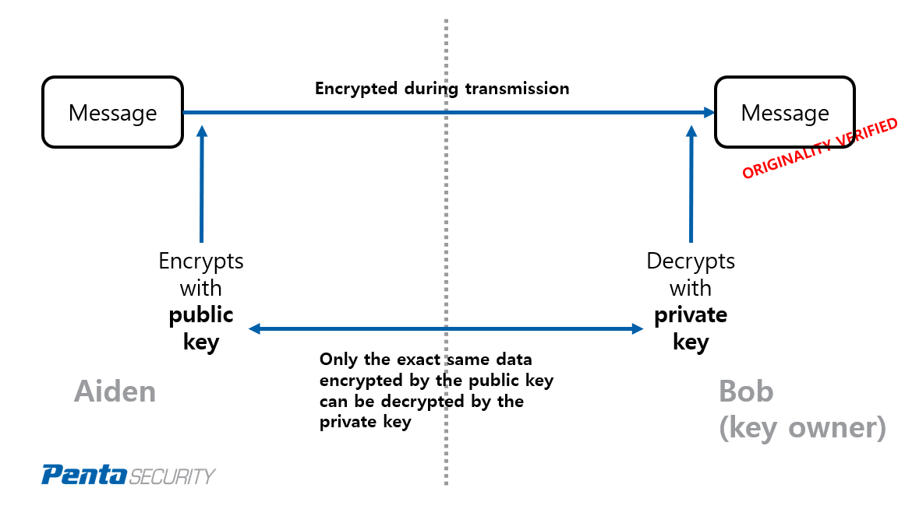
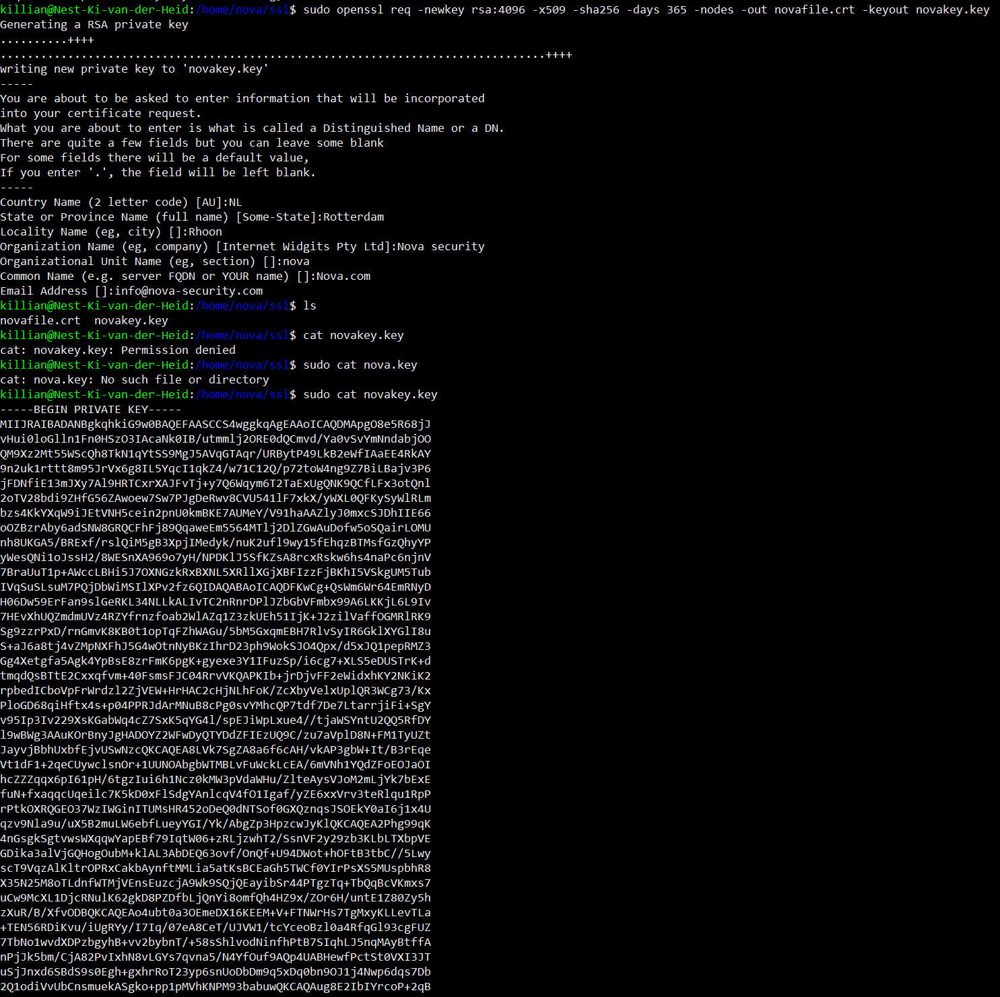
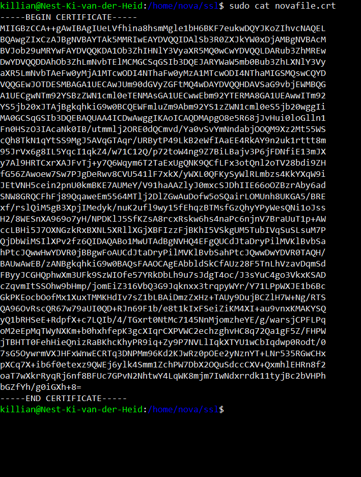
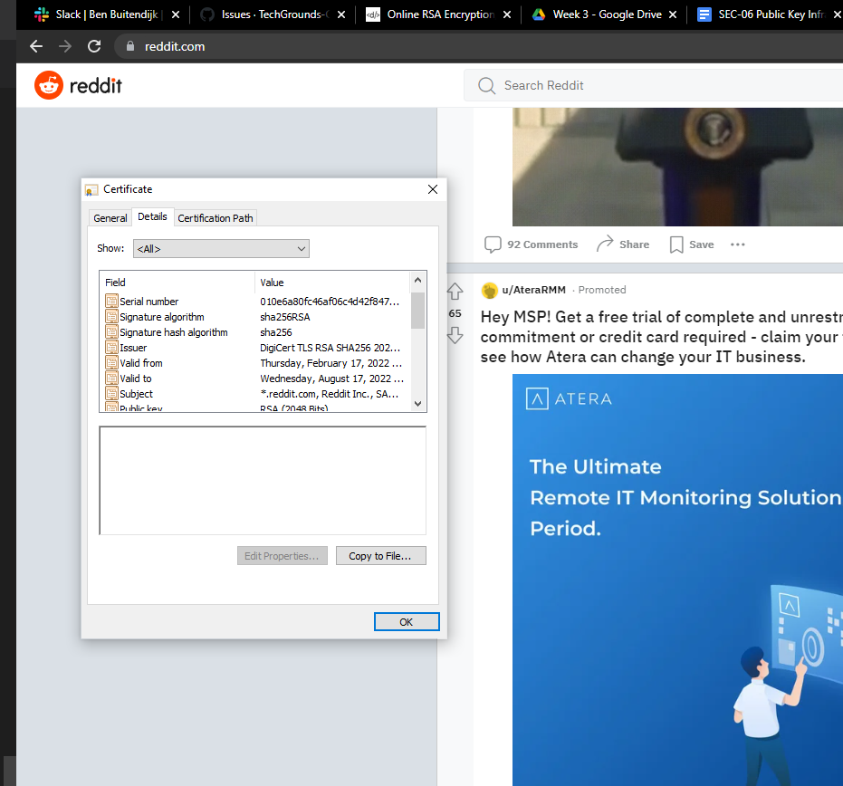
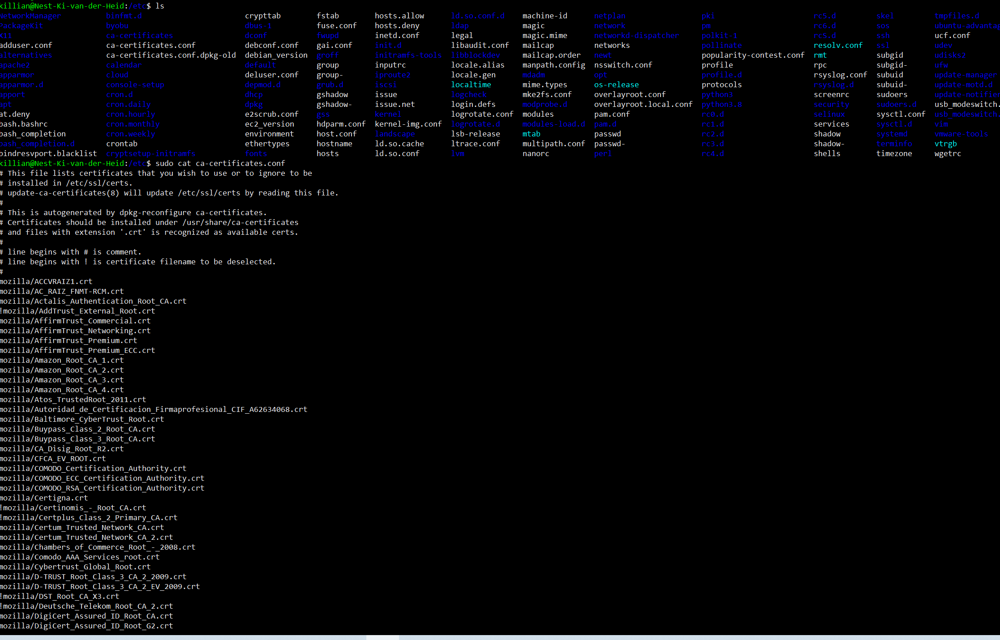

# Public Key Infrastructure

## Key terminology
- ***PKI(Public Key Infrastructure):*** Is the technology used to encrypt and authenticate data during transmissions. The encrypting makes sure that the data is unreadable and only can be decrypted by entities that are authorized. And the authentication makes sure that the data being transmissioned isn't tempered with and that the sender is who they say they are. This identity check is done with digital certificates.
- ***Digital Certificates:*** Are the same thing as a passport in real life. They are used to identify a entity. Every entity is associated with a digital certificate. To check if a Certificate is legit, for example in real life border control at a airport checks it and they know its legit if your pasport is issued by the goverment. In this case, the government is a certified authority. And for example in the digital world, if you want to log in to your online banking account. As the client, you are sending a request to the bank’s server to retrieve your account information and display it through the web application. In this process, the bank’s server verifies your digital certificate generated by the CA trusted by the bank.
- ***Entity:***  An entity does not have to be a person or a device, it can literally be anything, like a software program, a process, or even an action.
- ***CA(Certified Authority):*** Certified authorities are usually third-party firms that specialize in generating digital certificates.
- ***X.509:*** Is one of the ways to tells how PKI should function, this is not the only one but it is the most used one.
An X.509 certificate binds an identity to a public key using a digital signature. A certificate contains an identity (a hostname, or an organization, or an individual) and a public key (RSA, DSA, ECDSA, ed25519, etc.), and is either signed by a certificate authority or is self-signed. When a certificate is signed by a trusted certificate authority, or validated by other means, someone holding that certificate can use the public key it contains to establish secure communications with another party, or validate documents digitally signed by the corresponding private key.
X.509 also defines certificate revocation lists, which are a means to distribute information about certificates that have been deemed invalid by a signing authority, as well as a certification path validation algorithm, which allows for certificates to be signed by intermediate CA certificates, which are, in turn, signed by other certificates, eventually reaching a trust anchor.
- ***Self Signed Certificate:*** A self signed certificate is a digital certificate that’s not signed by a publicly trusted CA. This can include SSL/TLS certificates, code signing certificates, and S/MIME certificates. The reason why they’re considered different from traditional CA signed certificates is that they’re created, issued, and signed by the company or developer who is responsible for the website or software being signed. This is also the reason why self signed certificates are considered unsafe for public-facing websites and applications.
- ***Certification Path:*** Users of public key applications and systems must be confident that a subject's public key is genuine, for example, that the associated private key is owned by the subject. Public key certificates are used to establish this trust. 
If the user does not have a trusted copy of the public key of the CA that signed the subject's public key certificate, then another public key certificate vouching for the signing CA is required. This logic can be applied recursively, until a chain of certificates (or a certification path) is discovered from a trust anchor or a most-trusted CA to the target subject (commonly referred to as the end-entity). The most-trusted CA is usually specified by a certificate that is issued to a CA that the user directly trusts. In general, a certification path is an ordered list of certificates, usually comprised of the end-entity's public key certificate and zero or more additional certificates. A certification path typically has one or more encodings, allowing it to be safely transmitted across networks and to different operating system architectures.
A certification path must be validated before it can be relied on to establish trust in a subject's public key. Validation can consist of various checks on the certificates contained in the certification path, such as verifying the signatures and checking that each certificate has not been revoked. The PKIX standards define an algorithm for validating certification paths consisting of X.509 certificates.
Often a user may not have a certification path from a most-trusted CA to the subject. Providing services to build or discover certification paths is an important feature of public-key-enabled systems. RFC 2587 defines an LDAP (Lightweight Directory Access Protocol) schema definition which facilitates the discovery of X.509 certification paths using the LDAP directory service protocol.

  The next picture shows a certification path from a most-trusted CA's public key (CA 1) to the target subject (Alice). The certification path establishes trust in Alice's public key through an intermediate CA named CA2.
Figure 1. Certification Path

## Further Explantions
Besides the 2 examples i will give, PKI can also be used for securing retail transactions, digitally signing applications, smart card authentication, and many more. 

### ***How Does PKI Authenticate Digital Certificates?***
PKI works by encrypting data (in this case, digital certificate) with a cryptographic key, while having a separate key for decrypting it. The point here is to have one key for encryption and another for decryption. One of them is a private key, held by the key owner, while the other is a public key, shared with the public. Depending on the usage, the private key can either be the encryption key or the decryption key. In case of my example with the bank it would work like this: The owner of the certificate first encrypts it with the private key, then hands over the public key to the bank. The bank would decrypt it with the public key and verify the owner’s identity, and authenticate the user to access their account. As you see this works with key pairs, because it's a pair the bank can only decrypt the data with the public key that is paired with the private key that encrypted the data. This way if the data had been illegally modified by unauthorized parties in the transmission process, the decryption key would fail to decrypt the data because it would not match.

### ***How Does PKI Secure Private Messages?***
This is a different way than in the banking example. 
Imagine another situation where Seraphina needs to send a confidential message to Nova. In this case, there are three things that Seraphina and Nova would want to watch out for:

1.  They want the message to be kept secret so that no third party can view it during transmission.

2. The message is not altered or modified by any third party during transmission.

3. When Nova receives the message, he needs to make sure that the sender is truly Seraphina, and not someone who is pretending to be Seraphina.

PKI can easily ensure all these three criteria are met. How does it work in this case? First, Seraphina needs to request Nova’s public key. Then Seraphina uses Nova’s public key to encrypt the message she wants to send. After Nova receives the message, he simply needs to decrypt it with his private key. Note that different from the case of authenticating digital certificates, in this case, the owner of the keys is the receiver, not the sender, and that the public key is used as the encryption key while the private key is used as the decryption key.

### ***What are the biggest functions of PKI?***
The answer is CAIN:
 1. ***Confidentiality:*** The privacy of user transactions is protected by encrypting data streams and messages. The confidentiality function may be intended to prevent the unauthorized disclosure of information locally or across a network. By using Public Key Infrastructure (PKI), users are able to ensure that only an intended recipient can “unlock” (decrypt) an encrypted message. 

 2. ***Authentication:*** Authentication is the process of verifying that the user is who they say they are. PKI provides a means for senders and recipients to validate each other's identities.
 3. ***Integrity:*** Guaranteeing message integrity is a important function of PKI. PKI has built-in ways to validate that all the outputs are equivalent to the inputs. Any alter of the data can be immediately detected and prevented.
 4. ***Non-Repudiation:*** PKI ensures that an author cannot refute that they signed or encrypted a particular message once it has been sent, assuming the private key is secured. Here Digital signatures link senders to their messages. Only the sender of the message could sign messages with their private key and therefore, all messages signed with the sender's private key originated with that specific individual.

## Exercise
### Sources
1. [PKI](https://www.pentasecurity.com/blog/how-pki-work/)
2. [PKI2](https://www.keyfactor.com/resources/what-is-pki/#:~:text=Public%20key%20infrastructure%20(PKI)%20governs,end%2Dto%2Dend%20communications.)
3. [functs](https://www.omnisecu.com/security/public-key-infrastructure/what-is-public-key-infrastructure-pki.php)
4. [creating SSl](https://websiteforstudents.com/how-to-create-self-signed-certificates-on-ubuntu-linux/)
5. [path](https://www.ibm.com/docs/en/sdk-java-technology/7?topic=certpath-certification-path-introduction)

### Overcome challenges
Trouble focusing because there is alot to read.

### Results
## Create your own Self signed Certificate in your VM.
1. In the screenshot below you can see me creating the Self signed certificate.

2. In the screenshot below you can that the certificate has been created.

## Analyze some certification paths of known websites.
In the screenshot below you can see that the certificate for reddit is valid.

In the next screenshot you can see the certification path used for reddits certificate.

As you can see just like the example in the certification path key term. The path here is going trough CA1 before being validated for reddit itself.

In the screenshot below you can see some other details about the certificate

## Find the list of trusted certificate roots on your system (bonus points if you also find it in your VM).
Below you can see where i found the list for all the roots. If the picture is to smal to read, its in /etc and then in the ca-certificate.conf
