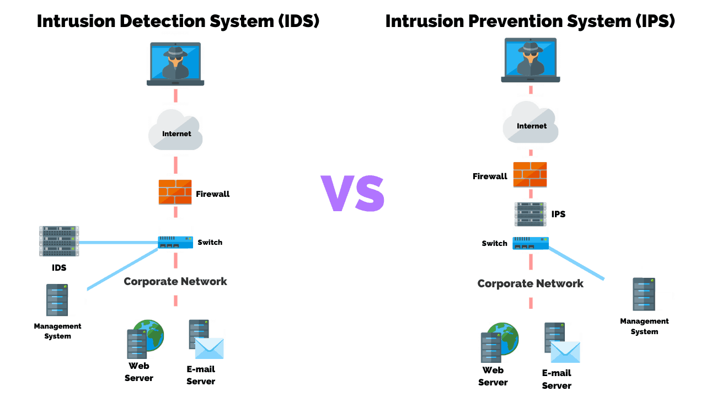

# Detection, response and analysis

## Key terminology
- ***Network based IPS and IDS:*** These are security systems that analyze network traffic. 2 examples below. A advantage of networked based systems is that you can protect multiple devices in one go. A disadvantage is that it cannot see something that already is ON the device, so if a attacker is already on your device trying to get in the IPS and IDS wont notice it.
- ***Network based IDS(Intrusion Detection System):*** This gets installed on the network and it makes copies of data and scans them, when it sees a malware or a attack it will send of a alert. AKA is detects the treat but it can't stop it because it scans a copy and its inside the network.
- ***Network based IPS(Intrusion Prevention System):*** This gets installed between for example a router and device, this way any traffic coming from or going towards that device gets scanned and if the IPS finds a treat it will stop it. AKA is prevents it. A dis advantage for this is that IPS can maybe block good data because it thinks its a treat while its not. This will have a negative impact on your network.
- ***Host based IPS and IDS:*** These are versions of IPS and IDS installed ON a device, its a software that runs on a host. This way every single host on a network will have his personal security. This has a big advantage but that comes at a cost. Think about a company with 1000 hosts, will be costly because of the licenses needed and the space the software needs.
  - in the picture below you can see the different locations of IPS and IDS.
  
- ***Signature match:*** This is one of the ways for IPS and IDS to identify malicious data. This means that for example a vendor has given us a database with over a 1000 dangerous signatures, the IPS/IDS will use that database to compare the signatures from the data transmissions. When it finds a match it will sound the alarm.
- ***Anomaly Detection:*** This is another of the ways for IPS and IDS to identify malicious data. Like the name kinda says this way of detecting is based on a basis. For example a network has 30 TCP sessions running at the same time. This will be the avarage, AKA the normal amount. When out of nowhere there will be 300 TCP sessiions this will be seen as a anomaly because it exceeds the basis. When this happens the IPS/IDS will sound the alarm.

## Exercise
### Sources
1. [YT](https://www.youtube.com/watch?v=rvKQtRklwQ4)

### Overcome challenges

### Results
1. 
