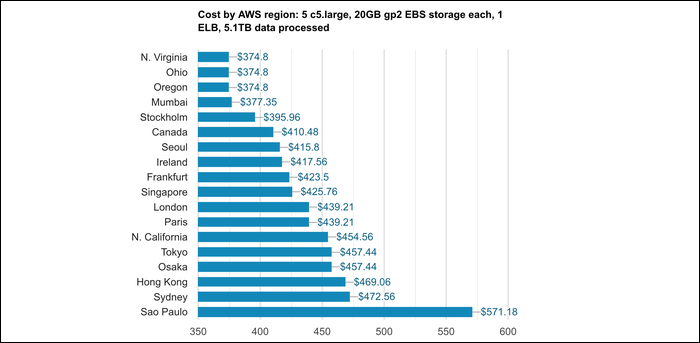
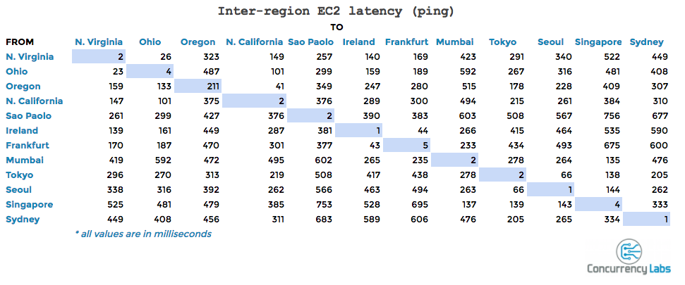
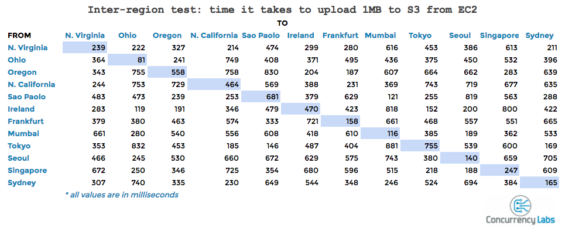
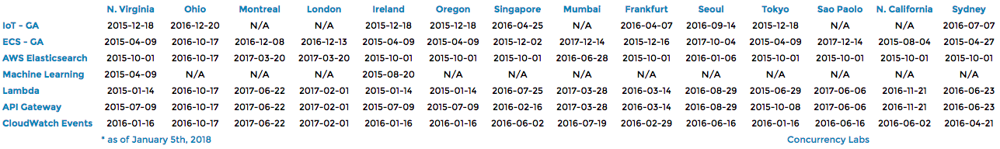

# Global infrastructure
Get to understand some of the terms like Regions, zones and locations.

## Key terminology
- ***AWS Regions:*** In AWS a region is a physical location around the world with clusters of data centers. Each cluster of data centers is called a AZ, more about AZ's later. In every region multiple of these az's are isolated and physically seperated. This is one big differences already with other cloud providers since most other providers often only have 1 data center in a region. AWS focuses highly on quality so AWS infrastructure Regions meet the highest levels of security, compliance, and data protection. AWS opens up new regions rapidly to ensure their customers are provided with global quality service.
- ***AZ(Availabilty Zone):*** Like explained before, an AZ is a cluster of data centers inside a region. The AZ's offers benefits and advantages to their customers for example: in every region every single AZ has indepentent power, cooling, physical security and are connected via redundant, ultra-low-latency networks. This makes it able that customers who want high availability can design their application to run in multiple AZ's to achieve even greater fault-tolerance. This makes it also way more scalable then for example a region with only one data center. All traffic between AZ's is encrypted. The network performance is enough to accomplish synchronous replication between AZ's. AZ's make partitioning applications for high availability very easy. If an application is partitioned across AZ's, companies are better isolated and protected from issues such as power outages, natural disasters and more. AZs are physically separated by a meaningful distance, kilometers away from any other AZ, although all are within 100 km of each other.
- ***Local Zone:*** AWS local zones are select AWS services close to the end user. Because it is close customers can easily run highly-demanding applications that require single-digit millisecond latencies to your end-users such as media & entertainment content creation, real-time gaming, reservoir simulations, electronic design automation, and machine learning. A local zone is an extension of a region, customers can run their latency sensitive application using AWS services like Amazon EC2 and Amazon Virtual Private Cloud. The local zones also provide a high-bandwidth, secure connection between local workloads and those running in the AWS Region, allowing you to seamlessly connect to the full range of in-region services through the same APIs and tool sets. 
- ***Amazon EC2(Amazon Elastic Compute Cloud):*** Amazon Elastic Compute Cloud (Amazon EC2) provides scalable computing capacity in the Amazon Web Services (AWS) Cloud. Using Amazon EC2 eliminates your need to invest in hardware up front, so you can develop and deploy applications faster. You can use Amazon EC2 to launch as many or as few virtual servers as you need, configure security and networking, and manage storage. Amazon EC2 enables you to scale up or down to handle changes in requirements or spikes in popularity, reducing your need to forecast traffic. 2 of the many features of EC2 are:
  - Preconfigured templates for your instances, known as Amazon Machine Images (AMIs), that package the bits you need for your server (including the operating system and additional software)
  - Secure login information for your instances using key pairs (AWS stores the public key, and you store the private key in a secure place)
- ***Amazon VPC(Amazon Virtual Private Cloud):*** A VPC is a virtual network dedicated to your AWS account. It is logically isolated from other virtual networks in the AWS Cloud. You can launch your AWS resources, such as Amazon EC2 instances, into your VPC. You can specify an IP address range for the VPC, add subnets, associate security groups, and configure route tables.
Amazon VPC enables you to launch AWS resources into a virtual network that you've defined. This virtual network closely resembles a traditional network that you'd operate in your own data center, with the benefits of using the scalable infrastructure of AWS.
- ***Edge Location:*** These are similar to Local zones but still very different, edge locations are also very close to the end user but they have a different focus and use than local zones. Edge locations are mainly used to host the web content (Statit or Dynamic), it may be in the form of Cache or to uploaded one by a user while local zones are mainly used for infrastructure deployment that places compute, storage, database, and other select AWS services close to large population. Meaning Edge locations might be small centers while local zone are bigger one so that it can provide the compute powers based on deployed infrastructure in this zone. Edge locations are endpoints for AWS which are used for caching content and used as Content delivery network (CDN). Edge locations serve requests for CloudFront and Route 53. CloudFront is a content delivery network, while Route 53 is a DNS service. Requests going to either one of these services will be routed to the nearest edge location automatically. This allows for low latency no matter where the end user is located. The 3 key benefits of edge locations are:
  - Faster Response
  - Less Access Time
  - Reducing The Latency Rate

- ***IAM (Identity and Access Management):*** IAM provides fine-grained access control across all of AWS. With IAM, you can control access to services and resources under specific conditions. Use IAM policies to manage permissions for your workforce and systems to ensure least privilege. IAM is offered at no additional charge. IAM provides authentication and authorization for AWS services. A service evaluates if an AWS request is allowed or denied. Access is denied by default and is allowed only when a policy explicitly grants access. You can attach policies to roles and resources to control access across AWS. For more information.
- ***AWS RDS(Amazon Relational Database Service):*** Amazon Relational Database Service (RDS) is a managed SQL database service provided by Amazon Web Services (AWS). Amazon RDS supports an array of database engines to store and organize data. It also helps with relational database management tasks, such as data migration, backup, recovery and patching. Amazon RDS facilitates the deployment and maintenance of relational databases in the cloud. A cloud administrator uses Amazon RDS to set up, operate, manage and scale a relational instance of a cloud database. Amazon RDS is not itself a database; it is a service used to manage relational databases.

## Exercise
### Sources
1. [AWS](https://aws.amazon.com/about-aws/global-infrastructure/regions_az/)
2. [EC2](https://docs.aws.amazon.com/AWSEC2/latest/UserGuide/concepts.html)
3. [VPC](https://docs.aws.amazon.com/vpc/latest/userguide/how-it-works.html)
4. [locvsedge](https://stackoverflow.com/questions/63786743/aws-edge-locations-vs-local-zones)
5. [edge](https://azurelessons.com/aws-edge-locations/)
6. [IAM](https://aws.amazon.com/iam/faqs/#:~:text=IAM%20provides%20fine%2Dgrained%20access,offered%20at%20no%20additional%20charge.)
7. [RDS](https://www.techtarget.com/searchaws/definition/Amazon-Relational-Database-Service-RDS#:~:text=An%20Amazon%20RDS%20instance%20is,Oracle%20and%20SQL%20Server%20instances.)
8. [region?](https://www.concurrencylabs.com/blog/choose-your-aws-region-wisely/#:~:text=If%20most%20of%20your%20users,in%20the%20US%20or%20Canada.)

### Overcome challenges
I have never read or heard any info about AWS, ive always been into azure if i even needed it. But the more i learn the more i like AWS and the more i want to know more and get side tracked.

### Results

## Why would you choose one region over another? (e.g. eu-central-1 (Frankfurt) over us-west-2 (Oregon)).

Stepping away a bit from the example, but there are various reasons why you need to think carefully about what region you pick. A simple reason could be: if most users of your application live in the USA you should pick a region in the USA. Below i will list other reasons why you pick any region above another one.

1. ***Pricing:*** Every region has different pricing, pick the wrong one and your wallet might not appriciate it.
Below you will see how big the difference can be.

    

2. ***Latency and transfer speed:*** Every region has different latencies and different transfer speeds.
Below you will see how big the difference can be in latency and in transfer speed.

3. ***Services:*** Not all services are available in all regions (some will take a VERY long time before they are).
Below you will see some AWS services and where they are avaible and when they got released, check machine learning for example.

4. ***AZ's:*** Not all regions have the same number of Availability Zones. If you are building an application with strict availability requirements, you should probably stay away from those four regions that only have 2 Availability Zones. When one goes down you will only have 1 left. If one goes down in a region with 4 AZ's you would have 3 left.

