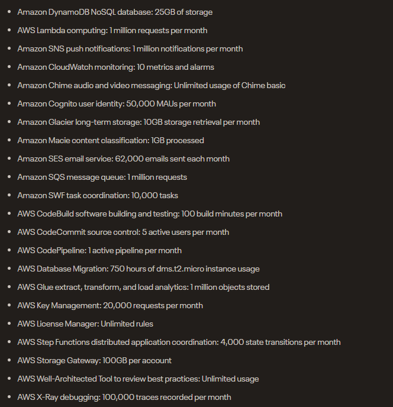

# Pricing
As the title says, study about the pricing from AWS.

## Key terminology
- ***TCO(Total cost of Ownership):*** is a calculation method that determines the overall cost of a product or service throughout its life cycle. This method combines both direct and indirect costs. TCO aims to analyse the actual cost of purchasing a product or service from a given supplier, beyond the basic purchase price.
- ***PAYG(Pay-as-you-go):*** With AWS like the title says, you pay for what you use. This ensures your company staying agile, responsive and scalable. This makes AWS pricing similar to how you pay for utilities like water and electricity. You only pay for the services you consume, and once you stop using them, there are no additional costs or termination fees. A company does not need to predict how much they need and pre buy services and spend the money before they know if they actually need it, it protects them from overprovisioning or the other way around, missing capacity. But Flexibility comes at a cost. If you want to really “pay as you go”, you will have to settle for Amazon’s On-Demand Pricing, which becomes quite expensive even for small workloads, when used for ongoing server deployments
- ***Save when you commit:*** For AWS Compute and AWS Machine Learning, Savings Plans offer savings over On-Demand in exchange for a commitment to use a specific amount (measured in $/hour) of an AWS service or a category of services, for a one- or three-year period. This is like a loyalty reward, If you plan on using AWS for a set period of time they will give you extra discount. 
Another option is to use “spot instances", these are machine instances that happen to be available at a given time, and will be taken away from you when another user demands them. Switching loads dynamically between spot instances, and helping Amazon manage their demand, can give you even bigger discounts.
- ***Pay less by using more:*** With AWS, you can get volume based discounts and realize important savings as your usage increases. For services such as S3 and data transfer OUT from EC2, pricing is tiered, meaning the more you use, the less you pay per GB. In addition, data transfer IN is always free of charge. As a result, as your AWS usage needs increase, you benefit from the economies of scale that allow you to increase adoption and keep costs under control. Sophisticated users of AWS can save a lot by dynamically moving workloads between services and creating economies of scale. These savings can go up to 90%.
- ***Economies of Scale:*** Economies of scale are the advantages that can sometimes occur as a result of increasing the size of a business. For example, a business might enjoy an economy of scale concerning its bulk purchasing. By buying a large number of products at once, it could negotiate a lower price per unit than its competitors. Economies of scale can be both internal and external. Internal economies of scale are based on management decisions, while external ones have to do with outside factors.
- ***Capex(Capital expenditures):*** These are purchases for investment, you could buy services or goods that will be used to improve your company in the future. For example if a delivery company buys new trucks for delivery this would be considered CAPEX. One of the defining features of capital expenditures is longevity, meaning the purchases benefit the company for longer than one tax year.
- ***Opex(Operating expenses):*** is an expense a business incurs through its normal business operations. For example: rent and salaries and more. Opex can be deducted from taxes for the year where the costs incurred, This can only be done if the company operated to earn profits.
If a company chooses to lease a piece of equipment instead of purchasing it as a capital expenditure, the lease cost would be classified as an operating expense.
- ***Amazon S3(Amazon Simple Storage Service):*** Amazon S3 is an object storage service that offers industry-leading scalability, data availability, security, and performance. Customers of all sizes and industries can use Amazon S3 to store and protect any amount of data for a range of use cases, such as data lakes, websites, mobile applications, backup and restore, archive, enterprise applications, IoT devices, and big data analytics. Amazon S3 provides management features so that you can optimize, organize, and configure access to your data to meet your specific business, organizational, and compliance requirements.
- ***EC2:*** I have explained this in my previous assignment so you can read about EC2 in assignment 1.
- ***AWS 12 months-free tier:*** hese free tier offers are only available to new AWS customers, and are available for 12 months following your AWS sign-up date. When your 12 month free usage term expires or if your application use exceeds the tiers, you simply pay standard, pay-as-you-go service rates.
- ***AWS Always Free tier:***  These free tier offers do not automatically expire at the end of your 12 month AWS Free Tier term, but are available to both existing and new AWS customers indefinitely.
- ***AWS Trial tier:*** These free tier offers are short term trial offers that start from the time of the first usage begins. Once the trial period expires you simply pay standard, pay-as-you-go service rates.

## Exercise
### Sources
1. [TCO](https://www.manutan.com/blog/en/glossary/understanding-tco-total-cost-of-ownership-origins-definition-calculation-advantages-and-so-on)
2. [TCO2](https://www.investopedia.com/terms/t/totalcostofownership.asp#:~:text=The%20total%20cost%20of%20ownership%20(TCO)%20is%20the%20purchase%20price,its%20value%20is%20over%20time.)
3. [AWSpricing](https://aws.amazon.com/pricing/)
4. [pricing](https://dzone.com/articles/the-cost-of-the-cloud-the-ultimate-aws-pricing-gui#:~:text=Amazon%20Web%20Services%20advertises%20four,has%20driven%20AWS's%20stellar%20growth.)
5. [AWS](https://aws.amazon.com/s3/pricing/)
6. [Scale](https://www.investopedia.com/terms/e/economiesofscale.asp#:~:text=Economies%20of%20scale%20are%20the,per%20unit%20than%20its%20competitors.)
7. [capvsop](https://www.investopedia.com/ask/answers/112814/whats-difference-between-capital-expenditures-capex-and-operational-expenditures-opex.asp#:~:text=Capital%20expenditures%20(CAPEX)%20are%20major,to%20keep%20its%20business%20operational.)
8. [Free tier](https://capiche.com/q/what-does-the-aws-free-tier-include)

### Overcome challenges
Knowing AWS is commercial company and needing to list all the advantages while also really wanting to know the disadvantages.

### Results
This was a pure study assignment, check key terms for explanations.

Below is a Photo of a list with all the permanantly free services.

Below you can see what is included in the free tier S3 and the free tier EC2.
