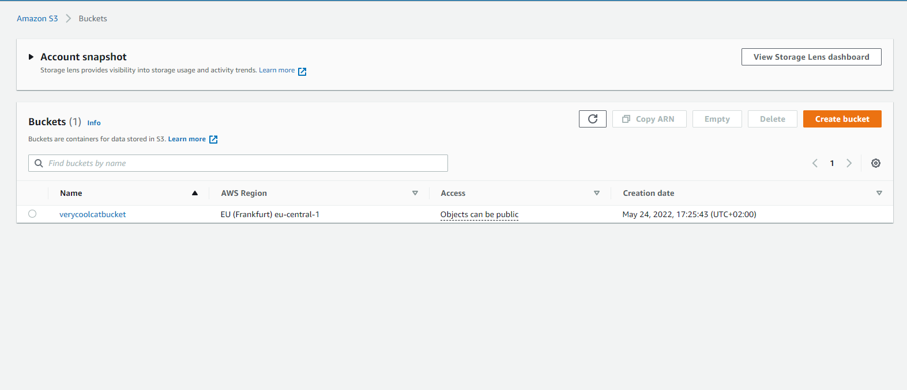
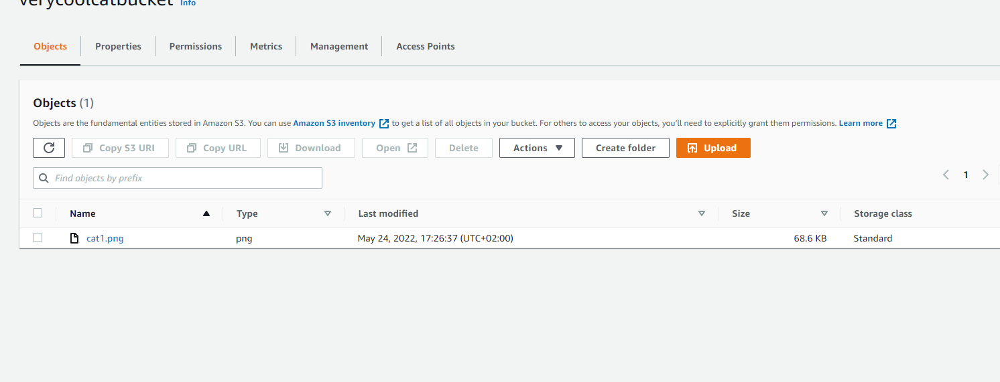
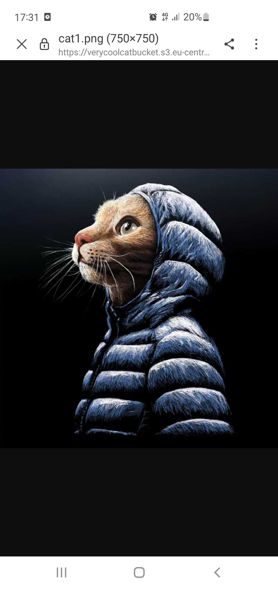
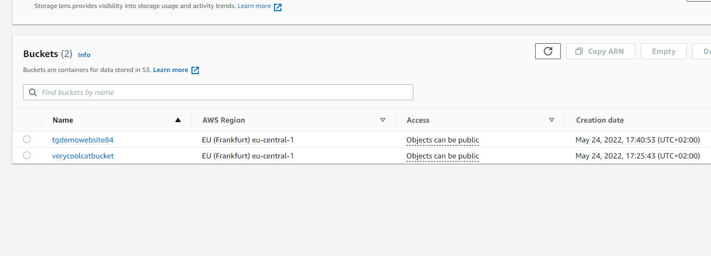
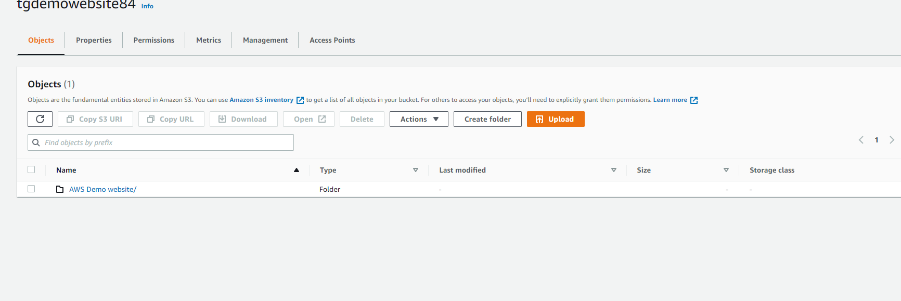
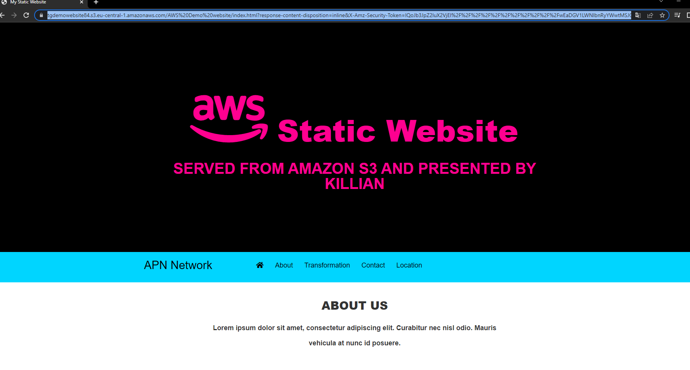

# S3
Learn the basics of how to upload files to your server in AWS.

## Key terminology
Most terminology used for this exercise has been explained in AWS-04 and other assignments.

- ***S3 Standard-IA*** : S3 Standard-IA is for data that is accessed less frequently, but requires rapid access when needed. S3 Standard-IA offers the high durability, high throughput, and low latency of S3 Standard, with a low per GB storage price and per GB retrieval charge. This combination of low cost and high performance make S3 Standard-IA ideal for long-term storage, backups, and as a data store for disaster recovery files.
- ***S3 One-zone IA*** : S3 One Zone-IA is for data that is accessed less frequently, but requires rapid access when needed. Unlike other S3 Storage Classes which store data in a minimum of three Availability Zones (AZs), S3 One Zone-IA stores data in a single AZ and costs 20% less than S3 Standard-IA. S3 One Zone-IA is ideal for customers who want a lower-cost option for infrequently accessed data but do not require the availability and resilience of S3 Standard or S3 Standard-IA. It’s a good choice for storing secondary backup copies of on-premises data or easily re-creatable data.

## Exercise
### Sources
1. Other assignments
2. [Policy](https://docs.aws.amazon.com/AmazonS3/latest/userguide/HostingWebsiteOnS3Setup.html#step4-add-bucket-policy-make-content-public)

### Overcome challenges
None really.

### Results
## Exercise 1

- Create new S3 bucket with the following requirements:
1. Region: Frankfurt (eu-central-1)
- Upload a cat picture to your bucket.
- Share the object URL of your cat picture with a peer. Make sure they are able to see the picture.

I did this excercise in the evening because of being sick so i used myself as a test subject. I send the link to the cat picture to myself and opened it on my phone. You will see if it worked or not below.

Below you will see my created bucket.

Next you will see i uploaded my cat picture.

To share my picture i created a presigned URL that will only work for 1 hour, below you will see the result.

## Exercise 2

- Create new bucket with the following requirements:
1. Region: Frankfurt (eu-central-1)
- Upload the four files that make up AWS’ demo website.
- Enable static website hosting.
- Share the bucket website endpoint with a peer. Make sure they are able to see the website.

For this excercise i did the same thing as for the first one.

Below you will see my newly created bucket for the website.

Below you can see i uploaded the Demo website folder and its files.

Below you can see me adding a policy to make my website publically accesible.

Last you can see that my website is accessible (via my moms laptop)

