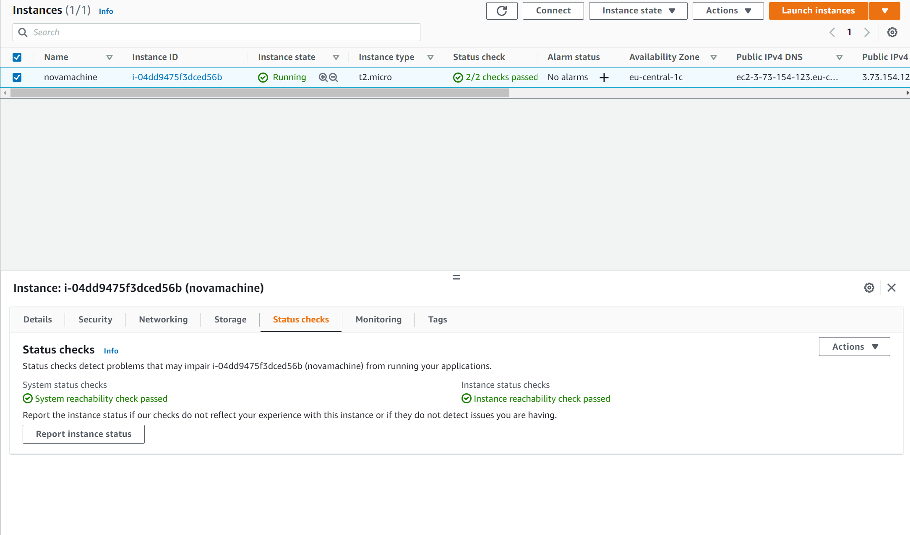
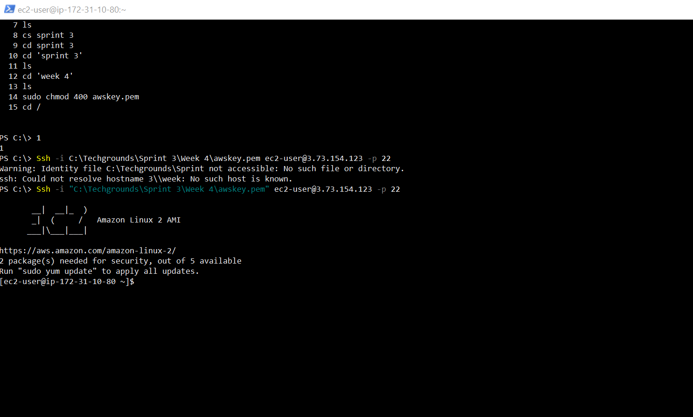
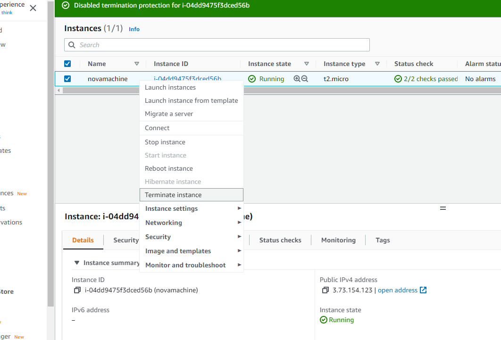

# EC2
Create your own EC2 instance, and learn how to set it up

## Key terminology
All key terms in this assignment that i needed i already explained in previous assignments.

## Exercise
### Sources
1. Other assignments
2. My classmate Aurel

### Overcome challenges
Not using any sources and purely using my memory from the assasement week. So it was a self created challenge.

### Results

## Exercise 1

1. Navigate to the EC2 menu.
2. Launch an EC2 instance with the following requirements:
  - AMI: Amazon Linux 2 AMI (HVM), SSD Volume Type
  - Instance type: t2.micro
  - Default network, no preference for subnet
  - Termination protection: enabled
  - User data:
    - #!/bin/bash
    - yum -y install httpd
    - systemctl enable httpd
    - systemctl start httpd
    - echo `'<html><h1>Hello From Your Web Server!</h1></html>' >   /var/www/html/index.html`
    - Root volume: general purpose SSD, Size: 8 GiB
    - New Security Group:
    - Name: Web server SG
    - Rules: Allow SSH, HTTP and HTTPS from anywhere

## Exercise 2

- Wait for the Status Checks to get out of the initialization stage. 
- When you click the Status Checks tab, you should see that the System reachability and the Instance reachability checks have passed.
- Log in to your EC2 instance using an ssh connection.
Terminate your instance.

Below you can see i created my EC2 instance and that the status check got a pass.

Below you can see i logged in with a SSH connection.

Below you see me terminating my instance.

