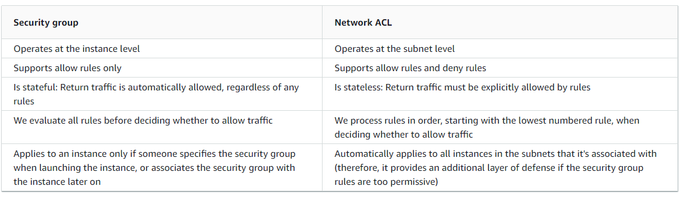

# Security groups
Study about AWS security.

## Key terminology
- ***Security group:*** A Security group act as a statefull virtual firewall, controlling the traffic that is allowed to reach and leave the resources that it is associated with. For example, after you associate a security group with an EC2 instance, it controls the inbound and outbound traffic for the instance. It is important to know that the rules are always allow rules. Something that isnt allowed is automatically denied. An instance can have multiple security groups but also a security group can be assigned to multiple instances. When you create a rule for a security group it will be applied to all connected instances automatically. An intresting thing to know is that when you create a security group it will have 0 inbound rules, so nothing will be allowed. But that newly created security group will have 1 outbound rule that allows everything. So all outbound traffic is allowed.
- ***NACL(Network Acces Control List):*** A ACL is an optional layer of security for your VPC that acts as a stateless firewall for controlling traffic in and out of one or more subnets. You might set up network ACLs with rules similar to your security groups in order to add an additional layer of security to your VPC but a ACL also has deny rules. When you create a VPC it automatically comes with a modifiable default network ACL. By default, it allows all inbound and outbound IPv4 traffic and, if applicable, IPv6 traffic. Differently then the security groups you can associate a network ACL with multiple subnets. But, a subnet can be associated with only one network ACL.

## Exercise
### Sources
1. [SC](https://docs.aws.amazon.com/vpc/latest/userguide/VPC_SecurityGroups.html)
2. [SC2](https://docs.aws.amazon.com/AWSEC2/latest/UserGuide/ec2-security-groups.html)
3. [DIFF](https://docs.aws.amazon.com/vpc/latest/userguide/VPC_Security.html#VPC_Security_Comparison)
4. [ACL](https://docs.aws.amazon.com/vpc/latest/userguide/vpc-network-acls.html)

### Overcome challenges
None besides needing to google everything.

### Results

A security group and a ACL are similar but definetly different, Below i will show you a summary of the basic differences.

The diagram below will show you the layers of security provided by security groups and network ACL's. In this example you can see how traffic from an internet gateway is routed to the appropriate subnet using the routes in the routing table. The rules of the network ACL that is associated with the subnet control which traffic is allowed to the subnet. The rules of the security group that is associated with an instance control which traffic is allowed to the instance.

As a conclusion personnaly i would say: ALWAYS use both NACL's and Security groups. But its not needed, you can see NACL's as a extra layer of security, and who doesnt want extra security?