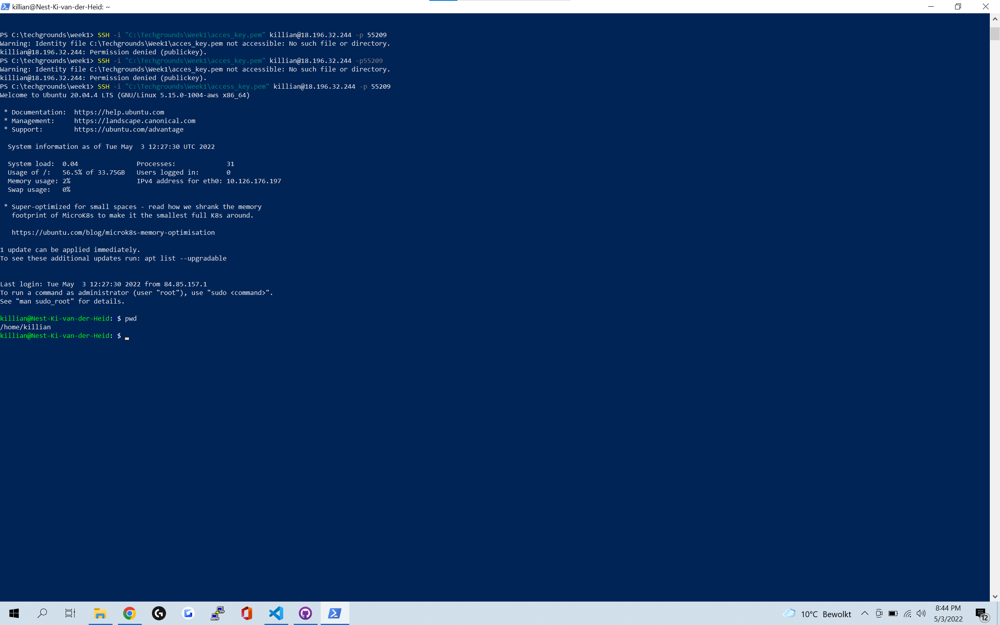
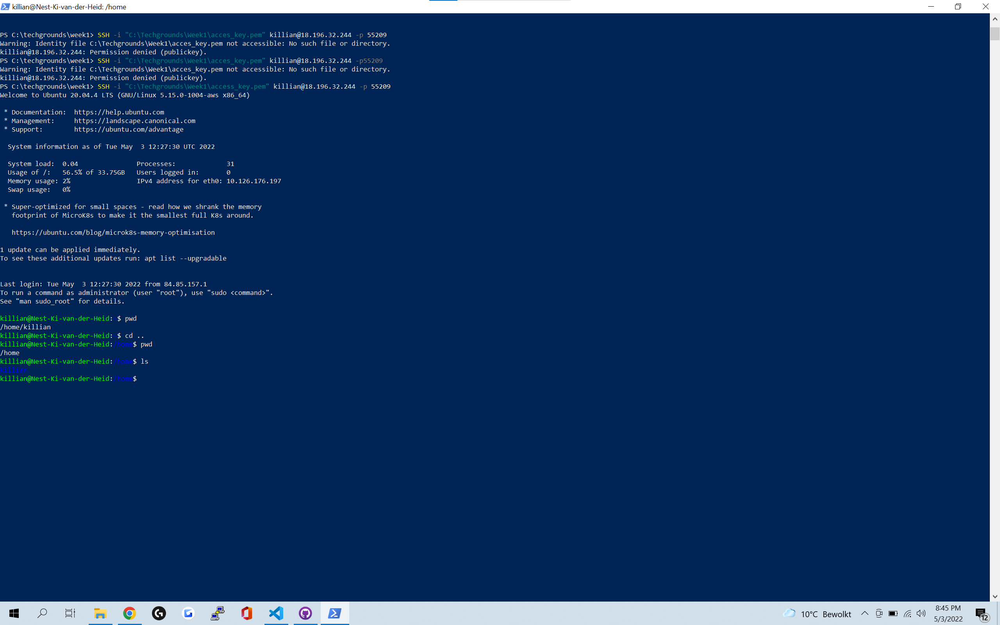
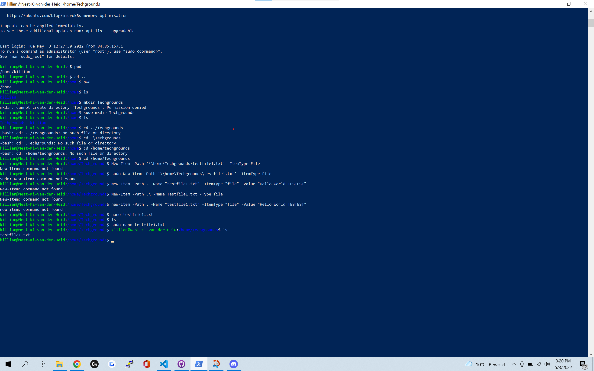
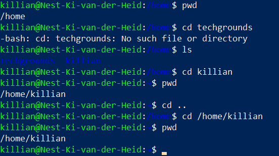

# Files and Directories
Learn some basic commands to move around and create objects in SSH

## Key terminology
 - ***Absolute Path:*** dit is de pathing vanuit de root, hier string je het hele path aan me kaar.
 - ***Relative Path:*** dit is de pathing als je naar een path wilt in je huidige locatie (de pwd)
 - ***PWD (Present Working Directory):*** Hiermee check je je huidige locatie.
 - ***CD (change directory):*** Hiermee navigeer je naar andere locaties.
 - ***LS (list):*** Hiermee list je alle bestanden in je huige directory.
 - ***Mkdir (make directory):*** Hiermee maak je een nieuwe directory de command is "mkdir name"
 - ***Nano:*** Nano is van de manieren om een file te maken, nano zelf is een text editor.
 

## Exercise
### Sources
1. [creating objects](https://techgenix.com/creating-files-and-folders-powershell-the-easy-way/#:~:text=To%20create%20a%20new%20file,to%20create%20in%20this%20cmdlet.)
2. [new-item command](https://docs.microsoft.com/en-us/powershell/module/microsoft.powershell.management/new-item?view=powershell-7)
3. [cmdlets](https://www.techtarget.com/whatis/definition/cmdlet#:~:text=A%20cmdlet%20%2D%2D%20pronounced%20command,coping%20files%20and%20changing%20directories.)
4. [SSH creating files](https://help.dreamhost.com/hc/en-us/articles/115006413028-Creating-and-editing-a-file-via-SSH)
5. [paths](https://hurst.systems/posts/powershell-understanding-paths/)

### Overcome challenges
Heel lang gezocht naar cmdlets maar moest gewoon commands gebruiken.
Mischien niet helemaal een challenge maar ik wist op een geven moment hoe ik de pathing moest doen in relative en in absolute. maar snappen deedt ik het niet helemaal en daar raakte ik een beetje onzeker van, na in de avond gewoon wat gegoogled te hebben durf ik nu tezeggen dat ik het kan/snap en kan uitleggen aan iemand anders.

### Results
- Hier laat ik zien in welke PWD ik zit.

- Hier list ik de inhoud van een directory.

- Hier maak ik een nieuwe directory aan en een niew text bestand(hier gebruik ik nano voor)

- Hier gebruik ik absolute en relative pathing.

    