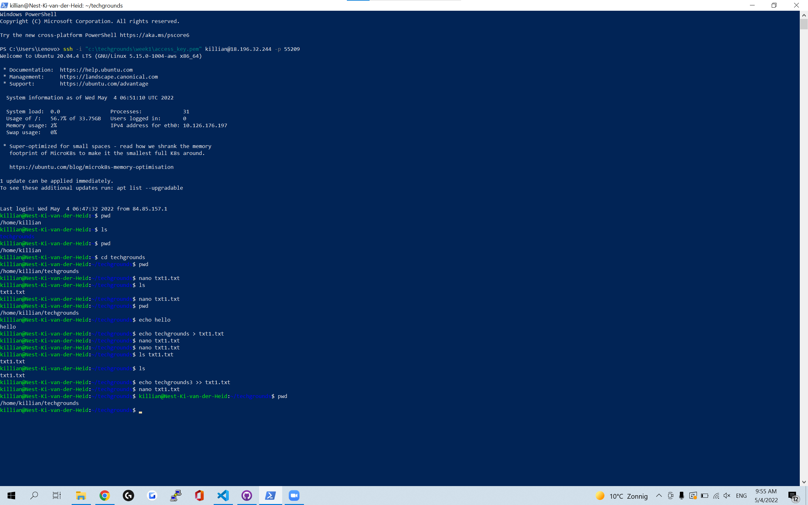
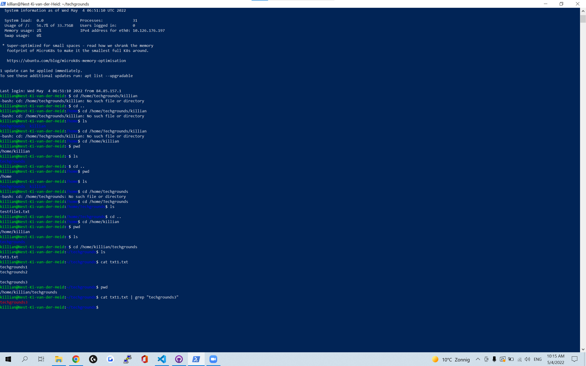
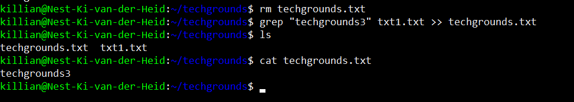

# Working with text (CLI)
Learn how to print outputs and redirect them. 

## Key terminology
 - ***STDIN:*** Dit betekend standaard input
 - ***STDOUT:*** Dit betekend standard output
 - ***Pipe (form of redirection):*** Met piping kan je meerdere commands aan me kaar rijgen en redirecten
 - ***Append >>:*** Iets met >> redirecten betekend dat je iets naar het einde van bijvoorbeeld een text bestand brengt.
 - ***Overwrite >:*** Iets met > redirecten betekend dat je de file herschrijft.
 - ***grep:*** Met grep kan je een string filteren uit een bestand.
 - ***Cat:*** Met cat kan je een file printen in je terminal

 

## Exercise
### Sources
1. [Piping](https://www.geeksforgeeks.org/piping-in-unix-or-linux/)
2. [in/output](https://www.educative.io/edpresso/how-to-do-input-output-redirection-in-linux)
3. [redirect to end of file](https://stackoverflow.com/questions/6207573/how-to-append-output-to-the-end-of-a-text-file)
4. [filtering cat](https://www.tecmint.com/linux-file-operations-commands/)
5. [grep](https://phoenixnap.com/kb/grep-command-linux-unix-examples)
6. [more grep](https://fedingo.com/how-to-save-grep-output-to-file-in-linux/)

### Overcome challenges
Hier had ik niet echt challenges mee, misschien alleen dat ik over pipes gelezen had en de opdracht met pipes wilde maken en daardoor er wat langer over deedt en uit eindelijk zonder pipes heb gedaan.

### Results
1. Hier print ik een woord en append die naar het einde van een file.

2. Hier laat ik zien dat mijn command uit Result 1 gewerkt heeft.

3. Hier print en filter ik een woord uit de text file van result 2.

4. Hier filter ik een woord uit een text file en append de uitkomst daarvan naar een nieuwe text file
