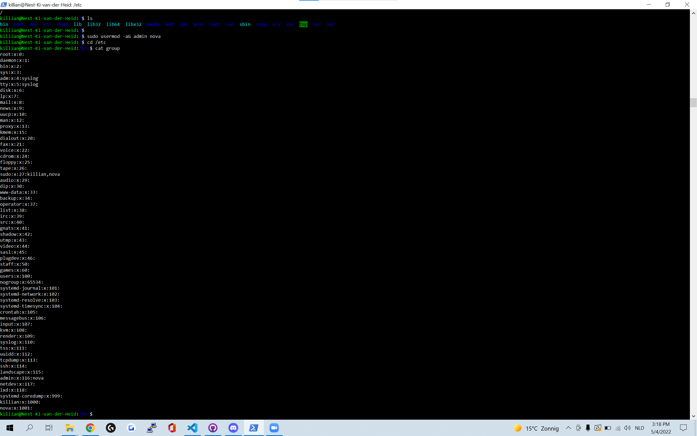
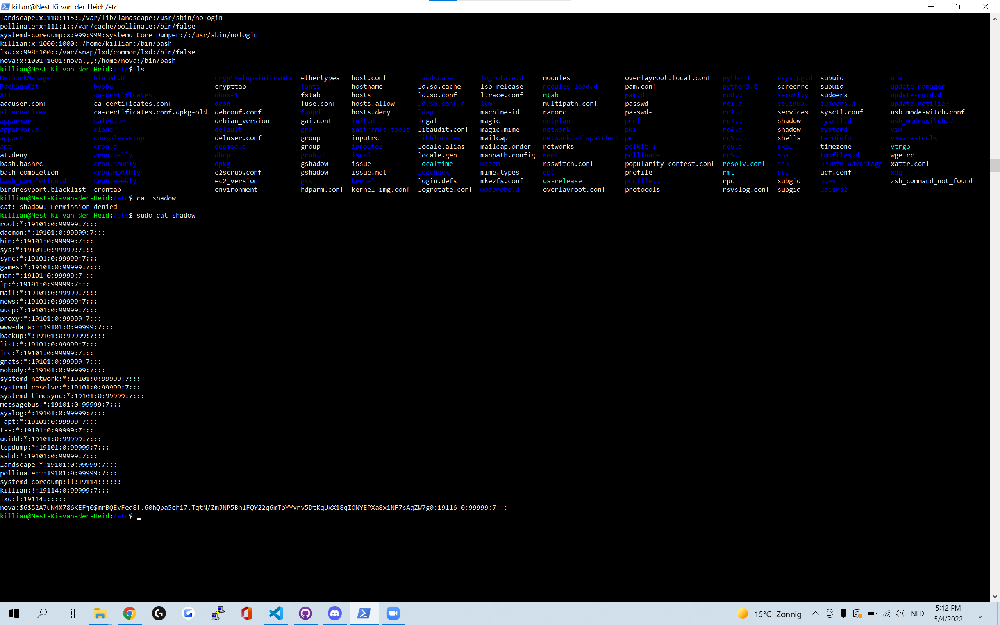

# Users and Groups
Create a new user with permissions and locate that new user in the users file

## Key terminology
 - 

 

## Exercise
### Sources
1. [add user to group](https://phoenixnap.com/kb/how-to-create-sudo-user-on-ubuntu)
2. [hoe lees ik passwd file](https://www.cyberciti.biz/faq/understanding-etcpasswd-file-format/)

### Overcome challenges
moeite hebben met het lezen van de bestanden, puur mijn dislexie zorgt er voor dat bijvoorbeeld het mapje passws door me kaar gaat als ik het probeer te lezen.
dit kost mij gewoon extra tijd en ook wat energie maar het lukt wel.

### Results

