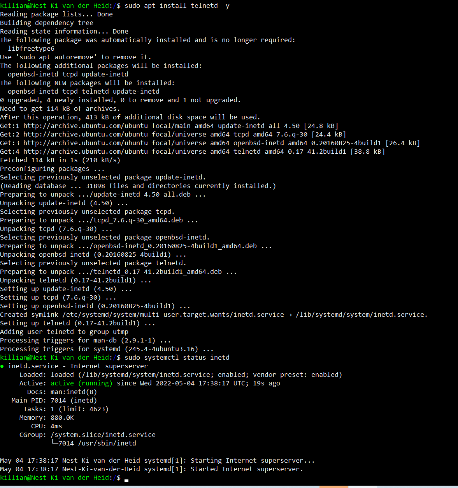
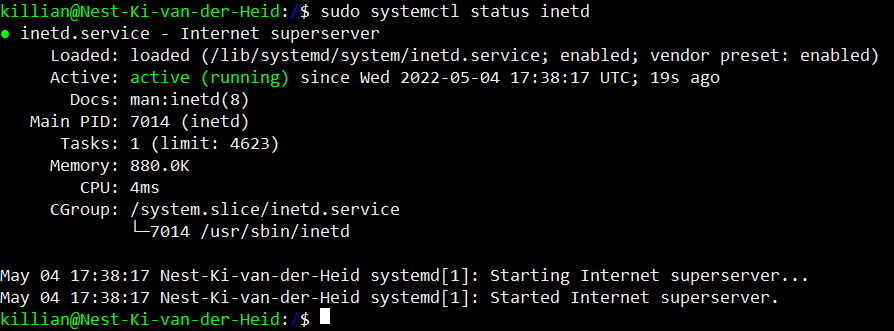
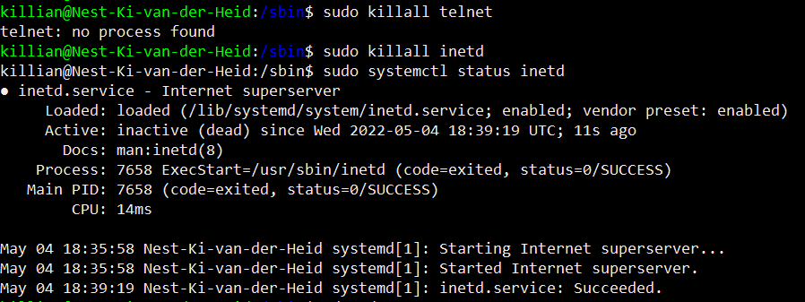

# Processes 
Install tellnet, find information about tellnet on your machine and close tellnet

## Key terminology
 - 
 

## Exercise
### Sources
1. [tellnet install, PID check, memory check](https://www.howtoforge.com/how-to-install-and-use-telnet-on-ubuntu/)
2. [kill telnet](https://itsfoss.com/how-to-find-the-process-id-of-a-program-and-kill-it-quick-tip/)
3. [kill](https://www.geeksforgeeks.org/kill-command-in-linux-with-examples/?ref=lbp)

### Overcome challenges
moest leren over tellnet en wat het was. Elke keer als we telnet killde kwam er een nieuw process met een adere PID.

### Results

