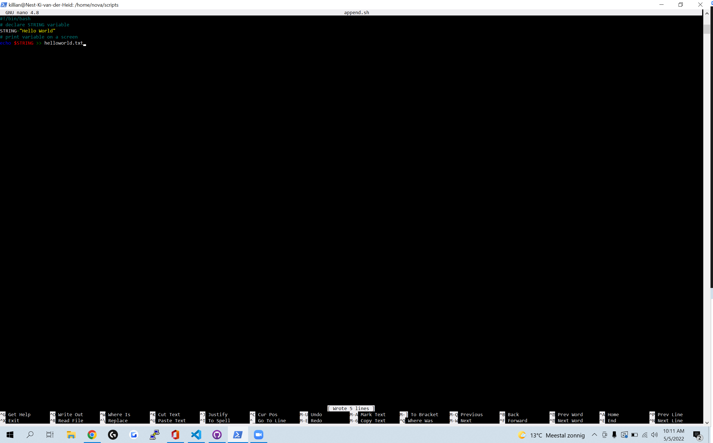

# Bash scripting 
what is assignment

## Key terminology
 - 
 

## Exercise
### Sources
1. [$PATH](https://opensource.com/article/17/6/set-path-linux)
2. [bash scripting 101](https://linuxconfig.org/bash-scripting-tutorial)
3. opdracht 3 sources over append
4. 

### Overcome challenges

### Results

