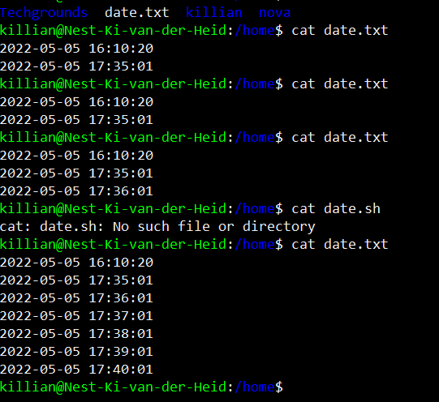
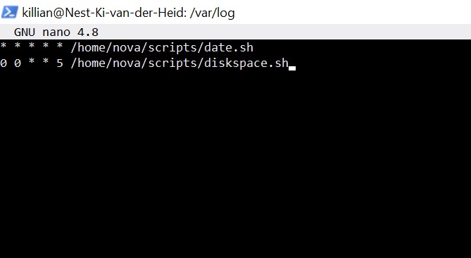

# Cron jobs 
Create a cron job

## Key terminology
 - crontab (crontable) a list with all the commands that have to be executed scheduled.
 

## Exercise
### Sources
1. [crontabs](https://www.freecodecamp.org/news/cron-jobs-in-linux/)
2. a friend who works with servers and linux
3. [diskspace check](http://blog.imm.cnr.it/content/linux-check-disk-space-command-view-system-disk-usage-df-and-du)

### Overcome challenges
never ever heard from crontabs. had to ask a friend who is a server maintainer what it was cause i was talking with him while doing the assignment.
ik had ook wel struggles met de manier van de cron tab invullen met * * * * etcetc

### Results

