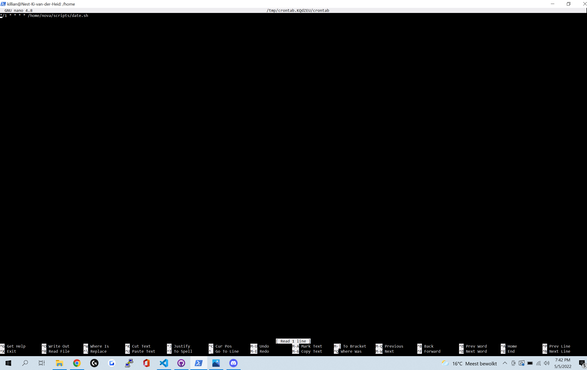

# Cron jobs 
Create a cron job

## Key terminology
 - 
 

## Exercise
### Sources
1. [crontabs]https://www.freecodecamp.org/news/cron-jobs-in-linux/
2. a friend who works with servers and linux

### Overcome challenges
never ever heard from crontabs. had to ask a friend who is a server maintainer what it was cause i was talking with him while doing the assignment

### Results

