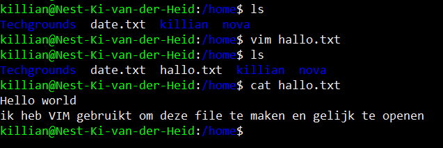

# Working with text 

## Key terminology
 - ***i:*** enter insert mode in vim. hier kan je text gaan neerzetten.
 - ***:wq:*** Met deze command in de command mode kan je write and quit uitvoeren.
 - ***Modes:*** VIM heeft verschillende modes zoals insert en command mode, hier duidelijke uitleg over in source 1.

## Exercise
### Sources
1. [VIM basics](https://www.howtoforge.com/vim-basics#:~:text=Vim%20has%20a%20particular%20working,in%20the%20command%20mode%20directly.)

### Overcome challenges
Erg comfy zijn met nano en na eerder gebruik van VIM een tijdje geleden wist ik nog dat VIM een stuk gecompleceerder was, dus moeite hebben met durven overstappen.

### Results

1. Deze screenshot zal voor zichzelf spreken
