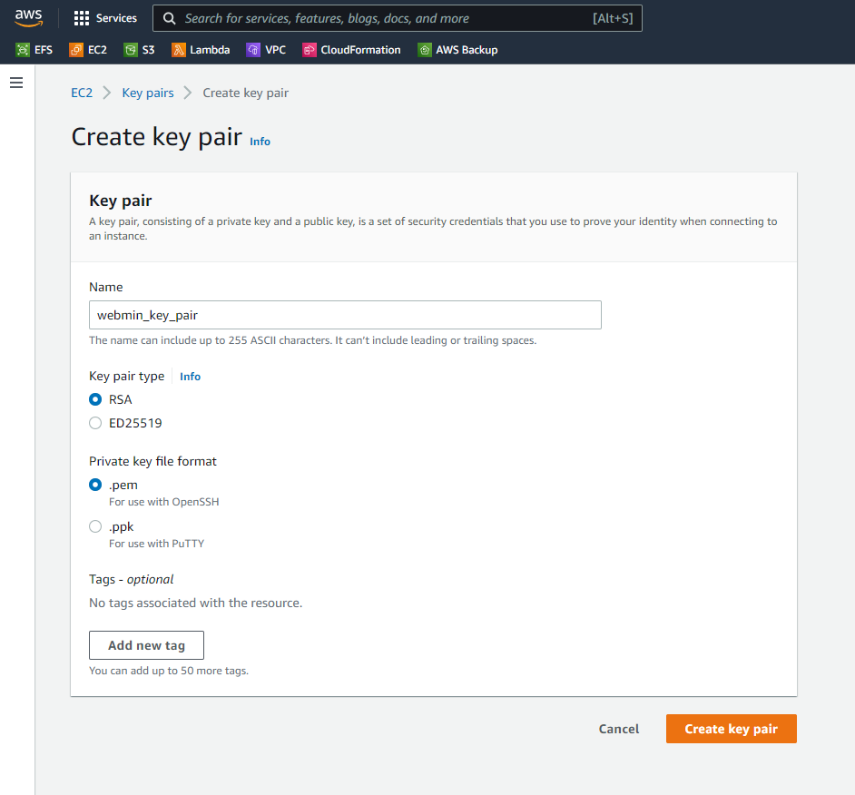

# README TG project V1.0

In this README you will get to know what to do to get this project running for yourself.
This project is created with AWS CDK, if you have no experience with CDK, don't worry in the requirements steps you will learn the basics.


# Requirments for the project
- [A github account](https://github.com/)
- [Python installed (during installation add python to your PATH)](https://www.python.org/downloads/)
- [An AWS account and user](https://aws.amazon.com/)
- [NodeJS installed](https://nodejs.org/en/)
- [An IDE (VScode recommended)](https://code.visualstudio.com/)
- AWS CDK installed, follow the steps below:
    1. Open a terminal session and run the following command: 
    ```
    npm install -g aws-cdk
    ```

    2. Check if the installation was succesfull with the command: 
    ```
    cdk --version
    ```
- [Setup your CDK (if you dont know how, follow the NEW PROJECT part of this workshop)](https://cdkworkshop.com/30-python/20-create-project.html)


# Editting the Files for your use
1. In the AWS console create a keypair and name it webmin_key_pair like in the picture below. (Remember where you store the key pair.)

2. In the top of the stack.py file edit the my_ip variable, this will allow on your PC to connect to the admin server.
3. Re deploy the project with: CDK deploy


# Connect via RDP (to the admin server)
1. Go the AWS console and go to ec2 instances, find your admin/manage server and select it, click connect.
2. Choose RDP client and follow the steps.
    - decrypt password by adding the webmin_key_pair.pem (remember/store this password and the username)
    - download the RDP launch file and login
3. Be patient it can take a few min to launch.


# Connect to webserver with SSH trough the Admin server.
1. Go the AWS console and go to ec2 instances, find your admin/manage server and select it, click connect.
2. Choose RDP client and follow the step below.
    decrypt password by adding the webmin_key_pair.pem (remember/store this password and the username)
3. Open a bash terminal in the same dir as where webmin_key_pair.pem is stored
4. Activate the SSH agent with command:
```
ssh-agent bash
```
5. Add the keypair to use for the servers with the command: 
```
ssh-add webmin_key_pair.pem
```
6. Use a proxy jump to SSH to your webserver trough the Admin server with the following command (this can only be done by you):
```
ssh -A -J <admin server Username(should be Administrator)>@<admin.server.public.ip> ec2-user@<web.server.private.ip>
```

# Close everything down when done
If all the steps above have worked this CDK project is working succesfully for you.
Close it down with the command:
```
CDK destroy
```